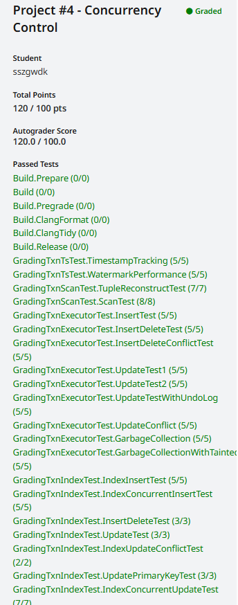

Task 4.2 需要重构之前实现的 Insert、Update 和 Delete 算子，主要是增加了两方面的考虑：

1. 之前的任务当中一个 Tuple 被删除之后不会再被修改，现在引入了索引支持，在进行插入 Insert 时，如果在索引中查询到该元组已被删除，则应更新已删除的元组，而不是创建新条目，因此现在 Table Heap 当中和 undo_log 中都会出现删除标记，因此相应地要在 Insert、Update、Delete 三个算子当中进行处理。
2. 竞争条件，即如果多个事务同时更新 Version Chain，应该要正确地中止其中一些。Butub 在 version info page 中提供了一个`in_progress`​ 字段可以表明在当前 tuple 上是否已经有一个正在运行的事务，因此需要借助该字段来避免并发问题。

## 关于 in_progress

写入相关事务调用 GetVersionLink 方法获取最新的 VersionLink后，需要校验它的 in_progress_ 属性，只有当为 false 或者 Version link 为空时才可继续执行，否则视为写冲突抛出异常，直接终止事务。

每个事务处理 rid 对应的 VersionLink 之前，会对 UndoVersionLink 的 `in_progress_`​ 置为 true，来起到加锁的作用。对于 self-modifcation 的操作，则不需要多次检查 `in_progress_`​。

事务在实际更新 VersionLink，即调用`UpdateVersionLink`​时，可以通过它的`check`​参数，实现CAS（Compare and Swap），进而保证原子操作，检测并发问题。

```c++
  auto UpdateVersionLink(RID rid, std::optional<VersionUndoLink> prev_version,
                         std::function<bool(std::optional<VersionUndoLink>)> &&check = nullptr) -> bool;
```

​`in_progress_`​ 的**释放时机**有两处：

1. commit 事务的时候
2. 事务执行过程中跑出异常（写写冲突、CAS失败等）

都可以根据`write_set_`​，将相关的RID `in_progress_`​ 重置为 false（注意如果事务已经获得了某个 rid 的 `in_progress_`​之后发生了异常，需要将该 rid 加入​`write_set_`​）

### 根据 rid 和 tuple_ts 获取 in_progress

分情况讨论即可，注意这里在调用`txn_mgr->UpdateVersionLink`​时都传入了一个check函数，我是通过lambda函数实现的，它的入参是`std::optional<VersionUndoLink>`​，代表原有的VersionLink，可以通过检查它有没有发生变化来避免一些并发问题。lambda的捕获域`[version_link]`​捕获了先前获取的VersionLink。伪代码如下：

```c++
void TxnGetInProgress(TransactionManager *txn_mgr, Transaction *txn, const RID rid, timestamp_t heap_tuple_ts) {
  auto version_link = txn_mgr->GetVersionLink(rid);
  const auto txn_id = txn->GetTransactionId();
  if (version_link.has_value()) {
    // (1) in_progress_ = false
    if (!version_link.value().in_progress_) {
      // 获取 in_progress
      if (!txn_mgr->UpdateVersionLink(rid, std::make_optional(VersionUndoLink{version_link.value().prev_, true}),
                                      [version_link](std::optional<VersionUndoLink> v) { return v == version_link; })) {
        // 失败说明需要终止当前事务
        ClearInProgressAndTxnSetTainted(txn, "Update : Setting In Progress to true Failed", txn_mgr);
      }
    } else {
      // (2) in_progress_ = true
      // 检查是否是self modification，如果不是，终止当前事务; 如果是，不要再获取in_progress了
      if (heap_tuple_ts != txn_id) {
        ClearInProgressAndTxnSetTainted(txn, "Update Executor: In progress is true, but not self modification",
                                        txn_mgr);
      }
    }
  } else {
    // version_link 为空，创建一个新的invalid version link
    auto new_version_link = std::make_optional(VersionUndoLink{{}, true});
    if (!txn_mgr->UpdateVersionLink(rid, new_version_link,
                                    [version_link](std::optional<VersionUndoLink> v) { return v == version_link; })) {
      ClearInProgressAndTxnSetTainted(txn, "Update executor: Insert temp version link and get in_progress failed",
                                      txn_mgr);
    }
  }
}
```

## Insert 算子

在 task4 中，Insert 算子在插入 tuple 时，会首先在主键索引中检索目标的`primary_key`​：

1. 如果结果为空，进入正常的插入逻辑
2. 如果结果不为空

    1. 如果结果数大于1，这是不应该发生的现象，直接终止事务，抛出异常
    2. 如果结果数等于1，且旧元组未被删除，此时插入会造成主键冲突，因此也直接终止事务
    3. 如果结果数等于1，且旧元组已被删除，此时进入更新逻辑

在进入更新逻辑之前，首先要获得对应 tuple 的 version link的 `in_progress`​。

如果是正常的插入逻辑，同样需要做出几处修改：

1. 在将 tuple 插入到 TableHeap 之后，要获取 in_progress_，做法是插入一个 invalid 的 version link
2. 在更新索引时，调用`index_->InsertEntry`​，如果返回 false，说明插入的 tuple 违反了唯一性约束，直接终止事务

## Update 算子

现在Update和Insert操作修改Versionlink之前，都要先获取对应VersionLink的in_progress_来避免并发问题，保证其他事务不会修改Versionlink。

两个部分可能涉及删除标记：

1. heap_tuple：最新的数据是已经删除的
2. undo_log：undo_log中是一个删除

执行逻辑的伪代码设计如下：

```c++
if (self_modification) {

  if (undo_link不为空且invalid) {
    // 说明tuple不是自己创建的，但是自己已经修改了一次
    if (!undo_log.is_deleted && !heap_tuple.is_deleted) {
      if (!IsTupleContentEqual(update_tuple, heap_tuple)) {
        // 按照更新的逻辑生成新的undo log
      }
      // 如果没有做任何修改，也不用更新Undo_log
    }
    // 若undo_log为<del>，此时等同于tuple是自己创建的
    // 若heap_tuple是删除标记，说明是当前事务删掉的，此时假定undo_log中包含所有原始数据，则也不用更新undo log
  }
  // 说明tuple是自己创建的，直接更新table_heap_
  UpdateTableHeap;
} else {
  // 不是self modification，则要插入新的undo_log，就不用考虑旧的undo_log了
  if (!heap_tuple.is_deleted) {
    // 此处无论有没有修改，都要插入一个新的undo_log
    UpdateUndoLog;
  } else {
    // 如果heap_tuple是一个删除标记，则插入一个带有删除标记的undo_log即可，不需要数据
    Insert A del undo log;
  }
  UpdateTableHeap;
}
AppendWriteSet;
// nonononononono!!!：UpdateIndexes;
```

> 重点注意：不能更新索引，因为在本任务中，索引项一旦生成就不会被删除，删除之后再更新反而会造成插入操作的并发问题

## Delete的执行逻辑

```c++
if (self_modification) {

  if (undo_link不为空且invalid) {
    // 说明tuple不是自己创建的，但是自己已经修改了一次
    if (!undo_log.is_deleted && !heap_tuple.is_deleted) {
      更新undo_log，使包含所有字段的原始数据
    }
    // 若undo_log为<del>，此时等同于tuple是自己创建的
    // 若heap_tuple是删除标记，说明是当前事务删掉的，此时假定undo_log中包含所有原始数据，则也不用更新undo log
  }
  // 说明tuple是自己创建的，直接更新table_heap_
  UpdateTableHeap;
} else {
  // 不是self modification，则要插入新的undo_log，就不用考虑旧的undo_log了
  if (!heap_tuple.is_deleted) {
    // 此处无论有没有修改，都要插入一个新的undo_log
    插入一个新undo_log，包含所有字段的原始数据
  } else {
    // 如果heap_tuple是一个删除标记，则插入一个带有删除标记的undo_log即可，不需要数据
    Insert A del undo log;
  }
  UpdateTableHeap;
}
AppendWriteSet;
// nonononononono!!!：UpdateIndexes;
```

> 可以发现 Update 和 Delete 执行逻辑类似，可以整合起来放在`execution_common.cpp`​中，方便调用和复用代码。

## 索引扫描

很简单，在原有index_scan的基础上加入ReconstructTuple。

## Primary key Update

对于Primary key Update，先全部delete、然后再依次Insert。注意不是“一次删除、一次插入”

### 怎么识别更新的是主键

我这里做的比较复杂，就是计算第一个update tuple，看是否发生主键的更新。

```c++
    if (primary_key_index_id >= 0) {
      // 计算第一个update tuple，看是否发生主键更新
      const auto rid = update_tuples_[0].GetRid();
      auto raw_tuple = table_info_->table_->GetTuple(rid).second;
      std::vector<Value> values{};
      values.reserve(plan_->target_expressions_.size());
      for (const auto &expr : plan_->target_expressions_) {
        values.push_back(expr->Evaluate(&raw_tuple, child_executor_->GetOutputSchema()));
      }
      auto update_tuple = Tuple{values, &table_info_->schema_};
      auto primary_key_index = table_indexes[primary_key_index_id];
      auto raw_primary_key = raw_tuple.KeyFromTuple(table_info_->schema_, primary_key_index->key_schema_,
                                                    primary_key_index->index_->GetKeyAttrs());
      auto update_primary_key = update_tuple.KeyFromTuple(table_info_->schema_, primary_key_index->key_schema_,
                                                          primary_key_index->index_->GetKeyAttrs());
      if (!IsTupleContentEqual(raw_primary_key, update_primary_key)) {
```

## 奖励任务1： Abort

在该任务之前，如果一个事务进入`Tainted`​状态，由于对应 Tuple 的时间戳始终保持为事务的临时 ID，会导致后续其它有写冲突的事务终止，所以此任务要求实现 Abort 的逻辑，能够回滚终止事务所作的修改，使后续的事务能够继续修改该 Tuple。

文档给了两种实现方法，第一种比较简单，缺点是终止的事务没办法立即 GC，会保留一段时间。第二种较为复杂，要同时获取表锁和版本链接锁，即一个新的锁定机制。

我选择简单的做法，不想再重构火葬场了hhh。

### Abort原理

​​

在这个例子中，txn9 将要被abort。你可以简单`ReconstructTuple`​并将 table heap 设置为最原始的 value。这很容易实现但是会让版本链出现两个ts = 3，你的 seqscan / indexscan 算子需要正确处理这种情况。

如果事务插入一个没有撤消日志的新元组，则中止进程只需将其设置为 ts = 0 的删除标记。BusTub 中的提交时间戳从 1 开始，因此将其设置为 0 是安全的。

您不需要还原索引修改。添加到索引中的任何内容都将保留在那里，不会被删除。您也不需要实际从表堆中删除元组。如果需要还原插入内容，只需将其设置为删除标记即可。

代码实现是在`transcation_manager.cpp`​中的`Abort`​函数，同样是遍历 write set 来做，注意要在释放 in_progress 之前。执行大致逻辑如下：

遍历write set，对于每个 rid：

1. 获取 version_link 和 heap_tuple
2. 如果 version_link 存在且`IsValid`​

    1. 只需要获取一个 undo_log（每个事务的所有修改至多插入一个 undo_log）
    2. ReconstructTuple 重构 Tuple
    3. 如果 Tuple 存在，`UpdateTupleInPlace`​；如果不存在说明被删除了，`UpdateTupleMeta`​
3. 如果 version_link 不存在，说明无 undo_log，根据文档要求，只需要将其设置为 ts = 0 的删除标记
4. 释放掉 in_progress 标记

## 奖励任务2：可串行化验证

如果事务在可串行化隔离级别运行，则需要在提交事务时验证它是否满足可串行化特性。Bustub 使用 OCC 向后验证进行可序列化验证。若要完成可序列化验证，每次调用 seqscan 算子或 indexscan 算子时，都需要将 scan filter（也称为 scan predicate）存储在事务中；还需要正确跟踪写入集。有了所有信息，我们可以通过检查 scan predicate（读取集）是否与当**前事务启动后开始**的事务写入集相交来执行可序列化验证。

首先，在`seqscan`​和`indexscan`​中统计`ScanPredicate`​获取事务读取的元组，例如：

```c++
SeqScanExecutor::SeqScanExecutor(ExecutorContext *exec_ctx, const SeqScanPlanNode *plan)
    : AbstractExecutor(exec_ctx), plan_(plan) {
  auto txn = exec_ctx_->GetTransaction();
  if (txn->GetIsolationLevel() == IsolationLevel::SERIALIZABLE) {
    txn->AppendScanPredicate(plan_->GetTableOid(), plan_->filter_predicate_);
  }
}
```

实现可串行化验证的代码在`TransactionManager::Commit`​当中调用`VerifyTxn`​，这部分已经实现好了，主要就是完成VerifyTxn函数。

VerifyTxn执行逻辑：  

1. 获取当前事务的 write set，如果为空，直接返回 true；
2. 创建一个 map 收集冲突事务修改的所有 RID，遍历`txn_map_`​中的每个`txn`​：

    1. 只需要考虑在当前事务的读取时间戳***之后***提交的所有`txn`​
    2. 同样忽略只读事务（write set 为空）
    3. 遍历`txn`​的 write set，将所有 rid 插入 map
3. 对于 map 当中的每个 rid，都是有可能与当前事务的读取集相交的，因此，对于每个 rid，遍历其版本链，以验证当前事务是否读取任何“幽灵”：

    1. 获取该 rid 的 heap_tuple，如果`tuple.first.ts_ == txn_id || tuple.first.ts_ <= read_ts`​，说明没有冲突，考虑下一个；
    2. 如果 heap_tuple 中是与提交的数据，即`(tuple.first.ts_ & TXN_START_ID) == 0`​，此时需要检查冲突，即检查是否满足`scan_predicate`​，若满足，返回false，说明不满足可串行化验证；
    3. 获取该 rid 的 version_link，如果不存在则考虑下一个 rid；如果存在：

        1. 首先拿到该 rid 的所有的 undo_log
        2. 对每个 undo_log **逐个（注意）**进行重构然后检查，因为版本链上每个元组都有可能与当前事务的读取集有交集。期间如果利用`scan_predicate`​检查出了冲突，则直接返回false
4. 没有发现冲突，返回 true

‍

拿下！！！

​​

​​
