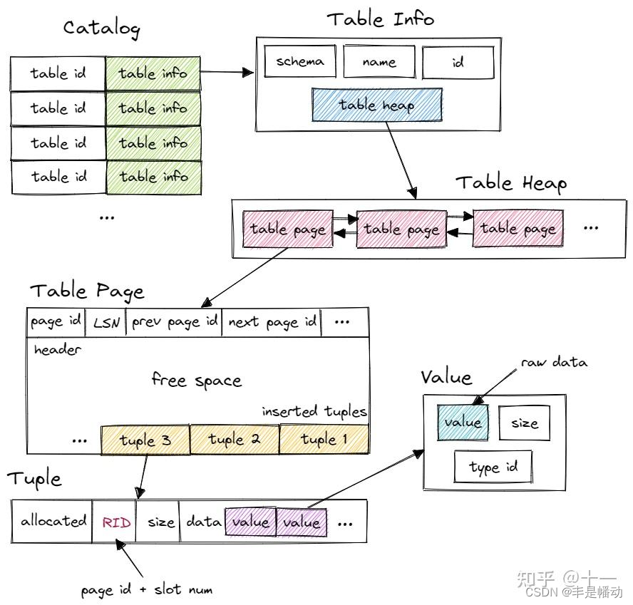
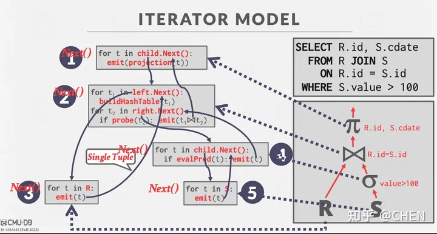
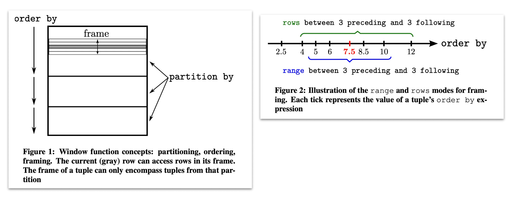

Project 3 Query Execution的任务是实现BusTub执行SQL命令的组件。主要分为：

1. 执行SQL查询的算子
2. 优化规则的实现

Project 3 的难点在于读代码，理解查询引擎的原理，弄懂了之后具体实现起来并不难。

## bustub的SQL引擎解析

墙裂推荐下面这篇文章

[做个数据库：2022 CMU15-445 Project3 Query Execution - 知乎 (zhihu.com)](https://zhuanlan.zhihu.com/p/587566135)

## bustub的表结构

这里引用一下 [做个数据库：2022 CMU15-445 Project3 Query Execution](https://zhuanlan.zhihu.com/p/587566135)中的图

​​

首先，Bustub 有一个 Catalog。Catalog 维护了几张 hashmap，保存了 table id 和 table name 到 table info 的映射关系。table id 由 Catalog 在新建 table 时自动分配，table name 则由用户指定。这里的 table info 包含了一张 table 信息，有 schema、name、id 和指向 table heap 的指针。系统的其他部分想要访问一张 table 时，先使用 name 或 id 从 Catalog 得到 table info，再访问 table info 中的 table heap。

table heap 是管理 table 数据的结构，包含 table 相关操作。table heap 可能由多个 table page 组成，仅保存其第一个 table page 的 page id。需要访问某个 table page 时，通过 page id 经由 buffer pool 访问。

table page 是实际存储 table 数据的结构，当需要新增 tuple 时，table heap 会找到当前属于自己的最后一张 table page，尝试插入，若最后一张 table page 已满，则新建一张 table page 插入 tuple。table page 低地址存放 header，tuple 从高地址也就是 table page 尾部开始插入。

tuple 对应数据表中的一行数据。每个 tuple 都由 RID 唯一标识。RID 由 page id + slot num 构成。tuple 由 value 组成，value 的个数和类型由 table info 中的 schema 指定。value 则是某个字段具体的值，value 本身还保存了类型信息。

## 火山模型/迭代模型

本 Project 中的查询算子采用 iterator query processing model，也就是火山模型进行实现。

每个算子会实现自己的`Next()`​ 方法来迭代式获取下一个 tuple。当`Next()`​ 函数被调用时，算子可能返回

1. 单一的 tuple
2. 没有更多的 tuple

在 BusTub 的实现中， Next函数还会额外返回一个 record identifier (RID)，用于唯一标识一个 tuple。所有的算子都在工厂类 `executor_factory.cpp`​ 中被创建。

​ ​

注意有很多算子属于 pipeline breakers，它会阻塞直到孩子发出所有的元组。我在实现的时候将这个阻塞的过程放在了“Init”方法中。**由于算子可能会被多次调用“Init”来重复使用，在实现的时候可以引入一些标记为进行判断，避免多次阻塞影响性能。**

## 样例算子代码解析

Bustub提供了几个样例算子的实现可供我们参考学习。

### Project算子

Project算子的构造函数如下

```c++
ProjectionExecutor::ProjectionExecutor(ExecutorContext *exec_ctx, const ProjectionPlanNode *plan,
                                       std::unique_ptr<AbstractExecutor> &&child_executor)
    : AbstractExecutor(exec_ctx), plan_(plan), child_executor_(std::move(child_executor)) {}
```

#### AbstractExecutor

`AbstractExecutor`​是一个抽象类型，主要的成员是一个`ExecutorContext`​指针。​`ExecutorContext`​保存了一个算子运行所需的所有上下文，主要成员包括：

1. 事务上下文`Transaction`​
2. ​`Catalog`​：提供有关访问、修改表的API
3. ​`BufferPoolManager`​：project2的内容，无需多盐
4. ​`TransactionManager`​：暂时应该不用管
5. ​`LockManager`​：也是事务相关，暂时不管
6. ​`check_exec_set_`​：用于优化任务
7. ​`checkOptions`​：检查的选项，用于优化任务
8. ​`is_delete_`​：23fall已经不使用了

它提供的API大多是返回私有成员的指针，需要重点关注和使用`Catalog`​、`BufferPoolManager`​提供的API。后续P4中`Transaction`​和`TransactionManager`​也非常关键。

#### ProjectPlanNode

其中保存了该算子的执行计划，构造函数如下：

```c++
 ProjectionPlanNode(SchemaRef output, std::vector<AbstractExpressionRef> expressions, AbstractPlanNodeRef child)
      : AbstractPlanNode(std::move(output), {std::move(child)}), expressions_(std::move(expressions)) {}
```

它继承了抽象类`AbstractPlanNode`​，先来看一下它，主要有两个成员：

1. ​`output_schema_`​：一个`SchemaRef`​类型（`Ref`​的含义就是`std::shared_ptr`​）的对象，标明输出结果包含哪些列
2. ​`children_`​：这个 plan node的孩子节点

整个`AbstractPlanNode`​提供的也是非常基础的API，例如：

```c++
  /** Virtual destructor. */
  virtual ~AbstractPlanNode() = default;

  /** @return the schema for the output of this plan node */
  auto OutputSchema() const -> const Schema & { return *output_schema_; }

  /** @return the child of this plan node at index child_idx */
  auto GetChildAt(uint32_t child_idx) const -> AbstractPlanNodeRef { return children_[child_idx]; }

  /** @return the children of this plan node */
  auto GetChildren() const -> const std::vector<AbstractPlanNodeRef> & { return children_; }

  /** @return the type of this plan node */
  virtual auto GetType() const -> PlanType = 0;
```

​`ProjectionPlanNode`​类除了继承了`AbstractPlanNode`​，还增加一个成员​`std::vector<AbstractExpressionRef> expressions_;`​

来看看它有啥用，字面意思理解好像就是表达式。

首先项目文档有关于它的描述：

> BusTub 中的 Expression 定义如下：
>
> * ​`ColumnValueExpression`​: directly places a column of the child executor to the output. The syntax `#0.0`​ means the first column in the first child. You will see something like `#0.0 = #1.0`​ in a plan for joins.
> * ​`ConstantExpression`​: represents a constant value (e.g., `1`​).
> * ​`ArithmeticExpression`​: a tree representing an arithmetic computation. For example, `1 + 2`​ would be represented by an `ArithmeticExpression`​ with two `ConstantExpression`​ (`1`​ and `2`​) as children.

实际很好理解：列值表达式、常量表达式、数学表达式

不论是哪个类型，最重要关注的都是它的`Evaluate`​和`EvaluateJoin`​接口。以列值表达式为例：

```c++
  auto Evaluate(const Tuple *tuple, const Schema &schema) const -> Value override {
    return tuple->GetValue(&schema, col_idx_);
  }

  auto EvaluateJoin(const Tuple *left_tuple, const Schema &left_schema, const Tuple *right_tuple,
                    const Schema &right_schema) const -> Value override {
    return tuple_idx_ == 0 ? left_tuple->GetValue(&left_schema, col_idx_)
                           : right_tuple->GetValue(&right_schema, col_idx_);
  }

```

很容易理解，就是执行该表达式并返回结果。（列值表达式中`GetValue`​就代表取某一列的值）

#### Project算子的API实现

根据上面提到的火山模型，各个算子都需要实现`Init`​和`Next`​两个API，Project算子的实现如下：

```c++
void ProjectionExecutor::Init() {
  // Initialize the child executor
  child_executor_->Init();
}

auto ProjectionExecutor::Next(Tuple *tuple, RID *rid) -> bool {
  Tuple child_tuple{};

  // Get the next tuple
  const auto status = child_executor_->Next(&child_tuple, rid);

  if (!status) {
    return false;
  }

  // Compute expressions
  std::vector<Value> values{};
  values.reserve(GetOutputSchema().GetColumnCount());
  for (const auto &expr : plan_->GetExpressions()) {
    values.push_back(expr->Evaluate(&child_tuple, child_executor_->GetOutputSchema()));
  }

  *tuple = Tuple{values, &GetOutputSchema()};

  return true;
}
```

​`Init`​当中需要注意执行一下子算子的`Init`​。

​`Next`​的逻辑也十分简单：就是先求子节点得到`child_tuple`​，然后在执行本节点的计划（执行表达式），然后将执行结果返回。

## Task#1：Access Method Executors

### seqscan

由于每次获取一个tuple，因此要在算子增加一个迭代器成员，记录当前扫描到的位置。

```c++
 private:
  /** The sequential scan plan node to be executed */
  const SeqScanPlanNode *plan_;
  std::unique_ptr<TableIterator> table_iter_;
```

注意`next`​中每次成功获取一个Tuple，就返回成功。

但是要注意判定两个条件：

1. 当前tuple没有被删除，需要检查`TupleMeta`​中的`is_deleted_`​
2. 如果有`filter_predicate`​（过滤谓词，就是过滤的条件），需要通过`Evaluate`​检查是否满足该条件。（使用方式可以参考`Filter`​算子中的Next实现）

> ​`filter_predicate`​都是一个`Expression`​，所有表达式都是通过`Evaluate`​来进行判断和运算。表达式类型很多，有常量表达式，列值表达式，逻辑表达式，比较表达式等等，需要重点理解。

### Insert、Update、Delete

Insert、Update和Delete三个算子需要首先关注的是它们均只执行一次，因此要在类成员中加入一个标记。

```c++
 private:
  /** The insert plan node to be executed*/
  const InsertPlanNode *plan_;
  /** The child executor from which tuples are obtained */
  std::unique_ptr<AbstractExecutor> child_executor_;
  bool is_done_ = false;
```

构造函数注意给`plan_`​和`child_executor_`​都赋值。

由于存在子节点，`Init`​函数需要调用子节点的`Init`​函数。

```c++
void InsertExecutor::Init() {
    child_executor_->Init();
    // table_info_ = exec_ctx_->GetCatalog()->GetTable(plan_->GetTableOid());
    is_done_ = false;
}
```

Insert算子的任务主要有两个：

1. 将Tuple插入目标表
2. 如果表上存在索引，在这些索引中更新该Tuple的信息

具体实现：

**循环**通过调用子节点的`Next`​获取将被插入的记录。调用`InsertTuple`​插入记录，返回值为新插入记录的rid。

在bustub中索引中存储的是对应记录的rid，因此要在目标表中所有的索引表中插入该条记录的索引信息。框架代码中提供了`KeyFromTuple`​来提取一个tuple在索引中的key，需要注意参数分别是：整个表的Schema（包含所有属性/列）、索引key的Schema、索引key的属性列表。

同时由文档和注释可知，Next返回的Tuple（出参）是Insert操作影响的行数，实际上就是统计插入的Tuple个数。

```c++
  std::vector values{{TypeId::INTEGER, count}};
    *tuple = Tuple{values, &GetOutputSchema()};
```

Update算子的思路大致与Insert相同，不过要先删除旧的记录、再插入更新后的记录。删除通过`table_info_->table_->UpdateTupleMeta(TupleMeta{0, true}, rid)`​将对应的tuple标记为`is_delete_=true`​。

如何获取更新后的Tuple？通过Update算子的执行计划`plan_`​中的表达式获取。

```c++
      // 获取更新后的tuple: Compute expressions
      std::vector<Value> values{};
      values.reserve(plan_->target_expressions_.size());
      for (const auto &expr : plan_->target_expressions_) {
        values.push_back(expr->Evaluate(&todo_tuple, child_executor_->GetOutputSchema()));
      }
      auto update_tuple = Tuple{values, &table_info_->schema_};
```

然后调用Insert接口插入新记录。接下来同样需要更新索引表中的对应索引，因为更新后的记录有了新的rid。这个比较简单，也是先删除后插入。

Delete算子略。

### IndexScan

索引扫描，即通过查找索引执行扫描操作，仅适用于匹配单个列的值（例如Select * from t1 where x = 1）。Bustub 对哈希索引做了很强的约束，只会对单个列建立索引，也不会插入重复的值。所以，从 IndexScanExecutor 中只可以获取一个或零个 tuple。

一个关键信息是：`IndexScanExecutor`​的执行计划`plan_`​，也就是`IndexScanPlanNode`​成员，包含一个`const ConstantValueExpression *pred_key_;`​，代表目标列的目标值。还包含了`index_oid_`​，代表所需索引表的id。

在`init`​中先通过`index_oid_`​获取索引表`hash_table`​，再解析出`pred_key_`​及其值`key_val`​，构建一个Tuple`index_key`​，调用`hash_table`​的`ScanKey`​接口，得到`target_rids_`​存储在算子自己的内存当中。

​`Next`​的实现较为简单，就是提取`target_rids_`​中第一个rid，获取对应的Tuple返回即可，如果`target_rids`​为空或tuple的`is_deleted == true`​，返回false。另外，同Insert，IndexScan算子只执行一次，因此要在类成员中加入一个标记。

### 将Seqscan优化成Indexscan

实现将SeqScanPlanNode优化为IndexScanPlanNode的优化器规则

函数原型：将原来的`SeqScanPlanNode`​替换成优化后的执行计划节点（有可能不满足优化的条件导致没有变化）

```c++
auto Optimizer::OptimizeSeqScanAsIndexScan(const bustub::AbstractPlanNodeRef &plan) -> AbstractPlanNodeRef
```

需要重点关注转化的条件：**仅当谓词中的索引列上有一个相等性测试时，才需要支持此优化器规则（来自的项目文档的翻译）**

实现流程如下：

1. 首先对所有子节点递归调用应用这一优化
2. 将优化后的子节点重新赋值给当前节点`auto optimized_plan = plan->CloneWithChildren(std::move(optimized_children));`​
3. 如果当前节点类型为`SeqScan`​

    1. 获取当前节点的谓词`predicate`​（where 子句）
    2. 检查是否满足 seqscan -> indexscan 转化的条件：

        1. 表中有索引
        2. ​`predicate`​不是逻辑运算，而是比较运算：`auto cmp_expr = std::dynamic_pointer_cast<ComparisonExpression>(predicate);`​
        3. 必须为等值比较（即WHERE v1 = 1）
        4. 存在等值比较对应的列上的索引
    3. 如果满足，提取indexscan所需的prev_key：`auto pred_key = std::dynamic_pointer_cast<ConstantValueExpression>(cmp_expr->GetChildAt(1));`​，然后构造一个`IndexScanPlanNode`​返回
4. 不满足转化条件，直接返回`optimized_plan`​

## Task#2：Aggregation & Join Executors

### Aggregation聚合

Aggregation算子对每个输入Group计算一个**聚合函数**，它只有一个孩子。

一些Aggregation的例子：

```c++
SELECT colA, MIN(colB) FROM __mock_table_1 GROUP BY colA;
SELECT COUNT(colA), min(colB) FROM __mock_table_1;
SELECT colA, MIN(colB) FROM __mock_table_1 GROUP BY colA HAVING MAX(colB) > 10;
SELECT DISTINCT colA, colB FROM __mock_table_1;
```

​`AggregationExecutor`​ **需要先从子执行器中获取所有数据**，然后对这些数据进行分组和聚合操作，最后将结果输出，而这个过程必须在init函数中完成。

> 即文档中提到的**pipeline breaker。**
>
> 聚合操作不能简单地按行（tuple-by-tuple）从其子节点接收数据，然后逐行输出结果。相反，**聚合操作需要先从其子节点获取所有相关的数据，完成整个聚合计算过程（例如计算总和、平均值、最小/最大值等），然后才能产生输出结果**。

实现聚合的一个常见的策略是维护一个哈希表，哈希表的key为Group-by子句对应的列值（对应一个分组），value为一个结果向量（因为可能同时有多个聚合函数）。该项目也是采用该思路。

框架代码已经完成了哈希表的核心数据结构，key和val都是一个`std::vector<Value>`​，如下：

```c++
std::unordered_map<AggregateKey, AggregateValue> ht_{};
/** AggregateKey represents a key in an aggregation operation */
struct AggregateKey {
  /** The group-by values */
  std::vector<Value> group_bys_;

  /**
   * Compares two aggregate keys for equality.
   * @param other the other aggregate key to be compared with
   * @return `true` if both aggregate keys have equivalent group-by expressions, `false` otherwise
   */
  auto operator==(const AggregateKey &other) const -> bool {
    for (uint32_t i = 0; i < other.group_bys_.size(); i++) {
      if (group_bys_[i].CompareEquals(other.group_bys_[i]) != CmpBool::CmpTrue) {
        return false;
      }
    }
    return true;
  }
};

/** AggregateValue represents a value for each of the running aggregates */
struct AggregateValue {
  /** The aggregate values */
  std::vector<Value> aggregates_;
};
```

我们需要封装一个`SimpleAggregationHashTable`​用于统计聚合结果，核心数据结构就是上面的`ht_`​。它已经提供了一个初始化聚合值API，即除了countstar操作，其他聚合操作的初始值都是null。

```c++
  /** @return The initial aggregate value for this aggregation executor */
  auto GenerateInitialAggregateValue() -> AggregateValue {
    std::vector<Value> values{};
    for (const auto &agg_type : agg_types_) {
      switch (agg_type) {
        case AggregationType::CountStarAggregate:
          // Count start starts at zero.
          values.emplace_back(ValueFactory::GetIntegerValue(0));
          break;
        // 除了CountStar，其他类型一开始都为NULL，注意switch语法，实际上都插入了NULL
        case AggregationType::CountAggregate:
        case AggregationType::SumAggregate:
        case AggregationType::MinAggregate:
        case AggregationType::MaxAggregate:
          // Others starts at null.
          values.emplace_back(ValueFactory::GetNullValueByType(TypeId::INTEGER));
          break;
      }
    }
    return {values};
  }
```

我们需要实现`CombineAggregateValues`​，功能是当一个输入到达时更新聚合值。几个聚合运算都非常简单，需要注意除了countstar，其他运算都不用考虑null值。

```c++
  void CombineAggregateValues(AggregateValue *result, const AggregateValue &input) {
    for (uint32_t i = 0; i < agg_exprs_.size(); i++) {
      auto old_val = &result->aggregates_[i];
      auto new_val = &input.aggregates_[i];
      switch (agg_types_[i]) {
        // CountStar：统计NULL
        case AggregationType::CountStarAggregate:
          *old_val = old_val->Add({TypeId::INTEGER, 1});
          break;
        // Count：统计非NULL
        case AggregationType::CountAggregate:
          if (!new_val->IsNull()) {
            if (old_val->IsNull()) {
              *old_val = ValueFactory::GetIntegerValue(0);
            }
            *old_val = old_val->Add({TypeId::INTEGER, 1});
          }
          break;
    。。。
      }
    }
  }
```

接下来需要实现`InsertCombine`​，即插入一个`AggregateKey`​和`AggregateValue`​。这是一个很关键的API。用于在哈希表中插入一个聚合键，同时更新聚合函数结果。

```c++
  void InsertCombine(const AggregateKey &agg_key, const AggregateValue &agg_val) {
    if (ht_.count(agg_key) == 0) {
      ht_.insert({agg_key, GenerateInitialAggregateValue()});
    }
    CombineAggregateValues(&ht_[agg_key], agg_val);
  }
```

接着实现`AggregationExecutor`​，即聚合算子，首先根据注释，增加两个成员，一个是上面的哈希表，一个是其上的迭代器，用于记录当前位置。

```c++
 private:
  /** The aggregation plan node */
  const AggregationPlanNode *plan_;
  /** The child executor that produces tuples over which the aggregation is computed */
  std::unique_ptr<AbstractExecutor> child_executor_;
  /** Simple aggregation hash table */
  std::unique_ptr<SimpleAggregationHashTable> aht_;
  /** Simple aggregation hash table iterator */
  std::unique_ptr<SimpleAggregationHashTable::Iterator> aht_iterator_;
```

根据上面的分析，聚合算子的`Init`​函数要先从子节点获取所有相关的数据，完成整个聚合计算的过程，计算结果记录在哈希表中，`Next`​通过迭代器返回结果。

因此，`Init`​的执行流程如下：

1. 初始化子算子
2. 创建一个`SimpleAggregationHashTable`​
3. 如果grouby子句为空，则在哈希表插入一个空的key，并初始化对应的val
4. 循环执行完子算子（pipeline breaker）：对每一个tuple

    1. 通过`MakeAggregateKey`​和`MakeAggregateValue`​构建聚合key和val
    2. 调用上面的`InsertCombine`​插入并更新聚合值
5. 聚合完毕，构建iter（因为可能同时有多个聚合函数）

​`Next`​函数则是通过上面构建的iter聚合的结果，每次返回一个结果。需要注意的是返回的结果形式，文档中有一句话指明了这一点。

> The output schema consists of the group-by columns followed by the aggregation columns.

即聚合键中的所有列+聚合值的所有列。

### NestedLoopJoin

目前只要实现InnerJoin和LeftJoin：

1. InnerJoin：两个表中都有
2. LeftJoin：左表的所有记录，右表中没有的取NULL

[一次性讲清楚INNER JOIN、LEFT JOIN、RIGHT JOIN的区别和用法详解-CSDN博客](https://blog.csdn.net/mfysss/article/details/135486067)

NestedLoopJoin的原理很简单，就是通过遍历获得匹配的行。

在本项目中，遍历是通过`left_executor_->Next`​和`right_executor_->Next`​实现，通过子算子的`init`​可以将指针重新置于表的起始位置。

对于InnerJoin和LeftJoin，都是外层遍历左表，内层遍历右表，但是由于每次只返回一个Tuple，所以每次结束要保留各种状态：

1. 左右表当前的指针位置已经通过子算子的`Next`​实现了控制，只要不调用就不会变
2. ​`bool continue_flag_`​：记录当前`Next`​函数运行的状态，若为True，代表当前左表行存在，且需要继续匹配剩下的右表行**（对于左表的一行，能够匹配的右表行可能有很多个 ），此时不需要调用左算子的Next，右算子也不需要Init；**如果为False，下次调用`Next`​时，就会遍历下一个左表行(`left_executor_->Next`​)，然后右表指针回到起点(`right_executor_->Init()`​)。

关于如何判断是否匹配，文档中已经指明，通过`predicate->EvaluateJoin`​。

## Task#3：HashJoin Executor and Optimization

HashJoin显然是比NestedLoopJoin那种多级遍历的方式更高效的Join方法，不过要满足一定的条件才行。

### HashJoin Executor

根据文档，HashJoin使用的基本前提就是谓词`predicate`​是以下形式：

​`<column expr> = column AND column = column AND ...`​

而HashJoin常见的实现就是用一个哈希表，先遍历并存储右表的所有行；然后遍历左表的所有行时，在哈希表中查找是否存在Key相等的元素，**以key相等作为匹配的条件。**

文档中提示可以参考上个任务聚合算子中的哈希表自定义`HashJoinKey`​和`SimpleHashJoinHashTable`​。其实不论是聚合key和聚合value，主要成员都是`std::vector<Value>`​，所以`HashJoinKey`​也是一样的。注意为了能够让`HashJoinKey`​作为`std::unordered_map`​的key，要在其上自定义实现`std::hash`​。

```c++
namespace bustub {
/** HashJoinKeyrepresents a key in an join operation */
class SimpleHashJoinHashTable {
 private:
  std::unordered_map<HashJoinKey, std::vector<Tuple>> ht_;
};

struct HashJoinKey {
  std::vector<Value> hash_keys_;
  /**
   * Compares two hash joi keys for equality
   * @param other the other hash join key to be compared with
   * @return `true` if both hash join key have equivalent values
   */
  auto operator==(const HashJoinKey &other) const -> bool {
    for (uint32_t i = 0; i < other.hash_keys_.size(); ++i) {
      if (hash_keys_[i].CompareEquals(other.hash_keys_[i]) != CmpBool::CmpTrue) {
        return false;
      }
    }
    return true;
  }
};
}  // namespace bustub


namespace std {
/** Implements std::hash on AggregateKey */
// 定义了这个才可以用std::unordered_map<HashJoinKey, std::vector<Tuple *>>
template <>
struct hash<bustub::HashJoinKey> {
  auto operator()(const bustub::HashJoinKey &join_key) const -> std::size_t {
    size_t curr_hash = 0;
    for (const auto &key : join_key.hash_keys_) {
      if (!key.IsNull()) {
        // 对每一个非空的value对象，计算出它的哈希值
        curr_hash = bustub::HashUtil::CombineHashes(curr_hash, bustub::HashUtil::HashValue(&key));
      }
    }
    return curr_hash;
  }
};
}
```

​`SimpleHashJoinHashTable`​的实现则更为简单，定义插入、查询的接口即可。

除此之外，还要在算子中定义获取Key的方法，同样参照聚合算子中获取聚合键的实现（`MakeAggregateKey`​），这里要区分`LeftJoinKey`​和`RightJoinKey`​。

#### Init

根据之前提到HashJoin的实现方法，Init中要获取并遍历右表的所有行，构建一个哈希表。

#### Next

​`Next`​的实现与NestedLoopJoin的思路几乎完全一致，区别主要在于不需要遍历右表了，只需要遍历左表获取`LeftTuple`​，然后每次直接从hash表中查询是否有匹配上的`RightTuple`​。

查询得到的结果是一个向量，意味着可能匹配上了多个右表行（多个`RightTuple`​），且由于每次只返回一个Tuple，因此要在算子中记录（增加两个私有成员）当前匹配上的右表向量和一个迭代器`right_tuple_iter_`​（用于记录位置），同时也要使用一个`continue_flag_`​标记。

另外注意当在哈希表中没办法找到与`LeftTuple`​匹配的`RightTuple`​时，表明右表中不存在匹配的行，要对这种情况进行检查并分情况处理：

1. 当Join类型为LeftJoin时，要返回一个结合NULL的Tuple。
2. 否则，进行往下遍历下一个`LeftTuple`​。

### OptimizeNLJAsHashJoin

将NestedLoopJoin优化为HashJoin，大体思路与之前将SeqScan优化为IndexScan类似：

1. 对所有子节点递归应用这一优化
2. 检查当前plan的`predicate`​是否满足优化的条件
3. 如果满足，准备参数并创建优化后的PlanNode

核心在于检查是否满足优化条件，主要通过`dynamic_cast`​和`predicate`​类型来判定。

这个优化主要检查`predicate`​是否满足:

​`<column expr> = column AND column = column AND ...`​

由于可能有多个AND子句，递归检查是一个很好的方法。

## Task#4：Sort + Limit Executors + Window Functions + Top-N Optimization

本任务中需要实现的几个算子都是需要在init阶段就获取所有子算子的输出结果（pipeline breaker），然后进行操作。

### Sort

Sort算子的Init和Next思路简单，init获取子算子的所有Tuple后根据order by子句对tuple进行排序。

重点是自定义排序规则，当存在多个order by子句时，排在前面的order by优先级更高，因此只有靠前的order by子句计算结果都相等，才会往后计算下一个order by。

### limit

更简单，在init中最多只获取limit个子算子中的Tuple。

### TopN

当既有sort操作又有limit限制时，使用TopN算法（即用一个堆维护前limit个数据，`std::priority_queue`​）显然效率更高。

### Sortlimit优化为TopN

由于limit和sort都只有一个child_executor，所以很好判断。若当前节点为limit节点，且其子节点为sort节点，此时满足优化条件，将其转化为一个topn算子。

注意：构建TopN节点时，传入的子节点child_executor应该为sort节点的child，而不是limit节点的child，否则传入了sort作为topn的子节点，相当于多排了一遍序，没有任何优化。

### Window Functions窗口函数

前置知识学习

[【MySQL】窗口函数详解（概念+练习+实战）_mysql 窗口函数-CSDN博客](https://blog.csdn.net/CoderSharry/article/details/135063960)

窗口函数语法

```c++
窗口函数([参数]) OVER (
  [PARTITION BY <分组列>] 
  [ORDER BY <排序列 ASC/DESC>]
  [ROWS BETWEEN 开始行 AND 结束行]
)
```

通常，窗口函数由三个部分组成：partition by, order by, and window frames。这三者都是可选的，因此这些功能的多种组合使窗口功能一开始令人生畏。

但是，窗口函数的概念模型有助于使其更易于理解. 概念模型如下:

1. 根据 partition by 子句中的条件拆分数据。
2. 然后，在每个分区中，按 order by 子句顺序排序。
3. 然后，在每个分区（现在已排序）中，循环访问每个元组。 对于每个元组，我们计算该元组的帧的边界条件。每个帧都有一个开始和结束（由window frames子句指定）。window 函数是在每一帧的元组上计算的，我们输出我们在每一帧中计算的内容。

​​​​

> 如果没有 order，聚合的窗口是第一个值到最后一个值；如果有 order，聚合的窗口的第一个值到当前值；如果有 partition，聚合只针对 partition 内

#### 任务要求和提示

这个任务不需要处理window frames，只需要实现`PARTITION BY`​和`ORDER BY`​子句。BusTub保障所有在一个查询中窗口函数的`ORDER BY`​子句都是相同的。

只要每行中的列匹配，测试用例就不会检查输出行的顺序。因此，当有`ORDER BY`​子句时，可以在进行计算之前先对元组进行排序，并且在没有子句排序时不要更改来自子执行程序的元组的顺序

您可以通过以下步骤实现算子：

1. 执行`ORDER BY`​子句排序Tuples
2. 对每个partition生成初始值
3. Combine values for each partition and record the value for each row.

您可以重用sort算子中的代码来完成步骤 1，并重用聚合算子中的代码来完成步骤 2 和步骤 3。

除了之前任务实现的聚合函数，您还需要实现`RANK`​函数。BusTub Planner确保如果存在`RANK`​窗口函数，`ORDER BY`​子句不为空。

#### 算子实现

根据文档提示，需要参考aggregate算子的**哈希表**实现窗口函数的运算（即实现一个窗口函数哈希表​`SimpleWindowFunctionHashTable`​），同时需要参考sort算子实现order by子句排序。

首要考虑的问题是：计算窗口函数所用的哈希表的key和val如何定义？

先看`WindowFunction`​的定义，有一个对应的function_、多个partition_by_和order_by_子句。

```c++
  struct WindowFunction {
    AbstractExpressionRef function_;
    WindowFunctionType type_;
    std::vector<AbstractExpressionRef> partition_by_;
    std::vector<std::pair<OrderByType, AbstractExpressionRef>> order_by_;
  };
```

根据窗口函数的概念模型，根据 partition by 子句中的条件拆分数据，即为key，参考aggregation算子的`AggregateKey`​，可以发现同样适用于`Windowkey`​。

而对于value，不同于aggregation那样可以同时运算多个聚合函数，一个窗口函数只有一个function_，因而value应为单个`Value`​

```c++
  auto MakeWindowKey(const Tuple *tuple, const std::vector<AbstractExpressionRef> &partition_bys) -> AggregateKey {
    std::vector<Value> keys;
    keys.reserve(partition_bys.size());
    for (auto &expr : partition_bys) {
      keys.emplace_back(expr->Evaluate(tuple, plan_->OutputSchema()));
    }
    return {keys};
  }
  auto MakeWindowValue(const Tuple *tuple, const AbstractExpressionRef &function) {
    return function->Evaluate(tuple, plan_->OutputSchema());
  }

```

明确了key和value定义，对照aggregation算子的哈希表实现，封装`SimpleWindowFunctionHashTable`​的`GenerateInitialAggregateValue`​、`CombineAggregateValue`​和`InsertCombine`​三个接口，实现逻辑十分相似。

一处需要注意的地方是`InsertCombine`​和`CombineAggregateValue`​现在都会返回一个当前计算得到的Value（aggregation则是统计一个Group_by_中的所有元组），这也是由于窗口函数的特性：**“如果有 order，聚合的窗口为第一个值到当前值”。**所以在输出中一个partition_by_组中不同Tuple的对应列的值都是不同的。

为了更方便实现窗口函数算子的功能，我增加了以下两个私有成员：

1. ​`std::vector<SimpleWindowFunctionHashTable> whts_`​
2. ​`std::deque<std::vector<Value>> tuples_`​

窗口函数算子的`Init`​是一个难点，文档提供了实现步骤，不过很粗略。我的具体实现步骤如下：

1. 初始化子算子，获取子算子的所有输出`tuples`​。
2. 对于排序，根据文档，所有的窗口函数只支持一个order by子句，因此这里只需要找到第一个order_by子句，然后采用Sort算子中同样的排序规则即可。
3. 接下来考虑为每个窗口函数构建哈希表，planNode当中记录了执行计划的所有输出列，并且为窗口函数的列构建了一个哈希表（`plan_->window_functions_`​）。对于普通数值列不做任何处理，对于窗口函数列为其构建一个哈希表，用于后续的窗口函数计算。
4. 接着对所有元组执行窗口函数：

    1. 创建一个Value向量`values`​
    2. 遍历所有输出列：

        1. 如果只是单纯的数值列，不需要进行处理直接存入vector
        2. 如果是窗口函数列，则先构建Windowkey，接着计算要插入哈希表的Value，可通过窗口函数`function_`​得到对应的列值（注意对于Rank操作要特殊处理，因为是根据order_by子句排序，所以要取order_by列的值）。最后再调用哈希表的接口计算窗口函数。（此时哈希表中存的是第一个tuple到当前tuple的聚合结果，不一定是最终结果）
    3. ​`tuples_.emplace_back(std::move(values));`​
5. 最后还有一个特殊处理，就是对于没有order_by子句的窗口函数列，需要取出哈希表中计算出的最新值，即每个partition_by_下的统计结果。

> 这同样是基于窗口函数的概念模型：**如果没有 order，聚合的窗口是第一个值到最后一个值；如果有 order，聚合的窗口的第一个值到当前值；如果有 partition，聚合只针对 partition 内**

‍
