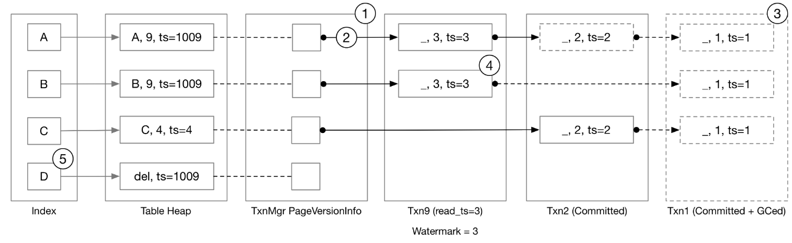
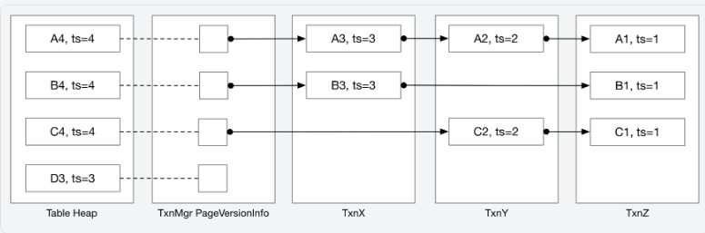
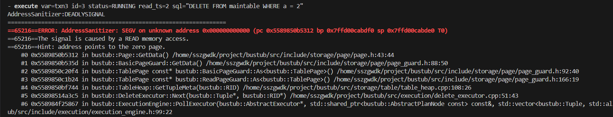
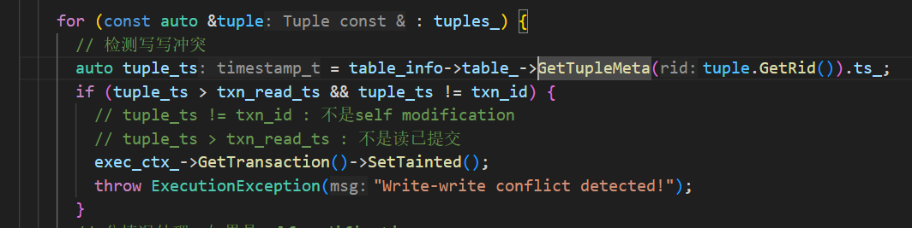
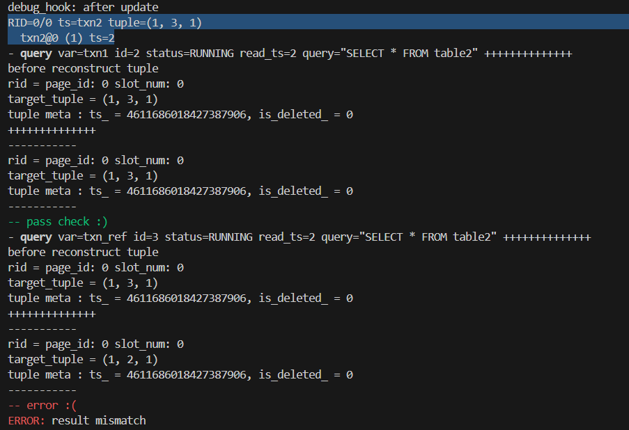
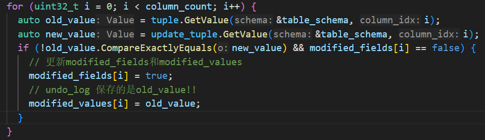

23 fall 的 Bustub 引入了 MVCC（多版本并发控制），采用 Hyper MVCC 的方法，即使用类似增量表（delta table）的结构，利用 undo logs（撤销日志）和 Version Chain（版本链）实现并发控制。

Project4 的正确性基于 P1 和 P2，不基于 P3，因为会基于 MVCC 重写 P3 的许多算子。要求至少为事务实现 SNAPSHOT ISOLATION（快照隔离）级别，奖励任务2会要求实现 SERIALIZABLE（可串行化）隔离级别。

## Bustub中的Hyper MVCC结构

​​

在Bustub中，最新的 Tuple 数据存储在 Table Heap 当中，而旧版本的数据都以撤销日志 undo log 的形式存在各个事务的本地缓冲区中，事务管理器（TxnManager）维护了每个 Tuple 的第一个撤销日志的链接（Versionlink）。对于一个 Tuple 来说，它的 Versionlink + 所有 undo logs 构成了它的版本链。

## Task#1：时间戳

BusTub中所有事务都被分配两个时间戳：

1. read timestamp
2. commit timestamp

当事务开始时，将为它分配一个read timestamp，它等于最新提交事务的commit timestamp。在事务提交时，将为其分配一个单调递增的commit timestamp。read timestamp确定事务可以读取哪些数据，commit timestamp确定事务的序列化顺序。

### 1.1 Timestamp Allocation

这部分实现时间戳的分配，一个是在`TransactionManager::Begin`​中设置一个事务的`read_ts_`​，一个是在`TransactionManager::Commit`​中设置事务的`commit_ts_`​，并为`last_commit_ts_`​加 1。两个任务都很简单，需要了解 C++ 原子变量`atomic`​的使用即可。

### 1.2 Watermark

这个任务要求以 O(logN) 或 O(1) 时间复杂度的算法，维护当前运行事务中的最小`read_ts`​。我没想到 O(1) 的算法，主要在 Remove 时需要找到现存的次小的 read_ts，感觉难以实现 O(1)。

所以我采用了 O(logN) 的方法，使用一个map来统计和排序。

> 回过头来看发现了一个可能的优化方法，在`TransactionManager`​和测试代码中，调用`Watermark::AddTxn(timestamp_t read_ts)`​的参数是递增的，也就是不用考虑在AddTxn中排序，直接用一个队列就可以存储这些read_ts，且能够保证单调递增，只需要用一个`unordered_map`​维护出现次数。在Remove的逻辑中，当某个timestamp的次数减为0时打上懒标记，每次检查队头的ts是否有效，无效则pop直到出现有效的ts，watermark始终是队头的有效read_ts。

## Task#2：Storage Format and Sequential Scan

如上面所说，Bustub在三个地方存储事务数据：table heap、transaction manager 和每个 transaction 内部。

table heap总是包含最新更新的数据，transaction manager中`PageVersionInfo`​存储指向最新的 undolog 的指针，在每个事务的本地缓冲区中，以 undolog 的格式存储事务修改的元组。

若要在给定的读取时间戳处检索元组，需要 （1） 获取给定时间戳之后发生的所有修改（又称撤消日志 undo logs），以及 （2） 将修改（undo logs）应用于最新版本的元组，以恢复元组的过去版本。

​​

### ReconstructTuple

​`ReconstructTuple`​即利用最新的 Tuple 和 undo_logs，恢复出旧版本的 Tuple。它获取存储在table heap中的`base_tuple`​和`base_meta`​，以及按添加到系统的时间降序排列的撤消日志列表`undo_logs`​。

​`ReconstructTuple`​始终将提供的所有修改（undo_logs）应用于函数，而无需查看元数据或撤消日志中的时间戳。它不需要访问函数参数列表中提供的数据以外的数据。

```c++
struct UndoLog {
  /* Whether this log is a deletion marker */
  bool is_deleted_;
  /* The fields modified by this undo log */
  std::vector<bool> modified_fields_;
  /* The modified fields */
  Tuple tuple_;
  /* Timestamp of this undo log */
  timestamp_t ts_{INVALID_TS};
  /* Undo log prev version */
  UndoLink prev_version_{};
};
struct UndoLink {
  /* Previous version can be found in which txn */
  txn_id_t prev_txn_{INVALID_TXN_ID};
  /* The log index of the previous version in `prev_txn_` */
  int prev_log_idx_{0};

  friend auto operator==(const UndoLink &a, const UndoLink &b) {
    return a.prev_txn_ == b.prev_txn_ && a.prev_log_idx_ == b.prev_log_idx_;
  }

  friend auto operator!=(const UndoLink &a, const UndoLink &b) { return !(a == b); }

  /* Checks if the undo link points to something. */
  auto IsValid() const -> bool { return prev_txn_ != INVALID_TXN_ID; }
};
```

undo log中保存了一个部分更新，`modified_fields_`​是一个长度与表 schema 相等的 bool 向量，若某个 field 为 true，表明对这一列进行了更新。`tuple_`​存储了部分tuple，若要从元组中检索值，可能需要基于 table schema 和修改后的字段构造元组的**部分schema**。时间戳是此撤消日志对应的读取时间戳。我们还存储了指向下一个撤消日志的链接`prev_version_`​，如果这是链中的最后一个撤消日志，则 TxnId 将设置为 INVALID_TXN。

​`ReconstructTuple`​的实现流程如下：

1. 从`base_tuple`​中获取每一列的最新的 value，从`base_meta`​中获取当前的`is_deleted`​；
2. 遍历 undo_logs：

    1. 更新`is_deleted`​
    2. 根据`modified_fields_`​和 table schema 构造部分 schema（利用`Schema::CopySchema`​）
    3. 利用 undo_log 的`tuple_`​和上一步得到的部分 schema，为需要更新的列重新赋值
3. 检验`is_deleted`​，如果为 true，返回`std::nullopt`​，否则返回重构后的Tuple

最终返回结果是否存在，取决于最后一个 undo_log 的`is_deleted_`​，若 undo_log 为空，则取决于 base_meta 的`is_deleted_`​

### Sequential Scan / Tuple Retrieval

修改project3中实现的 seqscan 算子，根据当前事务的 read_ts 和对应 tuple 的版本链，获取 undo_logs，对 table heap 中最新的 tuple 进行重构。

1. 首先判定 TableHeap 中的 tuple 是否可以直接使用，满足下面两个条件之一：

    1. tuple的时间戳与当前事务临时时间戳相等
    2. tuple的时间戳 <= 当前事务的读时间戳
2. 若不能直接使用，则需要从 UndoLogs 中重构`Reconstruct`​

    1. 先获取对应 tuple 到第一个 undo log 的 undo link，如果 undo link 为空说明当前事务读不到该 tuple
    2. 如果不为空则获取**所有满足ts &gt; read_ts的undo_log，以及一个满足ts &lt;= read_ts的undo_log**​
    3. 如果不存在最后一个满足ts <= read_ts的undo_log，则说明读不到这个tuple，跳过
    4. 调用上一个任务实现的`ReconstructTuple`​进行重构
3. 接下来的逻辑与之前 seqscan 相同

## Task#3：MVCC Executors

实现 Insert、delete 和 Update 算子。

### Insert

这一部分同样是修改 p3 实现的插入算子，不过需要增加的内容很少。

1. 调用 table heap 的插入接口时带上事务临时时间戳作为Tuple的元数据
2. 此时没有 undo log，设置 version link 为 null
3. 将 rid 加入事务的 **write set（在 Commit 阶段有用）**

### Commit

> 来自文档：
>
> 同一时间只允许一个事务进入`Commit`​函数，因此要在 transaction manager 使用`commit_mutex_`​。
>
> 在该任务中，您需要扩展`Commit`​的在 transaction manager 中的实现：
>
> 1. 获取`commit_mutex_`​
> 2. 获取提交时间戳（但不要增加上次提交的时间戳，因为在提交完成之前，提交时间戳的内容不会稳定）。
> 3. 遍历此事务更改的所有元组（使用 write set），将基元组的时间戳设置为提交时间戳。您需要在所有修改执行程序（插入、更新、删除）中维护 write set。
> 4. 将事务设置为已提交状态，并更新事务的提交时间戳。
> 5. 更新`last_committed_ts`​.

之前的任务加上已有的代码已经实现了1、2、4、5的步骤，现在只需要实现步骤3，很简单只需要遍历 write set 获取 rid，然后通过 table heap 的接口更新 tuple 的时间戳即可。

### Update

目前我们的 Inser t算子并没有考虑主键索引，table heap 中当原 Tuple 被删除后就一直保留着，插入操作每次都会写入一个新的位置，因此 Update 操作不会遇到当前 tuple 已被删除以及版本链中有删除日志（`is_deleted`​字段为 true）的情况，所以要考虑的情况不怎么复杂。

在获取 update_tuple （更新后的 Tuple）后，执行步骤为：

1. 检测写写冲突：`heap_tuple_ts > txn_read_ts && heap_tuple_ts != txn_id`​

    1. 当前tuple最新时间戳大于事务读时间戳（当前事务读不到最新数据）并且不等于当前事务时间戳（不是self modification）
    2. 检测出冲突后，直接将事务设置为`Tainted`​，并抛出异常
2. 如果不是self modification（`heap_tuple_ts != txn_id`​）

    1. 生成新的undo log，**特别注意这个 undo log 包含的数据都是当前 heap_tuple 中被更新的字段数据（即旧数据），并且时间戳也是**​`heap_tuple_ts`​，而不是当前事务id（要加深对于 undo log 和重构过程的理解）
    2. 将 new undo log 的 prev version 指向当前头部的 undo link
    3. 将 undo link 指向 new undo log
    4. 更新 table heap
3. 如果是 self modification，则要分情况讨论：

    1. 如果 Undo link 不为空，说明不是本事务新插入的，但是本事务已经做了修改，已经生成了一个 undo log，但本次 update 可能又更新了几个新字段，此时原来的 undo log 不再适用，要把新字段的旧数据加入进来（undo log 中原有的数据保留不变）
    2. 如果Undo link为空，说明是本事务新插入的，只需要修改 table_heap 即可
4. 将目标tuple的rid加入write set

### Delete

Delete 算子逻辑是类似的，需要注意的是，delete 操作生成的 undo log 要包含旧数据的所有字段。

> 以上提到的 Update 和 Delete 的逻辑都是较为简单的，因为还没涉及删除标记，目前不会出现 heap_tuple 是删除标记以及 undo log 是删除标记的情况，但是在task4会出现。

### Stop-the-world Garbage Collection

遍历 table_heap 和 version link，记录需要保留的 txn。

由于 bustub 中的 undo log 管理在事务中，所以垃圾回收也以事务为单位，主要步骤如下：

1. 遍历txn_map_的所有事务
2. 遍历当前事务的 write set，从 table heap 中遍历 write set 中的每个记录，如果该事务创建的所有 undo log 均无效，则回收被标记且已提交的事务

## TxnMgrDbg

> 来自文档：
>
> 我们建议您实现 execution_common.cpp 中的`TxnMgrDbg`​函数，用于打印出表堆内容和版本链。我们的测试用例将在每个重要操作后调用你的 debug 函数，你可以打印任何你想要检查版本链的内容。

下面提供一下我的 Debug 函数：

```c++
void TxnMgrDbg(const std::string &info, TransactionManager *txn_mgr, const TableInfo *table_info,
               TableHeap *table_heap) {
  // always use stderr for printing logs...
  fmt::println(stderr, "debug_hook: {}", info);
  // We recommend implementing this function as traversing the table heap and print the version chain. An example output
  // of our reference solution:
  //
  // debug_hook: before verify scan
  // RID=0/0 ts=txn8 tuple=(1, <NULL>, <NULL>)
  //   txn8@0 (2, _, _) ts=1
  // RID=0/1 ts=3 tuple=(3, <NULL>, <NULL>)
  //   txn5@0 <del> ts=2
  //   txn3@0 (4, <NULL>, <NULL>) ts=1
  // RID=0/2 ts=4 <del marker> tuple=(<NULL>, <NULL>, <NULL>)
  //   txn7@0 (5, <NULL>, <NULL>) ts=3
  // RID=0/3 ts=txn6 <del marker> tuple=(<NULL>, <NULL>, <NULL>)
  //   txn6@0 (6, <NULL>, <NULL>) ts=2
  //   txn3@1 (7, _, _) ts=1
  auto tuple_iter = table_heap->MakeIterator();
  while (!tuple_iter.IsEnd()) {
    const auto rid = tuple_iter.GetRID();
    auto tuple_pair = tuple_iter.GetTuple();
    const auto tuple = tuple_pair.second;
    const auto tuple_meta = tuple_pair.first;
    ++tuple_iter;
    // 先打印table_heap中的元组信息
    auto ts = tuple_meta.ts_;
    std::string ts_string;
    if (ts > TXN_START_ID) {
      ts = ts - TXN_START_ID;
      ts_string = fmt::format("txn{}", ts);
    } else {
      ts_string = fmt::format("{}", ts);
    }
    if (tuple_meta.is_deleted_) {
      fmt::println(stderr, "RID={}/{} ts={} <del marker> tuple={}", rid.GetPageId(), rid.GetSlotNum(), ts_string,
                   tuple.ToString(&table_info->schema_));
    } else {
      fmt::println(stderr, "RID={}/{} ts={} tuple={}", rid.GetPageId(), rid.GetSlotNum(), ts_string,
                   tuple.ToString(&table_info->schema_));
    }
    // 打印version chain
    // auto version_link = txn_mgr->GetVersionLink(rid);
    auto undo_link = txn_mgr->GetUndoLink(rid);
    if (undo_link.has_value()) {
      auto link = undo_link.value();
      while (link.IsValid()) {
        // 有可能事务被GC
        auto undo_log_opt = txn_mgr->GetUndoLogOptional(link);
        if (!undo_log_opt.has_value()) {
          break;
        }
        auto undo_log = undo_log_opt.value();
        auto txn_id = link.prev_txn_;
        if (txn_id > TXN_START_ID) {
          txn_id = txn_id - TXN_START_ID;
        }
        if (undo_log.is_deleted_) {
          fmt::print(stderr, "  txn{}@{} <del> ts={}\n", txn_id, link.prev_log_idx_, undo_log.ts_);
        } else {
          // 构建Undolog的tuple schema
          std::vector<uint32_t> modified_cols;
          for (uint32_t i = 0; i < undo_log.modified_fields_.size(); ++i) {
            if (undo_log.modified_fields_[i]) {
              modified_cols.push_back(i);
            }
          }
          Schema undo_schema = Schema::CopySchema(&table_info->schema_, modified_cols);
          fmt::print(stderr, "  txn{}@{} {} ts={}\n", txn_id, link.prev_log_idx_,
                     undo_log.tuple_.ToString(&undo_schema), undo_log.ts_);
        }
        link = undo_log.prev_version_;
      }
    }
  }
}
```

‍

## Task3问题汇总

### GetTupleMeta出错

​​

​​

> 感觉这是一个巨坑！

在插入算子中，调用`auto new_rid = table_info->table_->InsertTuple(TupleMeta{transaction_tmp_ts_, false}, todo_tuple);`​**不会把**​`new_rid`​**存到 todo_tuple 当中去，所以不能通过**​`tuple.GetRid()`​获取 Tuple 的 Rid。

所以在其他算子中，例如 seqScan 算子，得到的 tuple 的 rid 都是空的。进而到 delete 算子、update算子中如果通过`tuple->GetRid()`​访问 table_heap_，会造成空指针访问。

解决方法：在 seqScan 算子中返回 tuple 和 rid 时，`tuple->SetRid(rid)`​。

### Update 生成的 undo log 与预期不符

​​

原因：在 self_modification 的情况下，当构造新的 undo log 时，应该保持 undo log 原有的数据不被修改，当列值有所更新时，不一定要更新数据，因为可能之前已经更新了，已经保存了原始的旧数据。

解决：此时要检查`modified_fields[i]`​，如果之前没有更新，再在undo_log中记录。即：

​`if (!old_value.CompareExactlyEquals(new_value) && modified_fields[i] == false)`​

​​

## Task#4：Primary Key Index

BusTub 支持主键索引，可以通过以下方式创建主键索引:

```
CREATE TABLE t1(v1 int PRIMARY KEY);
CREATE TABLE t1(v1 int, v2 int, PRIMARY KEY(v1, v2));
```

当一个 table 创建时指定了主键，bustub会自动创建一个索引（`is_primary_key`​为true）。一个表最多有一个主键索引。主键索引确保主键的唯一性。在此任务中需要处理算子中的主键索引。测试案例中不会通过`CREATE INDEX`​创建二级索引，因此在该任务中不需要维护二级索引。

### Index Scan

此时无需实现 MVCC Index Scan 算子。这适用于任务 4.2 及之后的任务。测试用例将使用范围查询而不是相等查询，以避免调用 IndexScan 算子，以便在实现 4.1 时不会将顺序扫描转换为索引扫描。

### 4.1 Inserts

文档里面写得很详细：

您将需要修改插入执行程序以正确处理主键索引。同时，您还需要考虑多个事务在多个线程中插入同一主键的情况。可以使用索引进行插入，请执行以下步骤：

1. 首先检查 tuple 是否已经在索引中存在（通过索引的`ScanKey`​接口查询），如果存在，终止当前事务

    1. 这仅适用于 4.1。如果要实现 4.2，则索引可能指向已删除的元组，在这种情况下，不应中止。
    2. 你只需要将事务状态设置为`TAINTED`​。`TAINTED`​表示事务即将中止，但数据尚未清理。您不需要实现实际的 Abort 过程。受污染的事务会在表堆中留下一些元组，您不需要清理它。当另一个事务插入到同一位置并检测到写入冲突时，由于元组未被清理，因此仍应将其视为冲突。
    3. 设置事务状态之后，你还需要抛出一个 ExecutionException。
2. 在 table heap 创建一个tuple（时间戳为 txn_id）
3. 之后，将元组插入索引中。如果违反唯一键约束，则哈希索引应返回 false（通过索引的`InsertEntry`​接口检测冲突）。在（1）和（3）之间，其他事务可能正在执行相同的操作，并且在当前事务创建新条目之前，会在索引中创建一个新条目。在这种情况下，您将需要中止事务，并且表堆中将有一个元组，该元组不被索引中的任何条目指向。

其他环节与 Task3 中保持不变。

完成 4.1 及之前的所有任务已经能够获得 80 分了，此时只有一个并发插入的测试用例。后续的任务需要再次重构算子，难度较大，内容较多，我将在下一篇文章中整理当时实现的思路和遇到的问题。

‍
