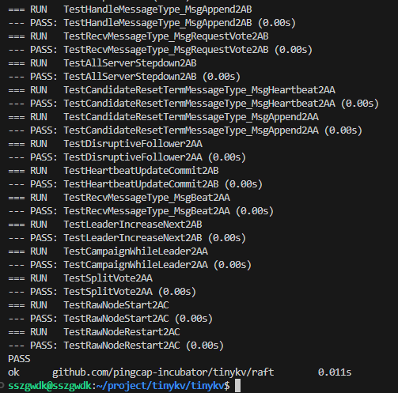

project2需要实现一个基于raft算法的高可用kv服务器。根据文档，有三部分需要完成，包括：

* A：实现基本的 Raft 算法
* B：在 Raft 之上构建容错 KV 服务器
* C：新增 raftlog GC 和 snapshot 支持

Project2A主要任务是实现Raft算法。

## 准备工作

非常建议先阅读一遍raft论文再来做project2A，不然在很多概念的理解上都会很吃力。一个非常有帮助的链接：

[Raft Consensus Algorithm](https://raft.github.io/)

‍

## aa选举和ab日志复制

这一部分主要实现Raft层进行共识（实现一致性）的逻辑，主要代码在`raft/log.go`​和`raft/raft.go`​当中。

### Raft和RaftLog类定义

如题目中所说，`raft.Raft`​提供了 Raft 算法的核心，包括消息处理、驱动逻辑时钟等。

Raft类定义解析如下：

* id：节点id
* Term：任期
* Vote：当前任期投票给了谁
* RaftLog：缓存日志条目
* Prs：用于leader维护各节点日志复制的进度（Match代表已经匹配的Index，Next代表即将发送的下一个Index）
* State：节点状态
* votes：记录投票信息
* msgs：需要发送的消息，消息分本地消息（本节点处理）和普通消息
* Lead：只想当前的leader
* heartbeatTimeout：心跳超时
* electionTimeout：选举超时
* heartbeatElapsed：记录距上次心跳超时经过的时间，用于判断是否心跳超时
* electionElapsed：记录，用于判断是否选举超时
* leadTransferee、PendingConfIndex：在3A领导权转移和配置变更中使用，此处忽略

结合Raft算法的要求，我增加了以下成员：

1. randElectTimeout：随机选举超时，必需，减少选举失败。
2. voteCount：当前票数，不必需
3. denialCount：当前拒绝投票数，不必需，方便统计

‍

​`raft.RaftLog`​是一个辅助结构体，主要用于raft节点缓存日志条目，通过`raft/storage.go`​中定义的`Storage`​接口与上层应用进行交互，能够获取日志条目和快照等持久化数据。

RaftLog类定义解析如下：

* storage：存储了自从上次快照以来的所有stable的日志条目，stable指已经持久化了。storage中还提供了获取初始状态、FirstIndex、LastIndex等信息的接口，初始化需要用到。
* applied、committed、stabled是非常重要的三个索引：分别代表已应用的、已提交的、已持久化的日志条目的最大索引，所有的日志条目的索引有如下关系：

  ```go
  //  snapshot/first.....applied....committed....stabled.....last
  //  --------|------------------------------------------------|
  //                            log entries
  //
  ```
* entries：所有还未compact的日志条目，这里compact的含义暂时忽略。
* pendingSnapshot：在2C中使用，暂时忽略。

参考代码中storage具有一个dummy entry的设计（题目也有说明：默认第一次启动raft时应具有条目 0），为RaftLog增加一个成员：

* dummyIndex：第一个日志的索引，用于方便计算下标位置

### 原理和数据处理流程

上面提到的日志条目实际上是代表某个操作的条目（例如`put、get`​等），tinykv首先要对这些操作的条目利用raft算法进行共识，只有在集群内大多数节点“接受”了某个操作，这个操作才会被“应用”到存储引擎中进行实际的数据操作。Raft模块就是维护集群在这些操作条目上的一致性，进而上层应用可以执行相同的操作，实现数据一致性。

如题目所述，Raft模块的处理流程都是由上层应用通过调用`RawNode`​（RawNode是对Raft的封装）的各个接口来异步推进的。

1. 上层应用负责通过调用`RawNode.Tick()`​来推进Raft节点的逻辑时钟，从而推进选举和leader发送心跳。
2. 上层应用通过调用`RawNode.Step()`​来推动Raft节点处理消息，Raft节点只需要把消息推送到`raft.Raft.msgs`​中，在`raft.Raft.Step()`​中实现消息处理的逻辑。
3. 上层应用通过调用`RawNode.Propose()`​向raft节点发送新的日志条目。
4. 通过`RawNode.Ready()`​来获取raft节点的各项状态更新，据此进行消息转发、持久化、实际数据操作等。
5. 通过`RawNode.Advance()`​来更新raft节点的内部状态，如应用的索引、稳定日志索引等。
6. 。。。

在project2A中，我们只需要理解：

上层的 RawNode 会定时调用 `tick()`​，驱动 Raft，同时如果有消息，则通过 `Step()`​ 函数传递给 Raft。然后 Raft 进行一系列的处理。将需要发送给其他节点的消息存放在 `r.msgs`​ 中，RawNode 会在生成 Ready 的时候取走并发送给别的节点。整个流程是线性的，`Tick()`​ 和`Step()`​ 不会被同时触发，这里不存在多线程的情况。

因此在2aa和2ab中，主要需要完成：

1. 针对`tick()`​的处理，即推进选举和leader发送心跳消息`heartbeatMsg`​等
2. 针对`Step()`​的处理，即消息处理，按照raft算法对各种类型的消息执行相应的动作，这些消息包含本地的消息、其他节点的消息、上层发来的propose消息等。
3. 辅助结构`RaftLog`​模块

### RaftLog模块

首先是`newLog`​，根据参数，需要从`storage`​中获取数据来进行初始化动作。由于`storage`​中保存的是所有已经持久化但是未被应用的日志条目，因此`applied = firstIndex - 1`​，`stabled = lastIndex`​。`storage`​中保存的`hardState`​保存了`Term、Vote、Commit`​三个信息，前两个用于Raft初始化，`Commit`​用来初始化`RaftLog.committed`​。获取`entries`​的方式也很简单，`storage`​提供了`Entries`​接口，因此可以通过调用`Entries(firstIndex, lastIndex+1)`​获取。

```go
func newLog(storage Storage) *RaftLog {
  // Your Code Here (2A).
  firstIndex, _ := storage.FirstIndex()
  lastIndex, _ := storage.LastIndex()
  hardState, _, _ := storage.InitialState()
  entries := make([]pb.Entry, 0)
  if firstIndex <= lastIndex {
    entries, _ = storage.Entries(firstIndex, lastIndex+1)
    if entries == nil {
      entries = make([]pb.Entry, 0)
    }
  }

  log := &RaftLog{
    storage:         storage,
    committed:       hardState.Commit,
    applied:         firstIndex - 1, // 对applied进行修正
    stabled:         lastIndex,
    entries:         entries,
    pendingSnapshot: nil,
    dummyIndex:      firstIndex,
  }
  return log
}
```

#### 其余函数

​`unstableEntries`​：所有未持久化的日志，字面意思处理即可

​`nextEnts`​：所有已经提交但没有应用的日志`(applied, committed]`​

​`lastIndex`​：最后一个条目的索引

​`Term`​：获取指定索引的日志条目的term，注意要返回`ErrUnavailable`​错误，如果不在[firstIndex, lastIndex]，调用`storage.Term`​即可

> 这一部分代码编写要十分注意几个Index的细节处理和条件判断，否则容易出现越界等错误。

### Raft模块

#### newRaft

```go
// newRaft return a raft peer with the given config
func newRaft(c *Config) *Raft {
  if err := c.validate(); err != nil {
    panic(err.Error())
  }
  // Your Code Here (2A).
  return nil
}
```

参数`Config`​提供了初始化所需的数据。值得注意的是`Storage`​，需要用它新建`RaftLog`​，获取`Term`​、`Vote`​等状态数据。另外，`c.peers`​有时会为空，这时也需要通过`Storage.InitialState()`​获取。节点初始身份为`follower`​。

#### tick()

```go
func (r *Raft) tick() {
  // Your Code Here (2A).
  switch r.State {
  case StateFollower:
    r.tickFollower()
  case StateCandidate:
    r.tickCandidate()
  case StateLeader:
    r.tickLeader()
  }
}
```

逻辑时钟推进时，根据当前节点的身份状态选择下一步的处理。

对于`Follower`​和`Candidate`​，tick的作用是推进选举超时，如果一旦发现超时，首先清零选举超时，然后发起选举。这里发起选举是通过`Step()`​处理一个本地消息`MessageType_MsgHup`​触发的，后面会提到。

```go
func (r *Raft) tickFollower() {
  r.electionElapsed += 1
  if r.electionElapsed >= r.randElectTimeout {
    r.electionElapsed = 0
    r.Step(pb.Message{From: r.id, To: r.id, MsgType: pb.MessageType_MsgHup})
  }
}

func (r *Raft) tickCandidate() {
  r.electionElapsed += 1
  if r.electionElapsed >= r.randElectTimeout {
    r.electionElapsed = 0
    r.Step(pb.Message{From: r.id, To: r.id, MsgType: pb.MessageType_MsgHup})
  }
}
```

而对于`Leader`​，tick的作用是触发心跳超时。如果发现超时，同样清零以后再广播心跳给其他节点`BroadCastHeartBeat`​，这里广播心跳也是通过`Step()`​处理一个本地消息`MessageType_HeartBeat`​触发的。

```go
func (r *Raft) tickLeader() {
  r.heartbeatElapsed += 1
  if r.heartbeatElapsed >= r.heartbeatTimeout {
    r.heartbeatElapsed = 0
    r.Step(pb.Message{From: r.id, To: r.id, MsgType: pb.MessageType_MsgBeat})
  }
}
```

#### 身份转换becomexxx

根据Raft算法，节点有三个身份状态：`follower`​、`candidate`​、`leader`​。一个顺利的选举流程的身份转换过程通常是：`follower->candidate->leader`​，其余情况大多都是切换回`follower`​。

在身份转换时要对raft节点的一些数据进行更改。

对于`becomefollower`​，需要更新`Vote`​、`State`​、`Term`​、`Lead`​，清空`votes`​、`leadTransferee`​，重置两个超时时间，最后随机化选举超时。

```go
// becomeFollower transform this peer's state to Follower
func (r *Raft) becomeFollower(term uint64, lead uint64) {
  // Your Code Here (2A).
  if term > r.Term {
    r.Vote = None
  }
  r.State = StateFollower
  r.Term = term
  r.Lead = lead
  r.votes = nil
  r.voteCount = 0
  r.denialCount = 0
  r.leadTransferee = None
  // reset
  r.heartbeatElapsed = 0
  r.electionElapsed = 0
  r.randElectTimeout = r.electionTimeout + rand.Intn(r.electionTimeout)
}
```

对于`becomeCandidate`​，根据Raft算法，要自增`Term`​，然后先投票给自己（如果当前集群只有一个节点，直接`becomeLeader`​）。也要重置超时，随机化选举超时。

对于`becomeLeader`​，可以看到注释里面提示：`// NOTE: Leader should propose a noop entry on its term`​，即需要向其他节点发送一条空条目，这是为了更新`Prs`​（Match代表已经匹配的Index，Next代表即将发送的下一个Index），来获取`follower`​的进度。

### step()消息处理

```go
func (r *Raft) Step(m pb.Message) error {
  // Your Code Here (2A).
  // node is not in cluster or has been removed
  switch r.State {
  case StateFollower:
    return r.stepFollower(m)
  case StateCandidate:
    return r.stepCandidate(m)
  case StateLeader:
    return r.stepLeader(m)
  }
  return nil
}

func (r *Raft) stepFollower(m pb.Message) error {
  switch m.MsgType {
  case pb.MessageType_MsgHup:
    r.handleHup()
  case pb.MessageType_MsgPropose:
    return ErrProposalDropped
  case pb.MessageType_MsgAppend:
    r.handleAppendEntries(m)
  case pb.MessageType_MsgRequestVote:
    r.handleRequestVote(m)
  case pb.MessageType_MsgSnapshot:
    r.handleSnapshot(m)
  case pb.MessageType_MsgHeartbeat:
    r.handleHeartbeat(m)
  case pb.MessageType_MsgTransferLeader:
    r.handleTransferLeader(m)
  case pb.MessageType_MsgTimeoutNow:
    r.handleHup()
  }
  return nil
}
...
```

​`Step`​结合当前节点身份状态`r.State`​和消息类型`MsgType`​选择要执行的动作。**这部分是实现Raft层的重点**，首先要理解各个Msg的作用以及含义。

文档中提到，对于一个Raft节点来说，Msg分本地消息和普通消息，其中普通消息是要发给其他节点的，要放到`r.msgs`​中供上层异步地取用；本地消息是本地发起的，因此套个`Step()`​直接进行消息处理。之前在`tick()`​中发起的就是本地消息`MsgHup`​和`MsgBeat`​

Raft 通过一个`Message`​结构体包含了所有种类的msg，所以其字段对于某一种msg会存在富余的情况，所以要结合raft算法来确定某一种msg设置了哪些字段，以及各个字段的作用是什么。

```go
type Message struct {
  MsgType              MessageType `protobuf:"varint,1,opt,name=msg_type,json=msgType,proto3,enum=eraftpb.MessageType" json:"msg_type,omitempty"`
  To                   uint64      `protobuf:"varint,2,opt,name=to,proto3" json:"to,omitempty"`
  From                 uint64      `protobuf:"varint,3,opt,name=from,proto3" json:"from,omitempty"`
  Term                 uint64      `protobuf:"varint,4,opt,name=term,proto3" json:"term,omitempty"`
  LogTerm              uint64      `protobuf:"varint,5,opt,name=log_term,json=logTerm,proto3" json:"log_term,omitempty"`
  Index                uint64      `protobuf:"varint,6,opt,name=index,proto3" json:"index,omitempty"`
  Entries              []*Entry    `protobuf:"bytes,7,rep,name=entries" json:"entries,omitempty"`
  Commit               uint64      `protobuf:"varint,8,opt,name=commit,proto3" json:"commit,omitempty"`
  Snapshot             *Snapshot   `protobuf:"bytes,9,opt,name=snapshot" json:"snapshot,omitempty"`
  Reject               bool        `protobuf:"varint,10,opt,name=reject,proto3" json:"reject,omitempty"`
  XXX_NoUnkeyedLiteral struct{}    `json:"-"`
  XXX_unrecognized     []byte      `json:"-"`
  XXX_sizecache        int32       `json:"-"`
}
```

tinykv中Raft的所有消息类型如下：

```go
var MessageType_name = map[int32]string{
  0:  "MsgHup",
  1:  "MsgBeat",
  2:  "MsgPropose",
  3:  "MsgAppend",
  4:  "MsgAppendResponse",
  5:  "MsgRequestVote",
  6:  "MsgRequestVoteResponse",
  7:  "MsgSnapshot",
  8:  "MsgHeartbeat",
  9:  "MsgHeartbeatResponse",
  11: "MsgTransferLeader",
  12: "MsgTimeoutNow",
}
```

以下列表汇总了所有消息类型的描述、有效字段，以及哪些身份状态需要处理该类型的消息：

|Name|描述|有效字段|follower|candidate|leader|
| ------------------------| -------------------------------------------------------------------------------------| -----------------------------------------------------------------------------------| ----------| -----------| --------|
|MsgHup|本地消息，发起选举|MsgType<br />|✔|✔||
|MsgBeat|本地消息，Leader广播心跳，用于检查follower进度和避免新的选举|MsgType|||✔|
|MsgPropose|本地消息，来自上层应用的Propose请求。只有Leader实际处理，其他都返回`ErrProposalDropped`​|MsgType Entries To|✔|✔|✔|
|MsgAppend|用于Leader向其他节点同步数据，即日志复制。|MsgType Index Term LogTerm Entries Commit To From|✔|✔|✔|
|MsgAppendResponse|用于回复收到的 `MessageType_MsgAppend`​ 和 `MessageType_MsgSnapshot`​。Leader据此更新Match和Next等记录|MsgType Index Term Reject To From|||✔|
|MsgRequestVote|candidate发送的投票请求|MsgType Index Term LogTerm To From|✔|✔|✔|
|MsgRequestVoteResponse|投票响应|MsgType Term Reject To From||✔||
|MsgSnapshot|project2c，当 Leader 发现目标节点所需的日志已经被 compact 的时候，则发送 Snapshot。|MsgType Term Snapshot To From|✔|✔|✔|
|MsgHeartbeat|来自Leader的心跳消息|MsgType Term To From|✔|||
|MsgHeartbeatResponse|心跳响应，包含当前follower的Commit索引，Leader据此判断它的进度|MsgType Term Commit To From Reject|||✔|
|MsgTransferLeader|本地消息，领导权转移，Project3A|MsgType From|✔|✔|✔|
|MsgTimeoutNow|目标节点收到该消息，即刻自增 term 发起选举|MsgType From To<br />|✔|✔||

下面分为领导人选举和日志复制两个部分分别介绍这些消息的处理逻辑。

### 领导人选举

#### handleHup

首先，`follower`​和`candidate`​选举超时都会触发`MsgHup`​，用于直接发起选举。`handleHup`的处理逻辑如下：

1. 判断能否进行选举：

    1. 判断自己是否在当前的 Prs 里面。因为自己可能已经被移除（Project3 涉及）。
    2. 判断是否有 pendingSnapshot。如果正在 applying snapshot，则不要发起选举，因为一定是其他的 leader 发给你 snapshot，如果你发起选举，你的 term+1 必定大于现有的 leader，这会造成集群的不稳定。
2. ​`becomeCandidate`​
3. 向其他所有节点发送投票请求`MsgRequestVote`​

#### handleRequestVote

​`follower`​、`candidate`​、`leader`​都有可能收到投票请求。在Raft论文中，为了避免已经提交的日志被覆盖保障一致性，除了最基本的任期条件，还增加了一个选举限制条件，即日志的新旧条件，具体可以再看一下论文中的描述。`handleRequestVote`的处理逻辑如下：

1. 如果任期比自己大，becomeFollower**（此时不一定投票给他）**
2. 如果任期没自己大，拒绝
3. 如果当前任期已经投票了，且不是他，拒绝
4. 如果日志比自己旧（比较最后一个条目的Term和Index，先比较Term，相等的情况下再比较Index），拒绝，否则`becomefollower`​并且投票给他

#### handleRequestVoteResponse

candidate收到投票响应后：

1. 如果任期比自己大，becomeFollower，此时直接返回
2. 根据`Reject`​更新`r.votes、r.voteCount、r.denialCount`​
3. 如果`r.voteCount`​超过半数，直接`becomeLeader`​，选举成功；`r.denialCount`​同理，如果超过半数，直接`becomeFollower`​，选举失败。

> 注意，不能直接`r.voteCount++`​和`r.denialCount++`​记录票数，而要通过遍历`r.votes`​，因为后面3B的测试中会出现重复的响应，会出现一直选举不出来的情况。

### 日志复制

节点成为Leader后，会不断向其他节点发送心跳来维持自己的地位，并通过心跳响应来了解其他节点的日志提交的进度，进而决定是否需要同步日志给他。

#### handleBeat

直接广播heartbeat

```go
func (r *Raft) handleBroadcastHeartBeat() {
  for peer := range r.Prs {
    if peer == r.id {
      continue
    }
    r.sendHeartbeat(peer)
  }
}
```

#### handleHeartbeat

只要根据`Term`决定是否`Reject`​，返回的响应中要附带`Commit`​，方便Leader收到后进行日志同步

#### handleHeartbeatResponse

leader在收到心跳响应后

1. 判断返回的Term是否大于当前Term，如果是则`becomeFollower`​直接返回
2. 根据follower的`Commit`​信息和leader中记录的`Match`​，判断leader是否需要同步日志给他

```go
func (r *Raft) handleHeartBeatResponse(m pb.Message) {
  if m.Term > r.Term {
    r.becomeFollower(m.Term, None)
    return
  }
  // if it doesn't have update-to-date log
  if m.Commit < r.RaftLog.committed || r.Prs[m.From].Match < r.RaftLog.LastIndex() {
    r.sendAppend(m.From)
  }
}
```

节点成为Leader后，上层应用会发送日志条目给他，即`MsgPropose`​，他需要将这些条目加入到自己的`RaftLog`​当中，然后同步给其他节点。

#### handlePropose

只有leader处理，如果不是leader，直接返回`ErrPorosalDropped`​。

1. 判断`r.leadTransferee`​，如果正在进行领导权转移，不能接受propose，直接返回`ErrPorosalDropped`​（Project3A）
2. 将propose消息中的`Entries`​加入到`r.RaftLog`​中
3. 广播Append消息给其他节点，即**日志复制**
4. 尝试更新Commit，`tryUpdateCommit`​

#### sendAppend的实现

​`sendAppend(to)`​即发送`MsgAppend`​给节点to，有许多值得注意的地方，各字段赋值如下：

```go
  msg := pb.Message{
    MsgType: pb.MessageType_MsgAppend,
    To:      to,
    From:    r.id,
    Term:    r.Term,
    LogTerm: preLogTerm,
    Index:   preLogIndex,
    Entries: sendEntreis,
    Commit:  r.RaftLog.committed,
  }
```

其中`LogTerm、Index`​分别代表论文中的`preLogTerm、preLogIndex`​（`preLogTerm = Term(Next-1)、preLogIndex = Next-1`​），是进行日志匹配的关键项，根据论文中的定理，如果在next-1的位置处匹配（即Term相同），代表之前的所有日志都匹配，就可以放心地接收`Next`​往后的所有条目了。

​`Commit`​的作用如上所述是让其他节点也能更新自己的`committed`​。

> 在project2C中，当Leader找不到`preLogIndex`​对应的日志条目时，代表它已经被Compact掉了，也代表节点to落后自己太多了，此时不再发送append消息，而是发送一个Snapshot给它。

#### tryUpdateCommit的实现

Leader需要根据集群所有节点的进度更新自己的Commit同时推进其他节点的Commit，日志的提交需要满足“大多数”的条件，只有当日志被提交以后才能被上层实际应用。

根据Raft算法， 我们取所有`Match`​的中位数，如果有更新，则广播给其他节点。

```go
func (r *Raft) tryUpdateCommit() {
  if len(r.Prs) == 1 {
    r.RaftLog.committed = r.RaftLog.LastIndex()
    return
  }
  // get all match
  var matches []uint64
  for peer := range r.Prs {
    if peer == r.id {
      continue
    }
    matches = append(matches, r.Prs[peer].Match)
  }
  sort.Sort(UInt64Slice(matches))

  // get mid
  midIndex := matches[len(matches)/2]
  midTerm, _ := r.RaftLog.Term(midIndex)
  // if mid > commit, update commit
  if midIndex > r.RaftLog.committed && midTerm == r.Term {
    r.RaftLog.committed = midIndex
    // send append to all peers
    r.bcastAppend()
  }
}
```

#### handleAppendEntries

这部分是实现日志复制的核心，有很多需要注意的细节。

我的实现步骤如下：

1. 如果比当前任期小，直接返回拒绝
2. becomeFollower()
3. 如果`m.Index`​比当前节点的lastIndex要大，说明Next-1 > lastIndex，显然Next要减小一点，于是直接拒绝，返回的响应中 Index = lastIndex + 1，让 Next减小到lastIndex+1（日志复制部分要注意理解`r.Prs`​中`Match`​和`Next`​字段的含义）
4. 如果`r.RaftLog.Term(m.Index)`​与`m.LogTerm`​不相同，说明在`m.Index`​处发生冲突，接下来论文中的原始做法是返回`Index = m.Index`​，从而让Next = `m.Index`​，即Next--。优化做法是返回在`r.RaftLog.Term(m.Index)`​这一任期下该节点的第一条日志的索引`conflictIndex`​，即让Next = `conflictIndex`​，这样能加快日志匹配的速度。
5. 如果上述两种情况都没有发生，说明该节点在`m.Index`​及之前的日志与Leader都是匹配，因此可以“接受”这个Append请求。但是有一种特殊情况需要考虑，就是被append的所有日志条目`m.Entries`​已经在该节点中存在了，这时可能后面还有一些日志条目，因此不能无脑截断然后append，如果没有冲突应当要保留这些多出来的日志。我的做法是首先判断该节点在`m.Index`​往后的日志长度是否大于`len(m.Entries)`​，如果不大于则可以无脑截断然后append，如果大于，则要逐个检查是否与`m.Entries`​中的条目相匹配，满足则不做任何修改，只要一个条目有冲突都直接截断然后append。
6. accept之后，要根据`m.Commit`​对`r.RaftLog.committed`​进行更新，我的做法是`r.RaftLog.committed = min(m.Commit, m.Index+uint64(len(m.Entries)))`​
7. 返回accpet的响应，注意对`Index`​的设置

#### handleAppendResponse

根据Raft算法，当leader收到Reject Append的响应后，要更新`Next`​（回退到某个可能匹配的位置），然后重新`sendAppend`​。

在`MsgAppendResponse m`​中：

1. 若`Reject == true`​，`m.Index`​代表Next需要回退到的位置；
2. 若`Reject == false`​，`m.Index`​代表最新匹配的位置，即新的`Match`​值。

因此，具体处理流程如下：

1. 如果`m.Term`​大于当前任期，Leader直接`becomeFollower`​并返回
2. 如果`m.Reject == true`​，令`r.Prs[m.From].Next = m.Index`​，重新调用`sendAppend`​
3. 如果`m.Reject == false && m.Index > r.Prs[m.From].Match`​，说明该follower接收了新的条目，更新对应的`Match`​和`Next`​，调用`tryUpdateCommit`​尝试提交日志条目。

‍

以上就实现了基本的领导人选举和日志复制，后面的项目还会增加`Snapshot`​、`TransferLeader`​等操作。

### 一些注意点

#### 选举超时随机化

根据raft论文，每次触发选举超时都要对这个超时时间进行随机化，能够有效减少选举冲突的情况发生。我的做法是在`becomexxx`​函数，即节点状态变更的函数中都加入以下代码来进行时间重置和选举超时随机化。

```sh
  r.heartbeatElapsed = 0
  r.electionElapsed = 0
  r.randElectTimeout = r.electionTimeout + rand.Intn(r.electionTimeout)
```

那么如何进行随机化？从哪里知道使用`r.randElectTimeout = r.electionTimeout + rand.Intn(r.electionTimeout)`​，即控制在`[et,2et]`​之间呢？

这是从2AA的测试点`testNonleaderElectionTimeoutRandomized`​中得知的。

```sh
func testNonleaderElectionTimeoutRandomized(t *testing.T, state StateType) {
  et := 10
  r := newTestRaft(1, []uint64{1, 2, 3}, et, 1, NewMemoryStorage())
  timeouts := make(map[int]bool)
  for round := 0; round < 50*et; round++ {
    switch state {
    case StateFollower:
      r.becomeFollower(r.Term+1, 2)
    case StateCandidate:
      r.becomeCandidate()
    }

    time := 0
    for len(r.readMessages()) == 0 {
      r.tick()
      time++
    }
    timeouts[time] = true
  }

  for d := et + 1; d < 2*et; d++ {
    if !timeouts[d] {
      t.Errorf("timeout in %d ticks should happen", d)
    }
  }
}
```

上述测试代码做的事情就是进行足够多次的模拟，验证随机化的选举超时有没有覆盖`[et+1,2et)`​。由此可知随机化的具体标准。

#### 发起选举

在2aa测试点中经常出现集群只有一个节点的情况，因此要对这种情况做特殊处理，使Candidate直接成为leader。

“给其他节点发送投票请求”时要注意附带`Term、LogTerm、Index`​三个字段，其中`LogTerm`​是最大日志的任期，`Index`​是最大日志的索引，其他节点可以通过它们来判断投票发起者的日志是否比自己的新，日志比自己旧那么就投反对票。这样就实现了论文中的“选举限制”，保障了安全性。

#### becomeLeader

​`becomeLeader`​存在一些需要特别注意的特殊处理：

1. 初始化`r.Prs`​，即每个节点的`Progress{Match, Next}`​。之前提到过是用于leader维护各节点日志复制的进度（Match代表已经匹配的Index，Next代表即将发送的下一个Index）。Match初始化为0即可，Next则要初始化为`r.RaftLog.LastIndex() + 1`​，代表后续给其他节点同步日志都先从`Next`​的位置开始，发生冲突再让对应节点的`Next`​回退。

    ```sh
      for _, peer := range r.Prs {
        peer.Match = 0
        peer.Next = r.RaftLog.LastIndex() + 1
      }
    ```
2. 根据文档和代码注释中的提示“`Leader should propose a noop entry on its term`​”，也就是`becomeLeader`​时append一个在Leader任期下的一个空条目，这样做的目的是让所有节点进行一次初始的日志同步操作

#### broadCastAppend

我的raft实现中主要有两处要`broadCastAppend`​，一处是上面提到的`becomeLeader`​，一处是`handlePropose`​（接收来自上层的日志条目）。

在每次`broadCastAppend`​之后都要立即`tryUpdateCommit`​而不等待`AppendResponse`​，这是考虑了单节点这一特殊情况，否则单节点将永远无法更新自己的`committed`​。

#### handleAppendEntries

​`handleAppendEntries`​的实现一定要仔细，注意覆盖所有的条件，注意测试点中提出的要求。

例如，在日志匹配的前提下，对于目标节点超出`preLogIndex`​的日志条目，不能够无脑截断掉。因为这些条目很可能与即将append的条目也是完全匹配的，那么再往后多出来的部分就不能够删除掉而要保留下来，因为本质上没做任何修改。

例如，在日志不匹配的前提下，同样不能对目标节点的日志做任何修改。我一开始为了方便处理，对于目标节点超出`preLogIndex`​的日志条目都直接截断掉，结果很多测试出现问题。

#### 消息处理的幂等性

文档中有这么一句描述：

> Raft RPC是幂等的,收到相同的RPC不会由任何危害.例如，如果追随者收到一个AppendEntries请求，其中包含其日志中已经存在的日志条目，则会忽略新请求中的这些条目。

所以我们在实现各种handle函数时，要经常考虑有重复请求的情况，例如重复的投票，重复的append消息等等。

‍

### 测试问题

2aa和2ab的测试大多数问题都可以靠错误日志发现原因。发生错误时，可以看看测试点的代码，里面可能有一些特殊的要求，对应的修改即可。

我在`testCandidateResetTerm`​遇到过测试卡死，通过输出发现问题原因是处理`Msg_Append`​时逻辑出错，导致日志冲突而`next`​没有发生变化，所以死循环了，一直在sendAppend。

这一部分问题比较多的就是`handleAppendEntries`​，我当时也是改了很多次才形成了最终的这个版本。

‍

## project2ac RawNode Ready

这一部分代码主要在`raft/rawnode.go`​，在理解了具体要求之后实现比较简单。

`RawNode`​是对`Raft`​的一个封装，提供了Raft模块与上层交互的相关函数。

1. ​`Ready()`​：返回一个Ready类型的数据，其中包含了当前Raft节点的状态，上层应用根据Ready中的数据进行持久化、日志条目的应用等操作。
2. ​`HasReady()`​：判断是否有状态更新。
3. ​`Advance(rd Ready)`​：由上层应用处理完某个Ready调用，用来更新Raft节点的一些状态。

首先我们需要考虑`RawNode`​的类定义中除了`Raft`​还需要什么成员。

​`Ready`​类定义如下：

1. ​`*SoftState`​：包含`Lead`​和`RaftState`​
2. ​`pb.HardState`​：包含`Term`​、`Vote`​、`Commit`​
3. ​`Entrise`​：存放还没持久化的所有条目
4. ​`Snapshot`​：存放需要应用的snapshot
5. ​`CommittedEntries`​：存放已经提交但是还没有被应用的日志条目
6. ​`Messages`​：存放raft节点中需要转发的一些消息（RequestVote、AppendEntries等等）

由上面的定义可以得知我们的`HasReady()`​需要对这6种数据进行检查，看是否有更新，后四个都只需要判断有没有即可，前两个则需要观察是否有变化，所以`RawNode`​的定义中要包含`prevSoftState`​和`prevHardState`​。

```go
type RawNode struct {
  Raft *Raft
  // Your Data Here (2A).
  prevSoftState *SoftState
  prevHardState pb.HardState
}
```

​`NewRaftNode`​也很简单。

```go
func NewRawNode(config *Config) (*RawNode, error) {
  // Your Code Here (2A).
  raft := newRaft(config)
  rn := &RawNode{
    Raft: raft,
    prevSoftState: &SoftState{
      Lead:      raft.Lead,
      RaftState: raft.State,
    },
    prevHardState: pb.HardState{
      Term:   raft.Term,
      Vote:   raft.Vote,
      Commit: raft.RaftLog.committed,
    },
  }
  return rn, nil
}
```

​`HasReady()`​检查是否有状态更新；`Ready()`​提取这些更新的状态数据，需要注意的是获取`Raft.msgs`​之后要clear掉，并且骨架代码中已经提供了很多辅助函数，例如`isHardStateEqual`​、`isEmptySnap`​等。

​`Advance()`​需要做的是更新两个索引值`stabled`​和`applied`​，同时`update prevSoftState、prevHardState`​即可。从这个函数可以看出上层对于Ready中的数据处理主要为“持久化”和“应用”两个方面。

‍

最后附上通过的截图（太长了只截取了一部分）

​​