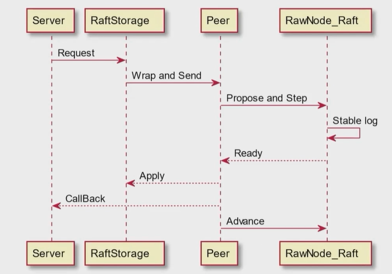
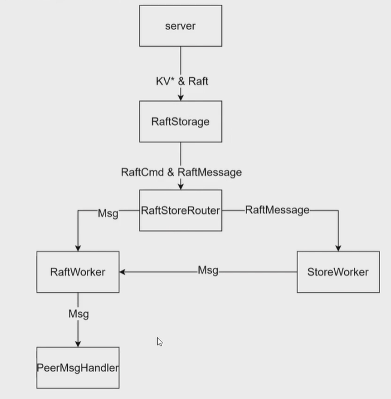

## Request执行流程和调用链分析

梳理tinykv中Request执行流程和调用链有助于理解project2B文档的要求和需要实现的逻辑，推荐看一看Talent Plan学习营分享课的对应部分，里面对Request执行流程分析的很到位。

[Talent Plan 2021 KV 学习营分享课 (pingcap.cn)](https://learn.pingcap.cn/learner/player/510002;id=510002;classroomId=720002;rcoId=630196;courseDetailId=510001;learnerAttemptId=1714889943880)

我这里就照搬一下原视频中的图片。

​​

‍

### 1 Server -> RaftStorage

当一个请求req到达时，首先Server对其进行一层封装传到RaftStorage。

server接口：proto/pkg/tinykvpb/tinykvpb.pb.go

```go
// Server API for TinyKv service
type TinyKvServer interface {
  // KV commands with mvcc/txn supported.
  KvGet(context.Context, *kvrpcpb.GetRequest) (*kvrpcpb.GetResponse, error)
  KvScan(context.Context, *kvrpcpb.ScanRequest) (*kvrpcpb.ScanResponse, error)
  KvPrewrite(context.Context, *kvrpcpb.PrewriteRequest) (*kvrpcpb.PrewriteResponse, error)
  KvCommit(context.Context, *kvrpcpb.CommitRequest) (*kvrpcpb.CommitResponse, error)
  KvCheckTxnStatus(context.Context, *kvrpcpb.CheckTxnStatusRequest) (*kvrpcpb.CheckTxnStatusResponse, error)
  KvBatchRollback(context.Context, *kvrpcpb.BatchRollbackRequest) (*kvrpcpb.BatchRollbackResponse, error)
  KvResolveLock(context.Context, *kvrpcpb.ResolveLockRequest) (*kvrpcpb.ResolveLockResponse, error)
  // RawKV commands.
  RawGet(context.Context, *kvrpcpb.RawGetRequest) (*kvrpcpb.RawGetResponse, error)
  RawPut(context.Context, *kvrpcpb.RawPutRequest) (*kvrpcpb.RawPutResponse, error)
  RawDelete(context.Context, *kvrpcpb.RawDeleteRequest) (*kvrpcpb.RawDeleteResponse, error)
  RawScan(context.Context, *kvrpcpb.RawScanRequest) (*kvrpcpb.RawScanResponse, error)
  // Raft commands (tinykv <-> tinykv).
  Raft(TinyKv_RaftServer) error
  Snapshot(TinyKv_SnapshotServer) error
  // Coprocessor
  Coprocessor(context.Context, *coprocessor.Request) (*coprocessor.Response, error)
}
```

server实现：kv/server/server.go

```go
type Server struct {
  storage storage.Storage

  // (Used in 4B)
  Latches *latches.Latches		// 锁集合，实现多版本并发控制

  // coprocessor API handler, out of course scope
  copHandler *coprocessor.CopHandler
}
```

目前主要需要看Storage，在此处使用的是kv/storage/raft_storage/raft_server.go中实现的`RaftStorage`​。

以它的`Write`​功能为例，首先将`batch`​中的`put、Get、Delete`​抽出来封装在`raft_cmdpb.Request`​中，再添加一些`header`​等打包成一个`RaftCommand`​发送给下层

​`RaftStorage`​就是Project2和Project3中需要实现的代码处理

### 2 RaftStorage -> Peer

RaftStorage定义如下：

```go
type RaftStorage struct {
  engines *engine_util.Engines
  config  *config.Config

  node          *raftstore.Node
  snapManager   *snap.SnapManager
  raftRouter    *raftstore.RaftstoreRouter
  raftSystem    *raftstore.Raftstore
  resolveWorker *worker.Worker
  snapWorker    *worker.Worker

  wg sync.WaitGroup
}

type RaftstoreRouter struct {
  router *router
}

type router struct {
  peers       sync.Map // regionID -> peerState
  peerSender  chan message.Msg
  storeSender chan<- message.Msg
}
```

这里需要注意的是`RaftstoreRouter`​，它是对`router`​的封装。router中有两个channel，都是生产者，作为中心的消息路由。`RaftstoreRouter`​增加了两个意义更加明确的函数`SendTaftMessage`​、`SendRaftCommand`​，用于传递消息给`peer`​。调用`router`​的`send`​接口就会把Msg传递给`peerSender`​这个channel。

以上就是消息生产者的部分，接下来看消费者的部分。

​`Server`​传到`RaftStorage`​的消息分`kv`​和`raft`​，对应`RaftStorage`​封装后分别是`RaftCmd`​和`RaftMessage`​，经过`Rounter`​，`RaftCmd`​会走到`RatfWorker`​（peer层前面专门处理Msg）里面，`RaftMessage`​会给到`StoreWorker`​，它会做一些region上的处理，同时把Msg再送到`RaftWoker`​里面去。

kv/raftstore/raft_worker.go：`raftWorker`​作为消费者，可以看到在初始创建的时候会拿到`router`​的`peerSender`​channel

```go
type raftWorker struct {
  pr *router

  // receiver of messages should sent to raft, including:
  // * raft command from `raftStorage`
  // * raft inner messages from other peers sent by network
  raftCh chan message.Msg
  ctx    *GlobalContext

  closeCh <-chan struct{}
}

func newRaftWorker(ctx *GlobalContext, pm *router) *raftWorker {
  return &raftWorker{
    raftCh: pm.peerSender,
    ctx:    ctx,
    pr:     pm,
  }
}
```

​`raftWorker`​跑起来之后会批量地取`peerSender`​中Msg，取了之后通过当前的PeerState生成`PeerMsgHandler`​来`HandleMsg`​。

```go
func (rw *raftWorker) run(closeCh <-chan struct{}, wg *sync.WaitGroup) {
  defer wg.Done()
  var msgs []message.Msg
  for {
    msgs = msgs[:0]
    select {
    case <-closeCh:
      return
    case msg := <-rw.raftCh:
      msgs = append(msgs, msg)
    }
    pending := len(rw.raftCh)
    for i := 0; i < pending; i++ {
      msgs = append(msgs, <-rw.raftCh)
    }
    peerStateMap := make(map[uint64]*peerState)
    for _, msg := range msgs {
      peerState := rw.getPeerState(peerStateMap, msg.RegionID)
      if peerState == nil {
        continue
      }
      newPeerMsgHandler(peerState.peer, rw.ctx).HandleMsg(msg)
    }
    for _, peerState := range peerStateMap {
      newPeerMsgHandler(peerState.peer, rw.ctx).HandleRaftReady()
    }
  }
}
```

因此消息传递的流程大致如下：

​​

### 3 Peer -> RawNode_Raft

kv/raftstore/peer_msg_handler.go 就是在Project2中主要需要实现的代码文件。我们要实现的第一个func就是`proposeRaftCommand`​。此时由于请求还没走到Raft层，现在需要把它预先丢给Raft层，在经过共识之后才能实际地去应用。

```go
func (d *peerMsgHandler) HandleMsg(msg message.Msg) {
  switch msg.Type {
  case message.MsgTypeRaftMessage:
    raftMsg := msg.Data.(*rspb.RaftMessage)
    if err := d.onRaftMsg(raftMsg); err != nil {
      log.Errorf("%s handle raft message error %v", d.Tag, err)
    }
  case message.MsgTypeRaftCmd:
    raftCMD := msg.Data.(*message.MsgRaftCmd)
    d.proposeRaftCommand(raftCMD.Request, raftCMD.Callback)
  case message.MsgTypeTick:
    d.onTick()
  case message.MsgTypeSplitRegion:
    split := msg.Data.(*message.MsgSplitRegion)
    log.Infof("%s on split with %v", d.Tag, split.SplitKey)
    d.onPrepareSplitRegion(split.RegionEpoch, split.SplitKey, split.Callback)
  case message.MsgTypeRegionApproximateSize:
    d.onApproximateRegionSize(msg.Data.(uint64))
  case message.MsgTypeGcSnap:
    gcSnap := msg.Data.(*message.MsgGCSnap)
    d.onGCSnap(gcSnap.Snaps)
  case message.MsgTypeStart:
    d.startTicker()
  }
}
```

```go
func (d *peerMsgHandler) proposeRaftCommand(msg *raft_cmdpb.RaftCmdRequest, cb *message.Callback) {
  err := d.preProposeRaftCommand(msg)
  if err != nil {
    cb.Done(ErrResp(err))
    return
  }
  // Your Code Here (2B).
}
```

### 4 RawNode_Raft -> Peer

当日志条目被Raft层提交以后，根据`Project2A`​，`Peer`​会通过`RawNode.Ready()`​异步地获取已经被提交的条目进行应用。我们回到刚才kv/raftstore/raft_worker.go中`run`​函数，可以看到在调用`HandleMsg(msg)`​之后，会批量地生成`PeerMsgHandler`​来`HandleRaftReady()`​。

```go
func (rw *raftWorker) run(closeCh <-chan struct{}, wg *sync.WaitGroup) {
  defer wg.Done()
  var msgs []message.Msg
  for {
    msgs = msgs[:0]
    select {
    case <-closeCh:
      return
    case msg := <-rw.raftCh:
      msgs = append(msgs, msg)
    }
    pending := len(rw.raftCh)
    for i := 0; i < pending; i++ {
      msgs = append(msgs, <-rw.raftCh)
    }
    peerStateMap := make(map[uint64]*peerState)
    for _, msg := range msgs {
      peerState := rw.getPeerState(peerStateMap, msg.RegionID)
      if peerState == nil {
        continue
      }
      newPeerMsgHandler(peerState.peer, rw.ctx).HandleMsg(msg)
    }
    for _, peerState := range peerStateMap {
      newPeerMsgHandler(peerState.peer, rw.ctx).HandleRaftReady()
    }
  }
}
```

我们实现的重点就是`HandleRaftReady()`​，这个函数执行的大致逻辑如下：

1. 首先判断有没有Ready，这需要调用Raft层的判断函数`HasReady()`​（raft/rawnode.go），如果没有的话就说明共识还没完成，如果有的话就会进行Apply
2. 如果要进行Apply的话，首先需要保存memory states 到磁盘当中，需要实现`SaveReadyState()`​（kv/raftstore/peer_storage.go），`SaveReadyState`​会做两件事情：

    1. 将当前的Raft日志持久化，把已经Ready，可以Apply的一些状态保存下来
    2. 保存snapshot（2C实现）
3. 接下来就是实际上去进行Apply的逻辑，对kv进行实际的写入读取等操作。
4. 在此之后，我们就可以`Advance`​（raft/rawnode.go）了。这个我们在Project2A已经完成了，`Advance`​做的事情也就是在实际完成Apply之后，Raft层中的节点的`RaftLog`​中的`stable、applied`​进行更新，同时也要更新一下`RaftNode`​中的`prevSoftState`​、`prevHardState`​（用于后续的状态对比`HasReady`​）。

‍

总结一下，我们在Project2B中需要实现Request流程中的以下几个环节：

1. Propose，通过`peerMsgHandler.proposeRaftCommand`​向Raft层传递日志条目
2. 获取Ready -> Stable log（对应kv/raftstore/peer_storage.go中的`PeerStorage.SaveReadyState()`​） -> Apply（同时CallBack）->Advance更新Raft节点状态，这些都是`peerMsgHandler.HandleRaftReady()`​需要实现的。

‍

下面讲述Project2B的实现思路

## PeerStorage

PeerStorage部分主要实现`SaveReadyState`​函数，对应Stable log环节，顾名思义，需要持久化一些数据。

根据文档，这个函数的作用是将`raft.Ready`​中更新的数据保存到 badger 中（即持久化），包括追加日志条目、保存 Raft HardState、应用Snapshot（2C）等。

### Append实现

追加日志对应`PeerStorage.Append()`​，根据已有的注释，该函数将给定的条目Append到raftDB，并更新ps.raftState，还将删除永远不会提交的日志条目。

```go
// Append the given entries to the raft log and update ps.raftState also delete log entries that will
// never be committed
func (ps *PeerStorage) Append(entries []eraftpb.Entry, raftWB *engine_util.WriteBatch) error {
  // Your Code Here (2B).
  return nil
}
```

实际上就是封装好一个`WriteBatch`​，方便后续对`raftDB`​进行`WriteToDB`​，实现持久化。

执行步骤：

1. ​`if len(entries) == 0`​，返回
2. 获取`stableLast := entries[len(entries)-1].Index`​，`prevLast, _ := ps.LastIndex()`​，分别代表目前需要持久化的最大Index，和已经持久化的最大Index。
3. 更新当前peerStorage的raftState的`LastIndex`​和`LastTerm`​
4. 遍历`entries`​，调用`raftWB.SetMeta`​实现Append
5. 最后需要删除的条目对应索引`[stableLast + 1, preLast]`​，这些条目永远都不会提交（常见的一种情况是被覆盖掉了），通过调用`raftWB.DeleteMeta`​实现。

### SaveReadyState 实现

这个函数实现比较简单，目前不用实现ApplySnapshot，因此按以下步骤：

1. Append日志条目
2. 更新`raftState.HardState`​
3. 持久化日志条目和更新后的`raftState`​，也是通过`SetMeta`​实现

```go
func (ps *PeerStorage) SaveReadyState(ready *raft.Ready) (*ApplySnapResult, error) {
  // Hint: you may call `Append()` and `ApplySnapshot()` in this function
  // Your Code Here (2B/2C).

  // 1. append
  wb := &engine_util.WriteBatch{}
  ps.Append(ready.Entries, wb)
  // 2. update hardstate and save raftState
  if !raft.IsEmptyHardState(ready.HardState) {
    ps.raftState.HardState = &ready.HardState
  }
  wb.SetMeta(meta.RaftStateKey(ps.region.Id), ps.raftState)
  // 3. write to DB
  ps.Engines.WriteRaft(wb)

  return nil, nil
}
```

‍

## PeerMsgHandler

根据之前“Request执行流程和调用链分析”的描述，在`PeerMsgHandler`​中我们要实现`proposeRaftCommand`​和`HandleRaftReady`​两个函数。

### ProposeRaftCommand

​`proposeRaftCommand`​是将上层的`RaftCmdRequest`​打包传递给Raft节点。

根据文档提示，要对以下两个错误进行处理：

* ErrNotLeader：在追随者上Propose raftCmd。因此，使用它来让客户端尝试其他peer。
* ErrStaleCommand：可能是由于领导者更改，某些日志未提交并被新的领导者日志覆盖。但客户并不知道这一点，仍在等待响应。因此，您应该返回此命令以让客户端知道并重试该命令。

很显然这里我们只要处理`ErrNotLeader`​这一错误，通过CallBack函数来返回错误响应。

```go
if !d.IsLeader() {
  leader := d.getPeerFromCache(d.LeaderId())
  cb.Done(ErrResp(&util.ErrNotLeader{RegionId: d.regionId, Leader: leader}))
  return
}
```

不过以上部分其实已经在`d.preProposeRaftCommand(msg)`​事先做好了。

```go
func (d *peerMsgHandler) proposeRaftCommand(msg *raft_cmdpb.RaftCmdRequest, cb *message.Callback) {
  err := d.preProposeRaftCommand(msg)
  if err != nil {
    cb.Done(ErrResp(err))
    return
  }
  // Your Code Here (2B).
  return
}

```

接下来我们要在`peer`​当中保存callback，于是查看`peer`​结构体找到了关键的结构`proposals`​，注释也说得非常直白。

```go
// Record the callback of the proposals
// (Used in 2B)
proposals []*proposal

type proposal struct {
  // index + term for unique identification
  index uint64
  term  uint64
  cb    *message.Callback
}
```

相关的函数在peer_msg_handler.go里面也为我们封装好了，直接调用即可

```go
proposal := &proposal{
  index: d.nextProposalIndex(),
  term:  d.Term(),
  cb:    cb,
}
```

紧接着Propose的逻辑，之前在2A部分提到过，上层的条目都是通过`RawNode.Propose()`​传递给Raft模块，因此这里是`d.RaftGroup.Propose`​，但是参数应该是`[]byte`​，所以这里需要对`msg`​做一些处理，在`RaftCmdRequest`​类下查找辅助函数，可以找到`Marshal`​正是我们需要的。完整代码如下：

```go
  proposal := &proposal{
    index: d.nextProposalIndex(),
    term:  d.Term(),
    cb:    cb,
  }
  data, marErr := msg.Marshal()
  if marErr != nil {
    cb.Done(ErrResp(marErr))
    return
  }
  perr := d.RaftGroup.Propose(data)
  if perr != nil {
    cb.Done(ErrResp(perr))
    return
  }
  // log.DPrintf("kv/raftstore/peer_msg_handler.go: proposal: %v", proposal)
  d.proposals = append(d.proposals, proposal)
```

> 注意`d.proposals = append(d.proposals, proposal)`​最后再调用，有可能前面的一些环节出错，例如`Propose`​到了非Leader节点，这时应该直接通过回调返回错误的响应。

## HandleRaftReady

​`HandleRaftReady`​是获取Raft节点是否有Ready（即状态更新），然后把这些更新进行持久化和实际应用的函数。是整个project2B的重点。

文档中对于它的执行逻辑描述比较详细，还贴心地给出了处理流程：

```go
for {
  select {
  case <-s.Ticker:
    Node.Tick()
  default:
    if Node.HasReady() {
      rd := Node.Ready()
      saveToStorage(rd.State, rd.Entries, rd.Snapshot)
      send(rd.Messages)
      for _, entry := range rd.CommittedEntries {
        process(entry)
      }
      s.Node.Advance(rd)
    }
}
```

​`saveToStorage`​实际上就是调用之前实现的`peerStorage`​的`SaveReadyState`​函数，作用就是做持久化。

​`send`​是把Raft节点要转发给其他节点的消息转发出去。

### process

我们重点要实现的就是`process`​，即entry应用的逻辑。这里要理解一下“应用”的含义，就是把entry中的操作拿给`kvDB`​去实际执行（例如`put、delete`​某个数据），与之前持久化日志条目（写入`raftDB`​）本质上是一样的，都是给`badger.DB`​做持久化。但是“应用”还需要一个额外的操作，还记得之前存入`peer.proposals`​的callback函数么，之前遇到错误时直接调用`cb.Done`​返回了错误响应，这里成功“应用”之后，同样需要调用它返回成功的响应。

这也带来了一个新的问题，如果在`proposals`​中的`RaftCmd`​没有被raft节点提交并且被覆盖了呢？显然永远不会执行这个`RaftCmd`​了，还记得在一开始提到的错误处理么？这就是第二个需要检查的错误情况`ErrStaleCommand`​，给出错误的响应。

* ErrStaleCommand：可能是由于领导者更改，某些日志未提交并被新的领导者日志覆盖。但客户并不知道这一点，仍在等待响应。因此，您应该返回此命令以让客户端知道并重试该命令。

新的问题又来了，怎么去识别这一问题的发生呢？

仔细思考“日志未提交并被新的领导者日志覆盖”这一情况，同一个Index下的Term肯定发生了变化。因此只要对相同Index下的entry和proposals的Term进行检查就可以发现错误。

下面给出我的做法，对于每个应用完成的条目，调用`clearStaleAndGetTargetProposal`​，会首先根据Index清理已经过时的一些proposals，接着利用目标entry的index和term进行匹配，如果成功返回true，此时`d.proposals[0]`​就是目标proposal；否则返回false，没有找到对应的proposal，应用之后不做响应（这种情况通常是follower节点，因为follower节点中不会保存callback，它应用的条目是leader发送的而不是客户端发送的，不用负责返回响应）。

```go
// if return true, d.proposals[0] is the target proposal
func (d *peerMsgHandler) clearStaleAndGetTargetProposal(entry *eraftpb.Entry) bool {
  d.clearStaleProposals(entry)
  if len(d.proposals) > 0 && d.proposals[0].index == entry.Index {
    p := d.proposals[0]
    if p.term != entry.Term {
      NotifyStaleReq(entry.Term, p.cb)
      d.proposals = d.proposals[1:]
      return false
    } else {
      return true
    }
  } else {
    return false
  }
}

func (d *peerMsgHandler) clearStaleProposals(entry *eraftpb.Entry) {
  var i int
  for i = 0; i < len(d.proposals) && d.proposals[i].index < entry.Index; i++ {
    d.proposals[i].cb.Done(ErrResp(&util.ErrStaleCommand{}))
  }
  d.proposals = d.proposals[i:]
}
```

2B目前只需要我们实现普通`Request`​处理（`Put、Delete、Get、Snap`​），而不需要对`AdminRequest`​进行处理（`AdminRequest`​主要为对Raft集群的一些操作，例如集群成员变更等等）

值得注意的是，对于普通`Request`​，一个entry可能包含多个操作，因此响应需要包含多个操作的响应；而对于`AdminReuqest`​，一个entry只能包含一个操作。具体可以看proto/pkg/raft_cmdpb/raft_cmdpb.pb.go中的`RaftCmdResponse`​类，可以看到`Responses`​是一个指针切片，而`AdminResponse`​则是一个指针。

```go
type RaftCmdResponse struct {
  Header               *RaftResponseHeader `protobuf:"bytes,1,opt,name=header" json:"header,omitempty"`
  Responses            []*Response         `protobuf:"bytes,2,rep,name=responses" json:"responses,omitempty"`
  AdminResponse        *AdminResponse      `protobuf:"bytes,3,opt,name=admin_response,json=adminResponse" json:"admin_response,omitempty"`
  XXX_NoUnkeyedLiteral struct{}            `json:"-"`
  XXX_unrecognized     []byte              `json:"-"`
  XXX_sizecache        int32               `json:"-"`
}
```

为了方便进一步理解process普通`Reuqest`​的流程，给出关键部分的伪代码：

```go
var p *proposal
resp := &raft_cmdpb.RaftCmdResponse{
  Header:    &raft_cmdpb.RaftResponseHeader{},
  Responses: []*raft_cmdpb.Response{},
}
for _, req := range cmd.Requests {
  switch req.CmdType {
  case raft_cmdpb.CmdType_Put:
    wb.SetCF(req.Put.Cf, req.Put.Key, req.Put.Value)

  case raft_cmdpb.CmdType_Delete:
    wb.DeleteCF(req.Delete.Cf, req.Delete.Key)

  case raft_cmdpb.CmdType_Get:
  case raft_cmdpb.CmdType_Snap:
  }

  if d.clearStaleAndGetTargetProposal(entry) {
    p = d.proposals[0]
    switch req.CmdType {
    case raft_cmdpb.CmdType_Put:
      resp.Responses = append(resp.Responses, &raft_cmdpb.Response{CmdType: raft_cmdpb.CmdType_Put, Put: &raft_cmdpb.PutResponse{}})
    case raft_cmdpb.CmdType_Delete:
      resp.Responses = append(resp.Responses, &raft_cmdpb.Response{CmdType: raft_cmdpb.CmdType_Delete, Delete: &raft_cmdpb.DeleteResponse{}})
    case raft_cmdpb.CmdType_Get:
      val, err := engine_util.GetCF(d.peerStorage.Engines.Kv, req.Get.Cf, req.Get.Key)
      if err != nil {
        panic(err)
      }
      resp.Responses = append(resp.Responses, &raft_cmdpb.Response{CmdType: raft_cmdpb.CmdType_Get, Get: &raft_cmdpb.GetResponse{Value: val}})
    case raft_cmdpb.CmdType_Snap:
      resp.Responses = append(resp.Responses, &raft_cmdpb.Response{CmdType: raft_cmdpb.CmdType_Snap, Snap: &raft_cmdpb.SnapResponse{Region: d.Region()}})
      p.cb.Txn = d.peerStorage.Engines.Kv.NewTransaction(false)
    default:
      resp.Responses = append(resp.Responses, &raft_cmdpb.Response{CmdType: raft_cmdpb.CmdType_Invalid})
    }
  }
}
if p != nil {
  p.cb.Done(resp)
  d.proposals = d.proposals[1:]
}
```