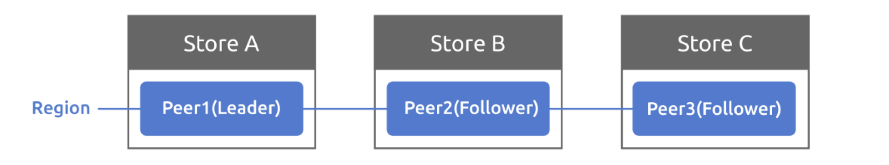

这几天想写tinykv project2B的思路，但是感觉内容太多不知道从何处写起。思来想去觉得可以先翻译一下project2B的文档，将比较关键的地方标注出来。

---

## B部分

在这一部分中，您将使用 A 部分中实现的 Raft 模块构建一个容错的键值存储服务。你的键/值服务将是一个复制的状态机，由几个使用 Raft 进行复制的键/值服务器组成。只要大多数服务器处于活动状态并且可以通信，键/值服务就应继续处理客户端请求，即使存在其他故障或网络分区。

在 project1 中，您已经实现了一个独立的 kv 服务器，因此您应该已经熟悉 kv 服务器 `Storage`​ 的API 和接口。

在介绍代码之前，您需要先了解三个术语：`Store`​, `Peer`​ and `Region`​，以及`proto/proto/metapb.proto`​中定义的术语。

* Store 代表 tinykv-server 的实例
* Peer 代表运行在 Store 上的 Raft 节点
* Region 是 Peers 的集合，也称为 Raft Group（**Region将键空间以范围range划分，是实现Project3 MuitiRaft的关键概念，Project2中默认只有一个Region**）

​​

为简单起见，project2 的 Store 上只有一个 Peer 节点，集群中只有一个 Region。因此，您现在无需考虑 Region 的范围。Project3 中将进一步引入多个 Region。

### the Code

首先，您应该看看`kv/storage/raft_storage/raft_server.go`​中的`RaftStorage`​，其也实现了`Storage`​接口。与`StandaloneStorage`​直接写入或读取底层引擎不同，它首先将每个写入和读取请求发送到 Raft，然后在 Raft 提交请求后对底层引擎进行实际的写入和读取。通过这种方式，可以保持多个`Stores`​之间的一致性。

​`RaftStorage`​创建一个`Raftstore`​驱动 Raft。在调用`Reader`​or`Write`​函数时，它实际上会通过通道（通道为`raftWorker`​的`raftCh`​）向 raftstore 发送一个定义在`proto/proto/raft_cmdpb.proto`​中的`RaftCmdRequest`​和四种基本命令类型（Get/Put/Delete/Snap），**并在 Raft 提交并应用命令后利用回调向客户端返回响应**。`Reader`​和`Write`​函数的参数`kvrpc.Context`​现在很有用，它从客户端的角度携带`Region`​信息，并作为`RaftCmdRequest`​的标头传递。**信息可能不正确或过时，因此 raftstore 需要检查它们并决定是否将该请求Propose到 Raft 层进行共识**。

然后，TinyKV的核心就来了——raftstore。结构有点复杂，请阅读 TiKV 参考文献，以便更好地理解设计：

* [https://pingcap.com/blog-cn/the-design-and-implementation-of-multi-raft/#raftstore](https://pingcap.com/blog-cn/the-design-and-implementation-of-multi-raft/#raftstore) （中文版，**非常推荐，对于整个Project2、Project3的理解有很大帮助，不过TiKV做了很多目前我们不用关心的优化，例如异步Apply、读写分离**）
* [https://pingcap.com/blog/design-and-implementation-of-multi-raft/#raftstore](https://pingcap.com/blog/design-and-implementation-of-multi-raft/#raftstore) （英文版）

raftstore的入口是`Raftstore`​，见`kv/raftstore/raftstore.go`​。它启动了一些工作线程异步处理特定任务，其中大多数现在没有使用，因此您可以忽略它们。您需要关注的只是`raftWorker`​.（kv/raftstore/raft_worker.go）

整个过程分为两部分：raft worker 轮询`raftCh`​以获取消息，包括驱动 Raft 模块的 base tick 和作为 Raft 条目提出（proposed）Raft 命令；**它从 Raft 模块获取并处理 ready，处理流程包括转发 raft 消息、持久化状态、将提交的条目应用于状态机。应用后，还要将响应通过回调返回给客户端。**

### 实现peer storage

peer storage是你通过 A 部分中的`Storage`​接口进行交互的内容，但除了 raft 日志之外，peer storage还管理其他持久化的元数据，这对于重启后恢复一致的状态机非常重要。此外，`proto/proto/raft_serverpb.proto`​中定义了三个重要状态：

* RaftLocalState：用于存储当前 Raft 的 HardState 和最后一个 Log 的 Index。
* RaftApplyState：用于存储 Raft 应用的最后一个 Log 索引和一些截断的 Log 信息。
* RegionLocalState：用于存储此 Store 上的 Region 信息和相应的 Peer State。Normal 表示该 Peer 正常，Tombstone 表示该 Peer 已从 Region 中移除，无法加入 Raft Group。

这些状态存储在两个 badger 实例中：raftdb 和 kvdb：

* raftdb 存储 Raft 日志和`RaftLocalState`​
* kvdb 将键值数据存储在不同的列族，`RegionLocalState`​和`RaftApplyState`​中。你可以把 kvdb 看作是 Raft 论文中提到的状态机

格式如下，`kv/raftstore/meta`​中提供了一些辅助函数，并用`writebatch.SetMeta()`​将它们设置为 badger。

|Key|KeyFormat|Value|DB|
| :-----------------| :---------------------------------| :-----------------| :-----|
|raft_log_key|0x01 0x02 region_id 0x01 log_idx|Entry|raft|
|raft_state_key|0x01 0x02 region_id 0x02|RaftLocalState|raft|
|apply_state_key|0x01 0x02 region_id 0x03|RaftApplyState|kv|
|region_state_key|0x01 0x03 region_id 0x01|RegionLocalState|kv|

> 您可能想知道为什么 TinyKV 需要两个 badger 实例。实际上，它可以使用一个badger来存储 raft 日志和状态机数据。分成两个实例只是为了和 TiKV 的设计保持一致。

应在`PeerStorage`​中创建和更新这些元数据。创建 PeerStorage 时，请参见`kv/raftstore/peer_storage.go`​。它初始化此 Peer 的 RaftLocalState、RaftApplyState，或者在重启时从底层引擎获取上一个值。请注意，RAFT_INIT_LOG_TERM 和 RAFT_INIT_LOG_INDEX 的值均为 5（只要它大于 1），但不是 0。之所以不将其设置为 0，是为了与 Peer 在 conf 更改后被动创建的情况区分开来。你现在可能还不太明白，所以只要记住它，当你实现conf change时，细节将在project3b中描述。

这部分需要实现的代码只有一个函数：`PeerStorage.SaveReadyState`​，这个函数的作用是将`raft.Ready`​中的数据保存到 badger存储引擎（**kvdb和raftdb，Project2C ​`ApplySnapshot`会涉及kvdb**）中，包括`Append`​日志条目（**即持久化 Raft 日志到 raftdb**）和保存 Raft HardState。

要`Append`​日志条目，只需将在`raft.Ready.Entries`​中的所有日志条目保存到 raftdb 中，并删除之前追加的日志条目，这些条目永远不会被提交。另外，更新peer storage的`RaftLocalState`​并将其保存到 raftdb。

保存`hard state`​也非常简单，只需更新 peer storage的`RaftLocalState.HardState`​并将其保存到 raftdb 即可。

> 提示：
>
> * 用`WriteBatch`​一次保存这些状态。
> * 有关如何读取和写入这些状态，请参阅`peer_storage.go`​中的其他函数。
> * 设置环境变量 LOG_LEVEL=debug，这可能有助于您进行调试，另请参阅所有可用的[日志级别](https://github.com/talent-plan/tinykv/blob/course/log/log.go)。

### Implement Raft ready process

在 project2 的 A 部分中，您构建了一个基于 tick 的 Raft 模块。现在，您需要编写外部进程来驱动它。大多数代码已经在`kv/raftstore/peer_msg_handler.go`​和`kv/raftstore/peer.go`​下实现。**所以你需要学习代码并完成`proposeRaftCommand`和`HandleRaftReady`​的逻辑**。以下是对该框架的一些解释。

Raft `RawNode`​已经使用`PeerStorage`​创建并存储在`peer`​中。在 raft worker 中，您可以看到它包含了`peer`​，采用`peerMsgHandler`​将其封装 。主要有两个功能：一个是`HandleMsg`​，另一个是`HandleRaftReady`​。

​`HandleMsg`​处理从 raftCh 接收到的所有消息，包括`MsgTypeTick`​ （调用`RawNode.Tick()`​来驱动Raft），`MsgTypeRaftCmd`​包装来自客户端的请求，以及`MsgTypeRaftMessage`​ Raft 对等节点之间传输的消息。所有消息类型都在`kv/raftstore/message/msg.go`​中定义。您可以查看它的详细信息，其中一些将在以下部分中使用。

消息处理完毕后，Raft 节点应该会有一些状态更新。**所以`HandleRaftReady`应该从 Raft 模块中获取 Ready 并执行相应的操作，例如持久化日志条目、应用已提交的条目并通过网络向其他 Peer 节点发送 Raft 消息**。

在伪代码中，raftstore 使用 Raft，如下所示：

```go
for {
  select {
  case <-s.Ticker:
    Node.Tick()
  default:
    if Node.HasReady() {
      rd := Node.Ready()
      saveToStorage(rd.State, rd.Entries, rd.Snapshot)
      send(rd.Messages)
      for _, entry := range rd.CommittedEntries {
        process(entry)
      }
      s.Node.Advance(rd)
    }
}
```

> 上述伪代码的`default`​分支大致展示了`HandleRaftReady`​的处理流程。

因此，读取或写入的整个过程将是这样的：

* 客户端调用 RPC RawGet/RawPut/RawDelete/RawScan
* RPC 处理程序调用`RaftStorage`​相关方法
* ​`RaftStorage`​向 raftstore 发送 Raft 命令请求，等待响应
* ​`RaftStore`​将 Raft 命令请求作为 Raft 日志`Propose`​给 Raft 层
* Raft 模块`Append`​日志，并使用`PeerStorage`​进行持久化
* Raft 模块提交日志（该日志被大多数节点接受）
* Raft worker 在处理 Raft ready 时应用 Raft 命令，并通过 callback 返回响应
* ​`RaftStorage`​接收来自回调的响应并返回到 RPC 处理程序
* RPC 处理程序执行一些操作并将 RPC 响应返回给客户端

您应该运行`make project2b`​以通过所有测试。整个测试运行一个模拟集群，包括多个具有模拟网络的 TinyKV 实例。它执行一些读取和写入操作，并检查返回值是否符合预期。

需要注意的是，错误处理是通过测试的重要组成部分。您可能已经注意到`proto/proto/errorpb.proto`​其中定义了一些错误，并且该错误是 gRPC 响应的一个字段。此外，实现`error`​接口的相应错误在`kv/raftstore/util/error.go`​中定义，因此您可以将它们用作函数的返回值。

这些错误主要与 Region 有关。所以它也是`RaftResponseHeader`​ of `RaftCmdResponse`​的成员。**在 Propose 请求或应用命令时**，可能会出现一些错误。如果是这样，你应该返回带有错误的 raft 命令响应，然后错误将进一步传递给 gRPC 响应。您可以使用`kv/raftstore/cmd_resp.go`​提供的​`BindRespError`​将这些错误转换为在返回带有错误的响应时定义的错误。

在此阶段，您可以考虑以下这些错误，其他错误将在 project3 中处理：

* ErrNotLeader：在 follower 上 Propose raft 命令。因此，使用它来让客户端尝试将请求发送给其他 Peer。
* ErrStaleCommand：可能是由于领导者更改，某些日志未提交并被新的领导者日志覆盖。但客户并不知道这一点，仍在等待响应。因此，您应该返回此命令以让客户端知道并重试该命令。

> 提示：
>
> * ​`PeerStorage`​实现了 Raft 模块的`Storage`​接口，你应该使用提供的`SaveReadyState()`​方法来持久化 Raft 相关的状态。
> * 使用`engine_util`​中的`WriteBatch`​以原子方式进行多次写入，例如，**您需要确保在一个`WriteBatch`中应用已提交的条目并更新`Applied`索引（这两个写入不要分开来做）**。
> * 用`Transport`​向其他 Peer 节点发送 raft 消息，它在`GlobalContext`​中
> * 如果服务器不是多数服务器的一部分，并且没有最新数据，则不应完成 get RPC。你可以直接将 get 操作放入 raft 日志中，或者实现 Raft 论文第 8 节中描述的只读操作的优化（**建议先完成最基本的功能，再考虑实现各种优化**）。
> * 在应用日志条目时，不要忘记更新并保留`ApplyState`​。
> * 你可以像 TiKV 一样异步应用已提交的 Raft 日志条目。这不是必需的，尽管提高性能是一个很大的挑战。
> * Propose时记录命令的回调，应用后返回回调。
> * 对于 snap 命令响应，应将 badger Txn 显式设置为回调。
> * **在 2A 之后采用随机测试，您可能需要多次运行某些测试以查找错误**