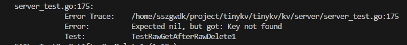
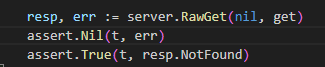
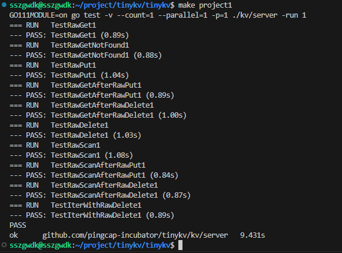

# TinyKV Project 1

project1是一个热身项目，内容非常简单。项目文档中提到需要实现两部分的内容：（1）独立存储引擎；（2）原始kv服务处理程序。下面分别介绍一下基本的思路。

## 独立存储引擎

文档中提到该任务是对badgerDB的读写API的封装以支持列族（Column Family, CF）。通过运行`grep -rIi "Your Code Here (1)."`​发现需要编写的代码主要在`kv/storage/standalone_storage/standalone_storage.go`​，需要实现：

1. 定义`StandAloneStorage`​的数据结构
2. 定义`NewStandAloneStorage`​函数，根据参数`Config`​创建一个`StandAloneStorage`​对象
3. 填充`Start, Stop, Reader, Write`​四个函数

### ​`StandAloneStorage`​​​的定义和新建

根据项目文档，engine_util包 （`kv/util/engine_util`​）中提供了所有的读写操作，即需要封装的API。但是我们并不知道它们在哪里，`kv/util/engine_util/doc.go`​中给出了一些信息：

```go
* engines: a data structure for keeping engines required by unistore.
* write_batch: code to batch writes into a single, atomic 'transaction'.
* cf_iterator: code to iterate over a whole column family in badger.
```

从命名和描述可以看出engines是存储引擎、write_batch是将多个写入整合到一个batch中，cf_iterator则是在badger中迭代列族。

再来看具体的文件。

​`kv/util/engine_util/engines.go`​中定义了`Engines`​类，包含了两个`badger.DB`​的指针，还提供了`NewEngines`​、`WriteKV`​、`WriteRaft`​、`Close`​、`Destroy`​、`CreateDB`​这些函数。很显然`StandAloneStorage`​是对`Engines`​的封装，需要包含一个`engine_util.Engines`​成员，`NewStandAloneStorage`​需要进行`CreateDB`​和`NewEngines`​两个步骤。`Start`​不需要修改，`Stop`​需要调用`en.Close()`​;

```go
type Engines struct {
  // Data, including data which is committed (i.e., committed across other nodes) and un-committed (i.e., only present
  // locally).
  Kv     *badger.DB
  KvPath string
  // Metadata used by Raft.
  Raft     *badger.DB
  RaftPath string
}

type StandAloneStorage struct {
  // Your Data Here (1).
  en *engine_util.Engines
}
```

### Write

关于Write的实现，文档告诉我们参数`ctx *kvrpcpb.Context`​暂时不用管，只剩下一个参数`batch []storage.Modify`​，可知是接口`Modify`​类型切片，通过观察类定义和相关函数发现，`Modify`​中可以是类型为`Put`​或`Delete`​类型的`Data`​，使用`.Key().Cf().Value()`​取对应的字段。

```go
type Modify struct {
  Data interface{}
}

type Put struct {
  Key   []byte
  Value []byte
  Cf    string
}

type Delete struct {
  Key []byte
  Cf  string
}

func (m *Modify) Key() []byte {
  switch m.Data.(type) {
  case Put:
    return m.Data.(Put).Key
  case Delete:
    return m.Data.(Delete).Key
  }
  return nil
}

func (m *Modify) Value() []byte {
  if putData, ok := m.Data.(Put); ok {
    return putData.Value
  }

  return nil
}

func (m *Modify) Cf() string {
  switch m.Data.(type) {
  case Put:
    return m.Data.(Put).Cf
  case Delete:
    return m.Data.(Delete).Cf
  }
  return ""
}
```

因此我们在`Write`​中需要做的应该是：声明一个空的`WriteBatch wb`，然后遍历参数`batch`​，提取每一个`key,val,cf`​，使用辅助函数添加到`wb`中；遍历结束后调用`en.WriteKV`​实现写入。

通过阅读`kv/util/engine_util/write_batch.go`​可知要用到的辅助函数是类`WriteBatch`​的`SetCF`​和`DeleteCF`​接口。

### Reader

​`Reader`​方法返回一个`StorageReader`​接口，要求实现`GetCF()、IterCF()、Close()`​三个方法

```go
type StorageReader interface {
  // When the key doesn't exist, return nil for the value
  GetCF(cf string, key []byte) ([]byte, error)
  IterCF(cf string) engine_util.DBIterator
  Close()
}
```

文档中说应该使用`badger.Txn`​来实现`Reader`​函数，但是`badger.Txn`​并没有`GetCF()、IterCF()、Close()`​这三个方法，因此不能满足`StorageReader`​接口的要求（go语言接口`interface`的限制），我们要对其进行封装。

我这里定义了一个`StandAloneStorageReader`​类，包含了一个`badger.Txn`​成员，分别使用`engine_util.GetCFFromTxn`​、`engine_util.NewCFIterator`​、`txn.Discard`​实现了`GetCF()、IterCF()、Close()`​。在`Reader`​中只需要调用`en.Kv.NewTransaction`​创建一个`txn`​，然后返回一个`StandAloneStorageReader`​即可。

```go
func (s *StandAloneStorage) Reader(ctx *kvrpcpb.Context) (storage.StorageReader, error) {
  // Your Code Here (1).
  txn := s.en.Kv.NewTransaction(false)
  return &StandAloneStorageReader{
    txn: txn,
  }, nil
}

type StandAloneStorageReader struct {
  txn *badger.Txn
}
```

## 实现服务处理程序

需要实现的代码在`kv/server/raw_api.go`​当中，需要实现`RawGet`​、`RawPut`​、`RawDelete`​、`RawScan`​。前三个都很简单，没有需要自己寻找或设计的数据结构，部分接口需要查找，不过都是可以根据参数和成员得到的。

​`RawScan`​函数主要是要弄清它的功能：从`startkey`​开始，取至多`limit`​个`kvPairs`​。

这样就知道需要用`Reader`​的迭代器，首先`Seek`​到`StartKey`​的位置，然后取至多`limit`​个`kvPairs`​。

​`iter`​的使用方式参考：`iter->Seek(StartKey)`​ -->`iter->Valid()`​ -->`iter.Next()`​

## 测试问题

出现一个问题

​​

查看测试代码，发现当KeyNotFound时要求err返回nil（后面许多关卡很多都需要面向测试点编程）

​​

解决后成功通过！完成 project 1！

​​
