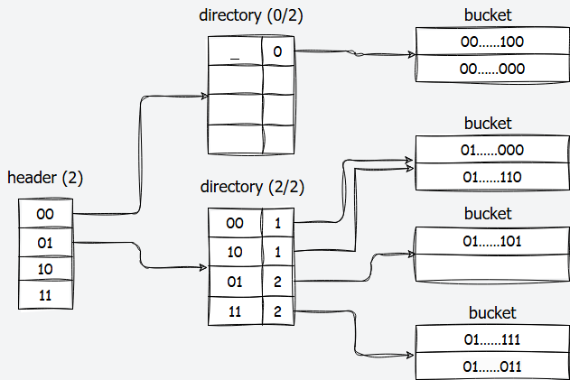
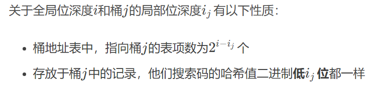
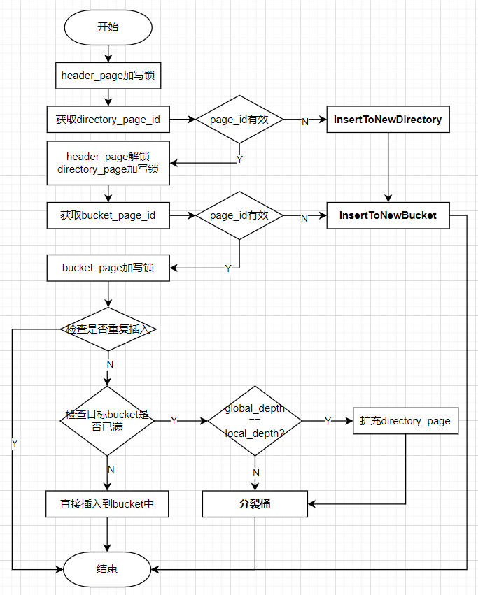
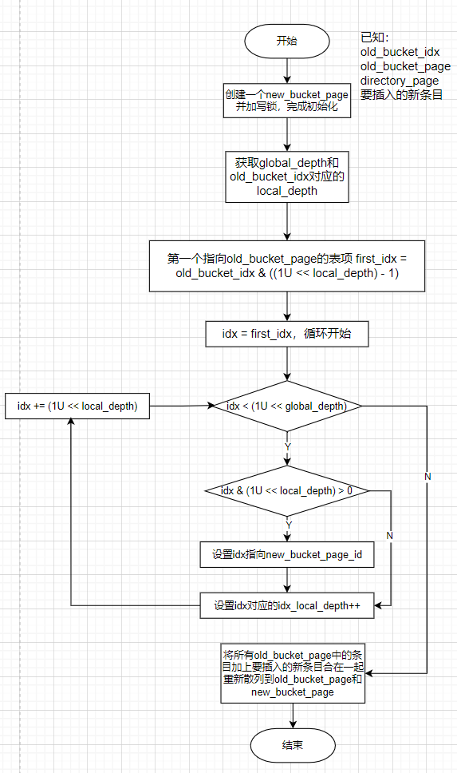
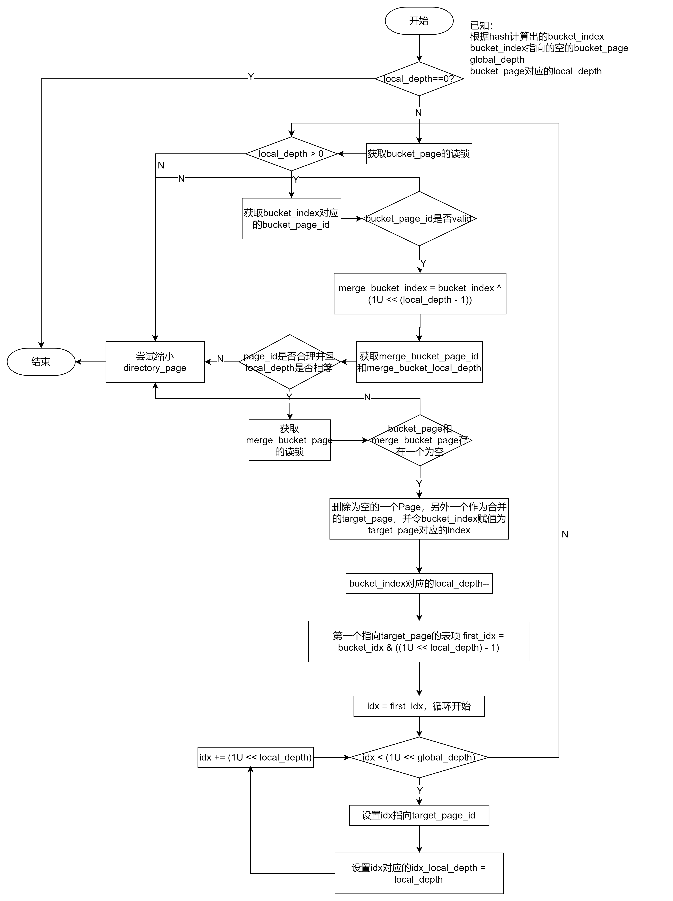

# CMU15-445 Fall 2023 Project 2

## bustub的哈希索引结构

bustub使用的哈希索引是可扩展哈希的一种变体，在两级方案的基础上添加了一个`HeaderPage`​，按照文档的说法，这是为了使哈希表可以容纳更多值并有可能实现更好的多线程性能。

​​

### 三种Page

如文档任务2所说，可扩展哈希表由三种Page组成：`HeaderPage`​、`DirectoryPage`​和`BucketPage`​。

#### HeaderPage

一般只有一个`HeaderPage`​，类似二级页表中的页目录表。

```c++
 private:
  page_id_t directory_page_ids_[HTABLE_HEADER_ARRAY_SIZE];
  uint32_t max_depth_;
```

​`HeaderPage`​维护成员包括一个`DirectoryPage`​数组和最大深度`max_depth_`​，记深度为x，数组的大小为`2 ^ x`​，且使用哈希值的最高有效x位进行索引。如位深度为2，32位哈希值为0x5f129982，最高有效位前2位为01，则会被索引到01对应的DirectoryPage上。

#### DirectoryPage

```c++
 private:
  uint32_t max_depth_;
  uint32_t global_depth_;
  uint8_t local_depths_[HTABLE_DIRECTORY_ARRAY_SIZE];
  page_id_t bucket_page_ids_[HTABLE_DIRECTORY_ARRAY_SIZE];
```

​`DirectoryPage`​的成员包含第三层的`BucketPage`​的PageId数组，全局位深度`global_depth`​和每一个Bucket的局部位深度`local_depth`​数组，PageId数组的大小为`2 ^ global_depth`​，且使用哈希值的最低有效`global_depth`​位进行索引。如全局位深度为2，32位哈希值为0x51129982，最低有效位后两位为10，则会被索引到10对应的BucketPage上。

#### BucketPage

```c++
 private:
  uint32_t size_;
  uint32_t max_size_;
  MappingType array_[HTableBucketArraySize(sizeof(MappingType))];
```

对应一个哈希桶，成员包含一个Key-Value数组，以及数组大小`size_`​。被索引到该Bucket的Key-Value会追加到该Bucket上进行存储。有一个`max_size_`​限制，例如2。

对上面提到的三个`depth`​的直观理解：

1. ​`max_depth`​：header、directory各自的最大深度限制，header的`max_depth`​还用于索引directory表项；
2. ​`global_depth`​：对应directory的当前深度，用于索引bucket表项（当前的max_size不代表有效条目数）；
3. ​`local_depth`​：对应bucket的当前深度（**==非常重要，在insert流程中具体讲解作用==**）

​**一个限制**​：`global_depth >= local_depth`​

​​

### 查找流程

假设哈希值固定为32bit

1. 获取`header_page`​，计算key的哈希值`hash`​
2. 根据`hash >> (32u - max_depth_)`​（取哈希值最高的`max_depth_`​位）得到`directory_page_index`​，进而得到`derectory_page`​
3. 根据`hash & (1u << global - 1)`​（取哈希值最低的`global_depth`​位）得到`buckect_page_index`​，进而得到`bucket_page`​
4. 遍历`bucket_page`​中的所有条目，查找是否有目标key

### 动态扩展原理

最核心需要理解的是插入操作可能触发的`directory`​扩容和桶拆分，以及删除操作可能触发的`directory`​缩容和桶合并。

#### Insert大致流程

1. 首先根据key的hash值，定位到目标桶`target`​，如果目标桶没满，直接追加。
2. 如果目标桶已经满了，这时候需要考虑`directory`​扩容和桶拆分，两种情况：

    1. ​`global_depth == local_depth[target]`​，此时代表只有一个表项指向`target`​（**注意理解这里深度相同的含义**），要做以下工作：

        1. ​`global_depth++`​，使得directory的容量翻倍，原来的**每个表项都产生出自己的一个副本表项**（称作`split_image`​，若一个原始表项的位置是`bucket_index`​，则它的`split_image`​对应位置是`bucket_index + (1 << (global_depth - 1))`​），新的表项包含和原始表项一样的指针，即指向相同的bucket。

            > 为什么只需要分裂一个桶，但是所有旧表项都要有一个副本呢？
            >
            > 因为global_depth++之后，由hash值获取目标桶的idx会增加一位，有可能就会指向副本的idx，此时副本表项指向相同的桶，就不会对结果造成影响。
            >
        2. 系统分配一个`new_bucket`​，让目标桶的副本表项指向它。**并且令**​`**local_depth[target]**`​**和**​`**local_depth[new_bucket]**`​**都等于**​`**global_depth**`​**，代表均只有一个表项指向它们。**
        3. 将目标桶中的所有记录和要插入的新记录合起来，根据记录的key的hash值的后`global_depth`​位（现在已经增加了一位）重新散列到`target_bucket`​和`new_bucket`​。
    2. ​`global_depth > local_depth[target]`​，此时directory中不止一个表项指向目标桶`target`​，会有`2^(global_depth - local_depth[target])`​个表项。此时不需要增加`global_depth`​，直接分裂目标桶即可：

        1. 系统分配一个`new_bucket`​
        2. **关键注意：哪些表项修改为指向**​`**new_bucket**`​**?因为此时不是两个了**

            > 以local_depth = 2，global_depth = 4为例，此时有`2^(4 - 2) = 4`​个表项指向`target_bucket`​（假设已有一个确定的`bucket_index`​，那么其他三个满足`idx & 0x3 == bucket_index & 0x3`​的idx即为指向`target_bucket`​的表项索引（**最低两位相同**））。
            >
            > 我们想要拆分bucket，也就是让local_depth+1，在这个例子中这些idx最低两位相同，要实现拆分，要让idx的第3位发挥作用，所以拆分的逻辑便是：让第3位 = 0 的idx对应的表项指向原始`target_bucket`​，让倒数第3位 = 1 的idx对应的表项指向新拆分得到的`new_bucket`​。
            >
            > 那么这个“第3位”怎么得到？很容易推出就是`local_depth+1`​，这也是`local_depth`​的含义之一，**代表多少位发挥作用**。进而可以用`1U << local_depth`​检查idx的对应位是否为1，以此来进行桶的拆分。
            >
        3. 重新散列所有记录，`local_depth++`​

#### Remove大致流程

当Remove成功之后，目标桶变空，就需要合并桶，此时只需要改变所有指向空桶的指针，然后删除掉对应页，同时对其`local_depth--`​即可。

> 注意，有可能合并之后桶还是空的，此时要持续合并直到不为空，不然不能通过测试。

最后还可能需要对directory缩容`global_depth--`​（如果所有bucket的local_depth都比global_depth小）。

‍

## Task#1：Read Write Page Guards

Task1要求实现三种`PageGuard`​类，分别是`BasicPageGuard`​、`ReadPageGuard`​和`WritePageGuard`​。三种`PageGuard`​类都使用RAII的思想保护`Buffer Pool Manager`​的缓冲页，防止用户遗漏调用`Unpin`​方法导致缓冲页被固定无法驱逐，与只能指针相似，当`PageGuard`​对象生命周期结束时，在析构函数中调用`Unpin`​方法来确保释放缓冲页；进一步的，`ReadPageGuard`​和`WritePageGuard`​还会保护缓存页的读写一致性，且避免死锁（若其他时候后忘记解锁，则在析构时解锁）。

三种类中主要实现的方法有：

* 三种`PageGuard`​的移动构造函数、移动赋值运算符、`Drop`​方法与析构函数
* ​`BasicPageGuard`​类中的`UpgradeRead()`​函数和`UpgradeWrite()`​函数

> 关于移动构造函数、移动赋值运算符，要对右值引用相关概念有所了解

​`Drop`​函数为对外提供的释放页接口，它需要做的事情就是调用一下`BufferPoolManager`​的`UnpinPage`​函数，将`page_`​中维护的页释放（如果有的话）；在`ReadPageGuard`​和`WritePageGuard`​中，则还需要解锁（读锁或写锁）。

实现完这三种`PageGuard`​类后，需要使用它们实现`BufferPoolManager`​类中的`FetchPageBasic`​、`FetchPageRead`​、`FetchPageWrite`​和`NewPageGuarded`​函数。实现也比较简单，都是先调用`FetchPage`​或`NewPage`​，然后构造一个`PageGuard`​，注意如果是`ReadPageGuard`​要加读锁`RLatch`​，如果是`WritePageGuard`​要加写锁`WLatch`​。

‍

## Task#2：Extendible Hash Table Pages

实现三种可扩展哈希中使用的数据结构，也就是三层结构中每一层的页面布局。如上文所说，分别是`HeaderPage`​、`DirectoryPage`​和`BucketPage`​。

这三个类中需要我们实现的接口都非常简单，需要注意一些边界条件，例如`max_depth`​的限制，`local_depth <= global_depth`​的限制等。

另外一个需要注意的是`DirectoryPage`​的`IncrGlobalDepth()`​，不仅要对`global_depth_++`​，如上文“Insert大致流程”中所说，还要为原有的表项创建副本，即拷贝bucket表项和local_depth。

‍

## Task#3：Extendible Hashing Implementation

实现Extendible Hashing的查询、插入和删除。难点在于“**bucket splitting/merging and directory growing/shrinking**”。

查询比较简单，按照header->directory->bucket的顺序来查找即可，注意使用Task1中实现的`FetchPageRead`​和三种`PageGuard`​的`Drop`​（尽早释放，提高并发度）。

### 插入Insert

​​​​

​`InsertToNewDirectory`​和`InsertToNewBucket`​的实现步骤是相似的：

1. 通过`NewPageGuarded`​新建数据页，并获取`PageGuard`​
2. 通过`UpgradeWrite()`​提升为写锁
3. ​`Init`​初始化页面
4. ​`SetDirectoryPageId`​或`SetBucketPageId`​：在headerPage或directoryPage设置表项
5. ​`InsertToNewBucket`​或`bucket_page->Insert(k, v, cmp_)`​

在上面的流程图中可以发现，除了`HeaderPage`​，`DirectoryPage`​和`BucketPage`​都是直到最后才释放写锁的（可能有并发度更高的实现），这里可以体现出bustub的可扩展哈希表增加了一个`HeaderPage`​的优势，这样在不同`directoryPage`​上的插入操作可以并发进行，从而能有更好的多线程性能。

分裂桶的步骤根据上文“Insert大致流程”，实现逻辑如下：

​​

‍

### 删除Remove

Remove操作首先按照类似查询的逻辑一步步定位到bucket_page，然后删除掉对应条目entry，如果出现未找到的情况，则直接返回false。

删除成功之后，如果当前bucket_page不为空，则直接返回true，否则要尝试合并bucket。合并详细流程如下（画得是真丑，轻喷）

​​​​

‍

