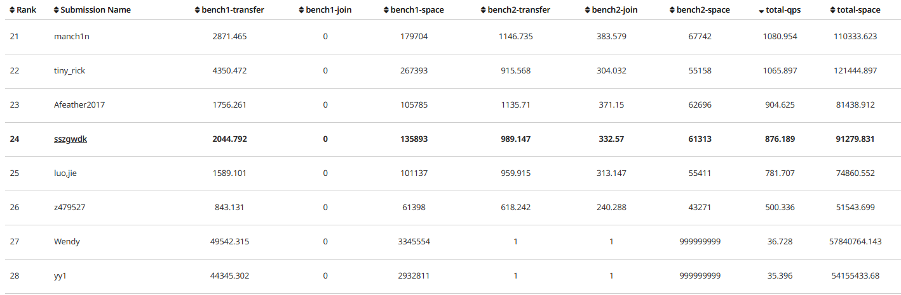
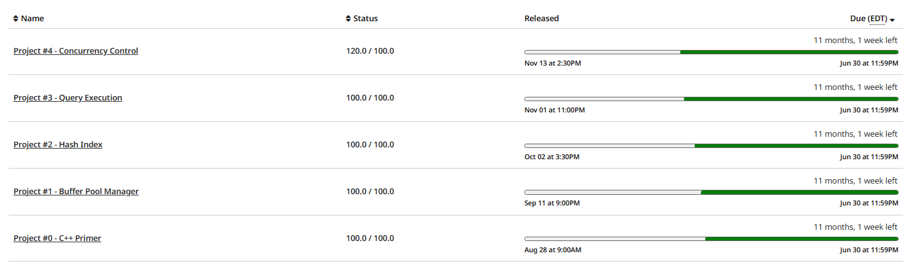

# CMU15-445 Fall 2023 入门

作为一名新接触存储领域的学生，我在自学了tinykv之后，感觉自己的基础实在是过于薄弱，对于常见的数据库组件，诸如缓存、索引、事务引擎等，都几乎毫无了解，又感到无从抓起。前段时间刚好在[CS自学指南 (csdiy.wiki)](https://csdiy.wiki/)看到CMU15-445这门课，它的project里面所涉及的缓存管理、索引、算子与优化器和并发控制，正是我当前迫切需要的知识。于是前前后后花了两个月左右的时间完成了所有的project，同样是不希望把工夫浪费了，因此写个Blog记录一下。

|Semester|Project 0|Project 1|Project 2|Project 3|Project 4|
| -------------| --------------------| ---------------------| ---------------| ----------------------------------------------------| ---------------------------------------------------------|
|Fall 2017|/|Buffer Pool Manager|B+ Tree Index|Two-Phase Locking + Concurrent B+ Tree Index|Logging and Recovery|
|Fall 2018|/|Buffer Pool Manager|B+ Tree Index|Two-Phase Locking + Deadlock Prevention/Detection|Logging and Recovery|
|Fall 2019|/|Buffer Pool Manager|Hash Index|Query Execution|Logging and Recovery|
|Fall 2020|/|Buffer Pool Manager|Hash Index|Query Execution|2PL Concurrency Control + Deadlock Detection|
|Fall 2021|/|Buffer Pool Manager|Hash Index|Query Execution|2PL Concurrency Control + Deadlock Prevention|
|Fall 2022|Trie|Buffer Pool Manager|B+ Tree Index|Query Execution + Optimization|Hierarchy 2PL Concurrency Control + Deadlock Detection|
|Spring 2023|Copy-on-write Trie|Buffer Pool Manager|B+ Tree Index|Query Execution + Optimization,|Hierarchy 2PL Concurrency Control + Deadlock Detection|
|Fall 2023|Copy-on-write Trie|Buffer Pool Manager|Hash Index|Query Execution + Optimization,|Multi-Version Concurrency Control|

CMU15-445有多个不同的版本，课程工作人员每学期都会尝试轮换一些内容，例如索引这一块有的是B+树有的是哈希索引。2023 Fall这一版引入了更多的新东西，特别是多版本并发控制，并且在平衡课程难度上花了不少工夫（项目难度是递增的，在以往的版本中听说B+树通常是最困难的），学生能够获得渐进和流畅的学习体验。

Project 0的内容是实现一个简单的字典树，目的是让学生提前熟悉一下后续项目要用到的一些c++特性，例如智能指针，锁管理，右值引用，强制类型转换等，打下良好的基础。

Project 1要求实现缓存管理，包括LRU-K淘汰算法、磁盘io调度器、缓存池管理接口，内容比较简单。

Project 2要在Project 1的基础上做，要求实现一个Extendible Hash Table，我认为难点主要是对该数据结构的理解以及处理一些边界条件，整体也不难。

Project 3与Project 1和2是解耦的，不过依赖与它们的正确性，内容实现基于火山模型的查询算子，例如scan、insert、aggregation等等。整体比较难，倒不在于实现方面，而在于需要阅读并理解bustub提供的很多框架代码和一些样例算子的实现，起步会非常艰难。

Project 4则更难，要在Project 3的基础上重构很多算子，实现事务管理和Hype MVCC，前80分相对容易获得，只要通过一个并发测试；后面的20分和奖励任务要考虑更多的并发测试和隐藏条件，还要再重构一次算子，很麻烦并且难度也很大。

‍

## 资源链接

官方project文档（非常建议慢慢地阅读英文文档，访问应该要用魔法）

[Assignments | CMU 15-445/645 :: Intro to Database Systems (Fall 2023)](https://15445.courses.cs.cmu.edu/fall2023/assignments.html)

代码测试/提交网站Grade：课程Entry Code: KK5DVJ

[15-445/645 (Non-CMU) Dashboard | Gradescope](https://www.gradescope.com/courses/585997)

> 本来还想找一些CMU445的课程中文讲义搭配project食用，找了几个发现都非常零碎，没办法获得清晰成体系的知识。
>
> 这里留个坑，有时间好好学习和整理存储的相关知识。

‍

## 环境配置

​`git clone --branch v20231227-2023fall https://github.com/cmu-db/bustub.git`​

官方文档提供了VSCode和Clion的环境配置以及调试的指导，已经足够了。

> If you are using VSCode, we recommend you to install [CMake Tools](https://marketplace.visualstudio.com/items?itemName=ms-vscode.cmake-tools), [C/C++ Extension Pack](https://marketplace.visualstudio.com/items?itemName=ms-vscode.cpptools-extension-pack) and [clangd](https://marketplace.visualstudio.com/items?itemName=llvm-vs-code-extensions.vscode-clangd). After that, follow this tutorial to learn how to use the visual debugger in VSCode: [Debug a C++ project in VS Code](https://www.youtube.com/watch?v=G9gnSGKYIg4).
>
> If you are using CLion, we recommend you to follow this tutorial: [CLion Debugger Fundamentals](https://www.youtube.com/watch?v=5wGsRdumueU).

官方仓库同样也提供了一键配置运行软件环境的脚本，运行一下命令即可。

​`sudo build_support/packages.sh`​

另外，项目文档中都有提供编译和测试的指导，照着来就行。

‍

## 通过情况

完成了所有的任务包括p4的两个奖励任务，下面是在所有任务基础上的total-qps排名24（在所有通过奖励关的人中排倒数第3哈哈哈），最后实在是懒得优化了。

​​

瞄了一眼除了奖励关都通过的人数，大概60人左右，估计之前版本的也得有100多了，感觉也许还真有点烂大街了罢。

​​

‍

