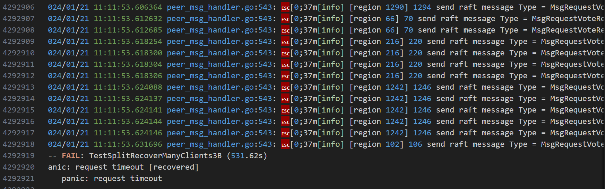

# TinyKV Project 3B 疑难杂症


我在做tinykv这个课程的过程中，3b之前遇到的问题大多能在网上找到解决方法，因此也没怎么做记录；而3b由于引入了Multi Raft以及集群成员变更、Split Region等Admin命令，对很多细节处理要求严格，并且测试点会模拟丢包和网络隔离等异常情况，需要做较多额外的针对性处理，因此我在做的时候遇到了许多网上难以找到的问题，通过在海量日志中一步步跟踪才解决了它们。

下面将对我在3b中遇到的疑难杂症及解决方法进行汇总。

## SnapShot相关

### （1）Request Timeout-1

问题原因：当前节点有snapshot正在被应用时，收到新的snapshot没有过滤掉

解决方法：当`r.RaftLog.pendingSnapshot != nil`​时不接受新的snapShot，并且不处理`Append`​消息。

```go
func (r *Raft) handleAppendEntries(m pb.Message) {
  if r.RaftLog.pendingSnapshot != nil {
    return
  }
  ...
```

```go
func (r *Raft) handleSnapshot(m pb.Message) {
  if r.RaftLog.pendingSnapshot != nil {
    return
  }
  ...
```

### （2）Request Timeout-2

问题原因：follower在处理append消息的时候，`prevLogIndex`​的条目在follower已经被Compact掉了（**Leader当中反而没有被Compact，怪了**），此时通过`RaftLog.Term()`​会返回错误，无法完成日志匹配动作，导致leader中记录的Match会保持不变，在集群中只有两个节点的情况下committed无法推进。

解决方法：follower返回响应，令leader主动发送一个Snapshot给自己，我这里利用了`MsgAppendResponse`​中没有使用的`commit`​字段。

```go
const ShouldSendSnapByCommit uint64 = 123456

func (r *Raft) handleAppendEntries(m pb.Message) {
。。。
  tTerm, terr := r.RaftLog.Term(m.Index)
    // debug
    lastTerm, _ := r.RaftLog.Term(r.RaftLog.LastIndex())
    if terr != nil {
      log.DPrintfRaft("node %d handleAppendEntries from %d failed, get term failed: %v\n", r.id, m.From, terr)
      log.DPrintfRaft("l.entries: %d, i: %d, l.dummyIndex: %d, l.lastIndex: %d\n", len(r.RaftLog.entries), m.Index, r.RaftLog.dummyIndex, r.RaftLog.LastIndex())

      // tell leader should send snapshot
      r.msgs = append(r.msgs, pb.Message{
        MsgType: pb.MessageType_MsgAppendResponse,
        To:      m.From,
        From:    r.id,
        Term:    lastTerm,
        Index:   0,
        Reject:  true,
        Commit:  ShouldSendSnapByCommit,
      })
      return
。。。
}


func (r *Raft) handleAppendResponse(m pb.Message) {
  if m.Term > r.Term {
    r.greaterTermRspNum += 1
    if r.greaterTermRspNum > GreaterTermRspThreshold {
      r.greaterTermRspNum = 0
      r.becomeFollower(m.Term, None)
      return
    }
    // r.becomeFollower(m.Term, None)
    return
  }

  // special handle for need to send snapshot
  if m.Commit == ShouldSendSnapByCommit {
    r.sendSnapshot(m.From)
    return
  }
。。。
}
```

‍

## TransferLeader相关

### （1）Request Timeout（选举冲突的问题）

```go
[RaftStore]: node[[region 1] 2] propose common request: header:<region_id:1 peer:<id:2 store_id:2 > region_epoch:<conf_ver:4 version:1 > > requests:<cmd_type:Put put:<cf:"default" key:"2 00000053" value:"x 2 53 y" > > , leader: 2
2024/02/22 07:53:32 [Raft]: node 2 is leader, but leadTransferee is not None, stop accept propose
2024/02/22 07:53:32 [Raft]: node 2 tryUpdateCommit: len(r.Prs) = 2, r.RaftLog.LastIndex() = 584, r.committed = 583
2024/02/22 07:53:32 [Raft]: node 2 transfer leader to 1 success! sendTimeoutNow!
2024/02/22 07:53:32 [RaftStore]: -------------------------------------------------------------------------
2024/02/22 07:53:32 [RaftStore]: node[[region 1] 2] propose common request: header:<region_id:1 peer:<id:2 store_id:2 > region_epoch:<conf_ver:4 version:1 > > requests:<cmd_type:Snap snap:<> > , leader: 2
2024/02/22 07:53:32 [Raft]: node 2 tryUpdateCommit: len(r.Prs) = 2, r.RaftLog.LastIndex() = 585, r.committed = 584
2024/02/22 07:53:32.433521 cluster.go:200: [info] [Cluster] request err resp. err: message:"raft proposal dropped" , req: header:<region_id:1 peer:<id:2 store_id:2 > region_epoch:<conf_ver:4 version:1 > > requests:<cmd_type:Put put:<cf:"default" key:"1 00000062" value:"x 1 62 y" > > 
2024/02/22 07:53:32.433521 cluster.go:200: [info] [Cluster] request err resp. err: message:"raft proposal dropped" , req: header:<region_id:1 peer:<id:2 store_id:2 > region_epoch:<conf_ver:4 version:1 > > requests:<cmd_type:Put put:<cf:"default" key:"4 00000046" value:"x 4 46 y" > > 
2024/02/22 07:53:32.433564 cluster.go:200: [info] [Cluster] request err resp. err: message:"raft proposal dropped" , req: header:<region_id:1 peer:<id:2 store_id:2 > region_epoch:<conf_ver:4 version:1 > > requests:<cmd_type:Put put:<cf:"default" key:"2 00000053" value:"x 2 53 y" > > 
2024/02/22 07:53:32 [RaftStore]: node[[region 1] 2]: process common request: header:<region_id:1 peer:<id:2 store_id:2 > region_epoch:<conf_ver:4 version:1 > > requests:<cmd_type:Put put:<cf:"default" key:"0 00000057" value:"x 0 57 y" > > 
2024/02/22 07:53:32 [Raft]: node 1 handleAppendEntries from 2, lastIndex: 584,preLogIndex: 583, preLogTerm: 6, len(m.Entries): 1
2024/02/22 07:53:32 [Raft]: node 1 handleAppendEntries from 2 success, conflictFlag: true
2024/02/22 07:53:32 [Raft]: node 1 handleAppendEntries from 2, lastIndex: 584,preLogIndex: 583, preLogTerm: 6, len(m.Entries): 1
2024/02/22 07:53:32 [Raft]: node 1 handleAppendEntries from 2 success, conflictFlag: true
2024/02/22 07:53:32 [Raft]: node 1 handleAppendEntries from 2, lastIndex: 584,preLogIndex: 584, preLogTerm: 6, len(m.Entries): 0
2024/02/22 07:53:32 [Raft]: node 1 handleAppendEntries from 2 success, conflictFlag: true
```

可以看到，当Node 2`sendTimeOutNow`​给1之后，由于还是leader，且`leaderTransferee == None`​，能够propose新的entry，导致node 1发起选举之后，没办法得到选票，没办法当选，从而造成冲突。

解决方法：leader在`sendTimeoutNow`​之后主动变为follower，从而不会接收到propose产生新的entry，目标节点能够顺利当选。

‍

### （2）TransferLeader的超时机制

如果领导权转移的目标节点失联，会导致leader一直处于leadTransferee的状态，没办法propose entry，因此要为TransferLeader增加超时机制，我直接使用选举超时作为领导权转移的超时时间。TransferLeader成功后`becomefollower()`​会完成清零选举超时的工作。

```go
func (r *Raft) tickLeader() {
  // special handle with leadTransforee
  if r.leadTransferee != None {
    r.electionElapsed += 1
    // can't transfer success before a ElectTimeout, give up
    if r.electionElapsed >= r.randElectTimeout {
      r.leadTransferee = None
      r.electionElapsed = 0
      r.randElectTimeout = r.electionTimeout + rand.Intn(r.electionTimeout)
    }
  }
  ...
```

‍

‍

## confChange相关

### （1）无法正确处理confChange命令

```go
--- FAIL: TestBasicConfChange3B (6.34s)
panic: have peer: id:2 store_id:2  [recovered]
  panic: have peer: id:2 store_id:2
```

错误原因：ConfChange条目中的数据不正确

Solution：在Propose中，针对 ConfChange 请求的序列化和反序列化方式与其他请求不同

```go
  ctx, marErr := msg.Marshal()
  if marErr != nil {
    panic(marErr)
  }
  err := d.RaftGroup.ProposeConfChange(eraftpb.ConfChange{
    ChangeType: msg.AdminRequest.ChangePeer.ChangeType,
    NodeId:     msg.AdminRequest.ChangePeer.Peer.Id,
    Context:    ctx,			// notice
  })
```

### （2）AddNode后 RequestTimeout（对于未初始化的Raft节点的处理）

```go
-- FAIL: TestBasicConfChange3B (52.68s)
panic: request timeout [recovered]
  panic: request timeout
```

错误原因：对于Raft节点不在集群当中（尚未初始化）的情况，屏蔽掉了`HeartBeat`​和`Snapshot`​消息，使得节点不能通过leader发送的Snapshot完成初始化，进而导致committed始终无法向前推进（**由于新节点的原因无法满足“集群大多数”的条件**），请求无法应用而超时。

Solution：对于Raft节点不在集群当中（尚未初始化）的情况，只能屏蔽选举相关的消息。

### （3）​[region x] x meta corruption detected​

```go
2023/12/29 12:16:14 request err resp.
panic: [region 1] 5 meta corruption detected

goroutine 321 [running]:
github.com/pingcap-incubator/tinykv/kv/raftstore.(*peerMsgHandler).destroyPeer(0xc17c9b9e10)
  /home/sszgwdk/project/tinykv/tinykv/kv/raftstore/peer_msg_handler.go:975 +0x265
github.com/pingcap-incubator/tinykv/kv/raftstore.(*peerMsgHandler).processConfChange(0xc17c9b9e10, 0xc17c924d50?, 0xc17c9b9aa0)
  /home/sszgwdk/project/tinykv/tinykv/kv/raftstore/peer_msg_handler.go:253 +0x6de
github.com/pingcap-incubator/tinykv/kv/raftstore.(*peerMsgHandler).process(0xc17c9b9e10, 0xc17c9b9c40)
  /home/sszgwdk/project/tinykv/tinykv/kv/raftstore/peer_msg_handler.go:351 +0x199
github.com/pingcap-incubator/tinykv/kv/raftstore.(*peerMsgHandler).HandleRaftReady(0xc17c9b9e10)
  /home/sszgwdk/project/tinykv/tinykv/kv/raftstore/peer_msg_handler.go:450 +0x408
github.com/pingcap-incubator/tinykv/kv/raftstore.(*raftWorker).run(0xc000264920, 0xc000039440, 0x0?)
  /home/sszgwdk/project/tinykv/tinykv/kv/raftstore/raft_worker.go:70 +0x439
created by github.com/pingcap-incubator/tinykv/kv/raftstore.(*Raftstore).startWorkers
  /home/sszgwdk/project/tinykv/tinykv/kv/raftstore/raftstore.go:271 +0x17b
FAIL	github.com/pingcap-incubator/tinykv/kv/test_raftstore	2.015s
FAIL
```

根据报错信息可以找到出错的位置在`destroyPeer`​，出错的代码：

```go
if _, ok := meta.regions[regionID]; !ok {
  panic(d.Tag + " meta corruption detected")
}
```

出错原因：对于RemoveNode命令的apply，不需要对`storeMeta`​进行修改，`destoryPeer`​会负责对`storeMeta`​的修改。因此下列操作是不应该做的：

```go
d.ctx.storeMeta.Lock()
delete(d.ctx.storeMeta.regions, targetPeer.Id)
d.ctx.storeMeta.regionRanges.Delete(&regionItem{region: region})
d.ctx.storeMeta.Unlock()
```

Solution：在RemoveNode的Apply处理中去掉

### （4）confChange Request TimeOut（propose成功，但是confChange无法添加到RaftLog当中）

```go
--- FAIL: TestConfChangeRecover3B (58.85s)
panic: request timeout [recovered]
  panic: request timeout
```

错误原因：当`r.PendingConfIndex != None`​，会忽略所有新的confChange Entry而不报错，这就造成了能够`ProposeConfChange`​成功，但是Entry却没有append进去。

```go
func (r *Raft) appendEntries(entries ...*pb.Entry) {
  ents := make([]pb.Entry, 0)
  for _, e := range entries {
    if e.EntryType == pb.EntryType_EntryConfChange {
      if r.PendingConfIndex != None {
        continue
      }
      r.PendingConfIndex = e.Index
    }
    ents = append(ents, pb.Entry{
      EntryType: e.EntryType,
      Term:      e.Term,
      Index:     e.Index,
      Data:      e.Data,
    })
  }
  r.RaftLog.appendEntries(ents...)
  r.Prs[r.id].Match = r.RaftLog.LastIndex()
  r.Prs[r.id].Next = r.RaftLog.LastIndex() + 1
}
```

显然这个条件`r.PendingConfIndex != None`​是不合适的，错误地忽略了不该忽略的confChange Entry。

正确的条件应该是：`r.PendingConfIndex != None && r.PendingConfIndex > r.RaftLog.applied`​，代表还有confChange Entry没有被Apply（已经Apply的显然可以忽略了）

### （5）删除节点时会遇到 Request timeout 问题

观察日志，发现一直在进行选举

​​

解决参考：

[TinyKV-White-Paper/Project3-MultiRaftKV.md at main · Smith-Cruise/TinyKV-White-Paper (github.com)](https://github.com/Smith-Cruise/TinyKV-White-Paper/blob/main/Project3-MultiRaftKV.md)

问题原因：只剩两个节点，然后被移除的那个节点正好是 Leader。因为网络是 unreliable，Leader 广播给另一个 Node 的心跳正好被丢了，也就是另一个节点的 commit 并不会被推进，也就是对方节点并不会执行 remove node 操作。而这一切 Leader 并不知道，它自己调用 `d.destroyPeer()`​ 已经销毁了。此时另一个节点并没有移除 Leader，它会发起选举，但是永远赢不了，因为需要收到被移除 Leader 的投票。

白皮书提供的解决方法：

1. 在 propose 阶段，如果已经处于两节点，被移除的正好是 Leader，那么直接拒绝该 propose，并且发起 Transfer Leader 到另一个节点上。Client 到时候会重试 remove node 指令。
2. 在 apply 阶段 DestroyPeer 上面做一个保险（有必要，虽然用到的概率很低），让 Leader 在自己被 remove 前重复多次发送心跳到目标节点，尝试推动目标节点的 commit。重复多次是为了抵消测试用例的 unreliable

我这里两个都实现了，不同的是第二个的保险措施我发送的是Append消息而不是心跳消息（我的Raft层实现中follower处理心跳没有推进Commit），并且根据我的测试，重复的次数为5已经够了。

即使如此，仍然只是在概率上避免了这个问题，不能完美的解决。

‍

## Split相关

### （1）Snap请求处理超时

日志显示总是snap消息的处理问题，总是报错`key not in region`​，而snap不涉及key。

问题原因：出在propose上面，对common request进行`key in region`​检查时应该跳过`Snap request`​，而这里忘记跳过了。

解决方法：

```go
  // check if key in region
  for _, req := range msg.Requests {
    if req.CmdType != raft_cmdpb.CmdType_Snap {
      if err := util.CheckKeyInRegion(getRequestKey(req), d.Region()); err != nil {
        cb.Done(ErrResp(err))
        return
      }
    }
  }
```

### （2）key [xxx...] is not in region xx

```go
panic: key [49 55 32 48 48 48 48 48 48 48 48] is not in region id:1 end_key:"13 00000001" region_epoch:<conf_ver:1 version:2 > peers:<id:1 store_id:1 > peers:<id:2 store_id:2 > peers:<id:3 store_id:3 > peers:<id:4 store_id:4 > peers:<id:5 store_id:5 > 

goroutine 327 [running]:
github.com/pingcap-incubator/tinykv/kv/storage/raft_storage.(*RegionIterator).Seek(0xc17cb84ed0, {0xc17cc01d50, 0xb, 0x10?})
  /home/sszgwdk/project/tinykv/tinykv/kv/storage/raft_storage/region_reader.go:83 +0xec
github.com/pingcap-incubator/tinykv/kv/test_raftstore.(*Cluster).Scan(0xb86019?, {0xc17cc01d50, 0xb, 0x10}, {0xc17c6dddb0, 0xb, 0x20})
  /home/sszgwdk/project/tinykv/tinykv/kv/test_raftstore/cluster.go:388 +0x322
github.com/pingcap-incubator/tinykv/kv/test_raftstore.GenericTest.func1(0x11, 0x0?)
  /home/sszgwdk/project/tinykv/tinykv/kv/test_raftstore/test_test.go:218 +0x533
github.com/pingcap-incubator/tinykv/kv/test_raftstore.runClient(0x0?, 0x0?, 0x0?, 0x0?)
  /home/sszgwdk/project/tinykv/tinykv/kv/test_raftstore/test_test.go:27 +0x78
created by github.com/pingcap-incubator/tinykv/kv/test_raftstore.SpawnClientsAndWait
  /home/sszgwdk/project/tinykv/tinykv/kv/test_raftstore/test_test.go:37 +0x85
FAIL	github.com/pingcap-incubator/tinykv/kv/test_raftstore	6.645s
FAIL
```

问题原因分析：报错是由Scan操作（对应Snap命令）引起的，Seek()函数产生的报错，错误原因是key不在该region中。

```go
func (it *RegionIterator) Seek(key []byte) {
  if err := util.CheckKeyInRegion(key, it.region); err != nil {
    panic(err)
  }
  it.iter.Seek(key)
}
```

猜想哪些情况会导致上述错误的发生：

1. 处理Snap命令时`region := c.GetRegion(key)`​获取了错误的region（这种情况有可能是在更新region后，没有及时告知Scheduler）
2. 目标region在请求过程中发生了变化，导致错误产生（然而Snap请求不包含key字段，没办法在raftStore中通过`checkKeyInRegion`​检查，所以为了避免Snap的key错误，当region发生变化时，清空所有proposals么？？）

再仔细打印和观察日志

```go
2024/02/04 17:23:03 [RaftStore]: process common request: header:<region_id:1 peer:<id:3 store_id:3 > region_epoch:<conf_ver:1 version:1 > > requests:<cmd_type:Snap snap:<> > 
2024/02/04 17:23:03 [RaftStore]: process common request: header:<region_id:1 peer:<id:3 store_id:3 > region_epoch:<conf_ver:1 version:1 > > requests:<cmd_type:Snap snap:<> > 
2024/02/04 17:23:03 [RaftStore]: process admin request: Split
2024/02/04 17:23:03.477082 cluster.go:204: [info] [Cluster] kv/test_raftstore/cluster.go: request success. req: header:<region_id:1 peer:<id:3 store_id:3 > region_epoch:<conf_ver:1 version:1 > > requests:<cmd_type:Snap snap:<> > 
2024/02/04 17:23:03.477110 cluster.go:204: [info] [Cluster] kv/test_raftstore/cluster.go: request success. req: header:<region_id:1 peer:<id:3 store_id:3 > region_epoch:<conf_ver:1 version:1 > > requests:<cmd_type:Snap snap:<> > 
2024/02/04 17:23:03.477145 region_reader.go:84: [info] seek key [51 32 48 48 48 48 48 48 48 48] in region 1 failed: key [51 32 48 48 48 48 48 48 48 48] is not in region id:1 end_key:"18 00000000" region_epoch:<conf_ver:1 version:2 > peers:<id:1 store_id:1 > peers:<id:2 store_id:2 > peers:<id:3 store_id:3 > peers:<id:4 store_id:4 > peers:<id:5 store_id:5 > 
2024/02/04 17:23:03.477158 region_reader.go:84: [info] seek key [56 32 48 48 48 48 48 48 48 48] in region 1 failed: key [56 32 48 48 48 48 48 48 48 48] is not in region id:1 end_key:"18 00000000" region_epoch:<conf_ver:1 version:2 > peers:<id:1 store_id:1 > peers:<id:2 store_id:2 > peers:<id:3 store_id:3 > peers:<id:4 store_id:4 > peers:<id:5 store_id:5 > 
```

发现错误原因是，已经处理完了Snap请求，但是之后执行了一个Split操作，导致region更新以后，再进行Scan就出错了，这是因为Snap响应中包含一个当前region的指针，Split之后就会导致`key not in region`​的错误。

解决方法：在Snap命令之后执行的Split命令不应当造成影响，因此要在返回Snap响应时拷贝一份region，从而避免后面的命令对region的修改

```go
case raft_cmdpb.CmdType_Snap:
  // solve key not in region error: copy region
  region := new(metapb.Region)
  err := util.CloneMsg(d.Region(), region)
  if err != nil {
    panic(err)
  }

  // resp.Responses = []*raft_cmdpb.Response{{CmdType: raft_cmdpb.CmdType_Snap, Snap: &raft_cmdpb.SnapResponse{Region: d.Region()}}}
  resp.Responses = append(resp.Responses, &raft_cmdpb.Response{CmdType: raft_cmdpb.CmdType_Snap, Snap: &raft_cmdpb.SnapResponse{Region: region}})
  p.cb.Txn = d.peerStorage.Engines.Kv.NewTransaction(false)

```

### （3）test timed out after 10m0s

这个是困扰我最久的一个错误，在上一篇project3b思路中也提到了。

错误原因是测试时间太久了。但是我根本不知道为什么这么久，一开始以为是选举太慢了，直到看到了`peer`​中两个成员：

```go
  // An inaccurate difference in region size since last reset.
  // split checker is triggered when it exceeds the threshold, it makes split checker not scan the data very often
  // (Used in 3B split)
  SizeDiffHint uint64
  // Approximate size of the region.
  // It's updated everytime the split checker scan the data
  // (Used in 3B split)
  ApproximateSize *uint64
```

原来split checker会依据`SizeDiffHint`​来判断region承载的数据量是否超出阈值，从而触发split操作。

因此要做如下两个修改

1. Apply Admin_Split完成后，要对`SizeDiffHint`​和`ApproximateSize`​更新

    ```go
    // clear region size
    d.SizeDiffHint = 0
    d.ApproximateSize = new(uint64)
    ```
2. Apply `put/delete`​时对`SizeDiffHint`​进行调整，在 `Put`​ 的时候，`SizeDiffHint`​ 加上 `key`​ 和 `value`​ 的大小；在 `Delete`​ 的时候，减去 `key`​ 的大小。

    ```go
    case raft_cmdpb.CmdType_Put:
      wb.SetCF(req.Put.Cf, req.Put.Key, req.Put.Value)
      d.SizeDiffHint += uint64(len(req.Put.Key) + len(req.Put.Value))

    case raft_cmdpb.CmdType_Delete:
      wb.DeleteCF(req.Delete.Cf, req.Delete.Key)
      d.SizeDiffHint -= uint64(len(req.Delete.Key))
    ```

> 当时没仔细看白皮书，它里面有提到过这个问题：
>
> 在 `nclient >= 8 && crash = true && split = true`​ 这种条件下，测试在 Delete 阶段卡死问题，这是因为在 apply `CmdType_Put`​ 和 `CmdType_Delete`​ 请求的时候没有更新 `SizeDiffHint`​。因此需要在 `Put`​ 的时候，`SizeDiffHint`​ 加上 `key`​ 和 `value`​ 的大小；在 `Delete`​ 的时候，减去 `key`​ 的大小。

### （4）runtime error: index out of range [1] with length 1

```go
2024/02/16 00:50:40.882060 peer.go:55: [info] [region 1] replicates peer with ID 14
2024/02/16 00:50:40.885097 peer_storage.go:182: [info] [region 1] 5 requesting snapshot
2024/02/16 00:50:40.984182 peer_storage.go:341: [info] [region 1] 14 begin to apply snapshot
2024/02/16 00:50:40.984211 region_task.go:93: [info] begin apply snap data. [regionId: 1]
2024/02/16 00:50:40.984223 region_task.go:137: [info] succeed in deleting data in range. [regionId: 1, startKey: , endKey: 32203030303030303033]
2024/02/16 00:50:40.996109 snap.go:700: [info] apply snapshot ingested 1 tables
2024/02/16 00:50:40.996163 region_task.go:117: [info] applying new data. [regionId: 1, timeTakes: 11.892027ms]
panic: runtime error: index out of range [1] with length 1

goroutine 288 [running]:
github.com/pingcap-incubator/tinykv/kv/raftstore.(*peerMsgHandler).processAdminRequest(0xc191a41e10, 0xc00000000a?, 0x27?)
  /home/sszgwdk/project/tinykv/tinykv/kv/raftstore/peer_msg_handler.go:137 +0xe08
github.com/pingcap-incubator/tinykv/kv/raftstore.(*peerMsgHandler).process(0xc191a41e10, 0xc224bbdea0)
  /home/sszgwdk/project/tinykv/tinykv/kv/raftstore/peer_msg_handler.go:442 +0x347
github.com/pingcap-incubator/tinykv/kv/raftstore.(*peerMsgHandler).HandleRaftReady(0xc191a41e10)
  /home/sszgwdk/project/tinykv/tinykv/kv/raftstore/peer_msg_handler.go:677 +0x57f
github.com/pingcap-incubator/tinykv/kv/raftstore.(*raftWorker).run(0xc1051b3840, 0xc000194d20, 0x0?)
  /home/sszgwdk/project/tinykv/tinykv/kv/raftstore/raft_worker.go:70 +0x439
created by github.com/pingcap-incubator/tinykv/kv/raftstore.(*Raftstore).startWorkers
  /home/sszgwdk/project/tinykv/tinykv/kv/raftstore/raftstore.go:271 +0x17b
FAIL	github.com/pingcap-incubator/tinykv/kv/test_raftstore	6.899s
FAIL
```

报错点在应用Split命令处

```go
  case raft_cmdpb.AdminCmdType_Split:
    leftRegion := d.Region()
    // check
    ...

    // backup rawRegion for delete regionRange
    rawRegion := new(metapb.Region)
    util.CloneMsg(leftRegion, rawRegion)

    // create rightRegion
    //
    // create rightRegion
    //
    rightRegion := new(metapb.Region)
    util.CloneMsg(leftRegion, rightRegion)
    // newPeers and split Region
    newPeers := make([]*metapb.Peer, 0)
    for i, peer := range leftRegion.Peers {
      newPeers = append(newPeers, &metapb.Peer{
        Id:      split.NewPeerIds[i],
        StoreId: peer.StoreId,
      })
    }

    // [StartKey, SplitKey) -> leftRegion
    // [SplitKey, EndKey) -> rightRegion
    rightRegion.Id = split.NewRegionId
    rightRegion.StartKey = split.SplitKey
    rightRegion.Peers = newPeers
    leftRegion.EndKey = split.SplitKey

    leftRegion.RegionEpoch.Version += 1
    rightRegion.RegionEpoch.Version += 1
    ...
```

这里默认`leftRegion.Peers`​与`split.NewPeerIds`​长度相同了，但实际可能没有，因此要修改，保证不会越界即可。

我这里直接判定长度是否相等了，如果不相等直接返回，等客户端重试。

```go
    if len(leftRegion.Peers) != len(split.NewPeerIds) {
      return
    }
```

### （5）find no peer for store 4 in region id:13 start_key:"0 00000011" end_key:"2 00000004"

```go
panic: find no peer for store 4 in region id:13 start_key:"0 00000011" end_key:"2 00000004" region_epoch:<conf_ver:6 version:3 > peers:<id:14 store_id:2 > 

goroutine 271 [running]:
github.com/pingcap-incubator/tinykv/kv/raftstore.(*peerMsgHandler).processAdminRequest(0xc17bdbfe10, 0xc10000000a?, 0x27?)
  /home/sszgwdk/project/tinykv/tinykv/kv/raftstore/peer_msg_handler.go:187 +0xdfd
github.com/pingcap-incubator/tinykv/kv/raftstore.(*peerMsgHandler).process(0xc17bdbfe10, 0xc20d840140)
  /home/sszgwdk/project/tinykv/tinykv/kv/raftstore/peer_msg_handler.go:445 +0x347
github.com/pingcap-incubator/tinykv/kv/raftstore.(*peerMsgHandler).HandleRaftReady(0xc17bdbfe10)
  /home/sszgwdk/project/tinykv/tinykv/kv/raftstore/peer_msg_handler.go:680 +0x57f
github.com/pingcap-incubator/tinykv/kv/raftstore.(*raftWorker).run(0xc000130b80, 0xc0002a51a0, 0x0?)
  /home/sszgwdk/project/tinykv/tinykv/kv/raftstore/raft_worker.go:70 +0x439
created by github.com/pingcap-incubator/tinykv/kv/raftstore.(*Raftstore).startWorkers
  /home/sszgwdk/project/tinykv/tinykv/kv/raftstore/raftstore.go:271 +0x17b
FAIL	github.com/pingcap-incubator/tinykv/kv/test_raftstore	7.331s
FAIL
rm -rf /tmp/*test-raftstore*
```

报错位置：Apply Split创建新的Peer

```go
    // Peer: creat and register and start
    newPeer, err := createPeer(d.ctx.store.Id, d.ctx.cfg, d.ctx.regionTaskSender, d.ctx.engine, rightRegion)
    if err != nil {
      panic(err)
    }
```

出问题的地方与上一个错误一样，没有对`newPeers`​是否为空进行判断，也没有对`newPeers`​是否包含当前store进行检查。

解决方法：

```go
    newPeers := make([]*metapb.Peer, 0)
    hasCurrentStore := false
    if len(leftRegion.Peers) != len(split.NewPeerIds) {
      return
    }

    for i, peer := range leftRegion.Peers {
      if i < len(split.NewPeerIds) {
        newPeers = append(newPeers, &metapb.Peer{
          Id:      split.NewPeerIds[i],
          StoreId: peer.StoreId,
        })
        if peer.StoreId == d.ctx.store.GetId() {
          hasCurrentStore = true
        }
      }
    }
    if len(newPeers) == 0 || !hasCurrentStore {
      return
    }
```

