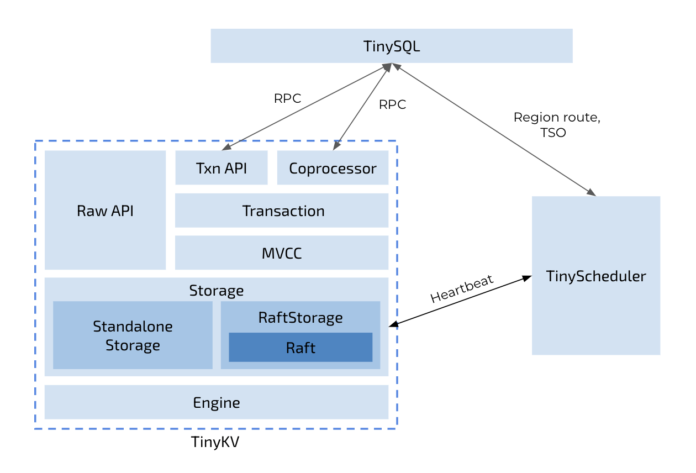

# TinyKV 启~动!


前段时间磕磕绊绊学习了Tinykv这个项目，通过所有测试就没再理了，现在觉得不能把工夫浪费了，因此写个Blog记录一下。
## 什么是Tinykv？

Tinykv是PingCAP推出的一个学习分布式系统的课程，这个公司在存储领域很厉害，比较著名的产品是TiDB。

Tinykv这个课程的具体内容是使用Raft共识算法构建一个具有分布式事务支持的键值存储系统，它提供了一些骨架代码，我们只需要填充其中的一些核心逻辑，例如Raft层实现共识，RaftStore实现消息处理等等。

整个课程有4个Project，分别为StandaloneKv、raftKv、MuiltiRaftKv、Transactions，整体难度上：porject3 > project2 >> project4 > project1。其中project2B和project3B是两个分水岭，一般都会Bug满天飞，需要打印详细的日志仔细地跟踪，并且有的Bug复现概率较低，要反复跑好几次，因此要坚持下来需要一定的毅力。

如果集中精力做的话，我了解到的几个同学都是暑假一个月不到的时间就完成了，整体代码量也不多，就是测试修Bug比较折磨。我当时还有学业上的别的事情，并没有太多的精力集中搞这个，从开始到完成花了有三个月，期间也是卡在2B和3B摆烂了很久。不过所幸是坚持到了最后。

如果时间凑巧的话，还可以报名PingCAP定期举办的tinykv学习营（[Talent Plan | TiDB 社区](https://tidb.net/talent-plan)），能起到一定的督促作用，还能与其他同学交流经验心得，可以少踩很多坑。

整个课程做下来能够学到的东西还是挺多的，例如raft共识算法、分布式系统架构、多版本并发控制等等，对于想走存储、分布式系统方向的同学还是很有用处的。

‍

## 资源链接

github仓库

[talent-plan/tinykv：基于 TiKV 模型构建分布式键值服务的课程 (github.com)](https://github.com/talent-plan/tinykv)

讲解视频

[Talent Plan 2021 KV 学习营分享课 (pingcap.com)](https://learn.pingcap.com/learner/course/510001)

很有帮助的文章，Tinykv白皮书

[如何快速通关 Talent Plan TinyKV？ - 知乎 (zhihu.com)](https://zhuanlan.zhihu.com/p/457696758)

‍

## 环境搭建

tinykv对硬件稍微有点要求，否则跑得太慢又Bug满天飞心态很容易炸。我是使用14核处理器，32GB内存，SSD固态的笔记本，搭配wsl2的linux环境，运行起来非常流畅。固态据说是刚需，其他感觉与这差不多的配置或者低一点也没关系。非常推荐使用wsl，可以直接连接vscode非常快，环境配起来也嘎嘎轻松；用虚拟机也可以，不过我感觉有点慢。有配置好服务器的话更好，可以一直挂着跑。

附上我当时配置wsl2参考的博客

[如何在Windows11上安装WSL2的Ubuntu22.04（包括换源）_wsl2换源_syqkali的博客-CSDN博客](https://blog.csdn.net/syqkali/article/details/131524540)

由于项目用go实现，所以也要配置golang的运行环境，项目里还用到了make，我这里直接用apt安装即可

```sh
sudo apt update
apt search golang-go
sudo apt install golang-go
go version 
sudo apt install make
```

接着从github仓库下载源码，得到的就是只有骨架代码的版本了。

​`git clone https://github.com/talent-plan/tinykv.git`​

建议在github上创建一个私有仓库来维护代码，这样就知道在哪些地方做了修改，并且可以很方便地恢复了。

‍

## 快速掌握Go语言基本语法

如果对Go语言的基本语法不熟悉，可以通过以下链接的教程快速掌握，对于Tinykv已经足够了。

[Go 语言之旅 (go-zh.org)](https://tour.go-zh.org/welcome/1)

‍

## Tinykv快速上手

tinykv根目录下的doc目录存放了四个project的说明文档。文档是全英文的（如果英文不是很好的话，可以先找中文翻译了解一下大体的框架，细节上还是要看英文，有些翻译得不准会造成误解），文档介绍了每个项目的要实现的具体功能和一些细节上的要求，不过整体上文档还是不够全面，很多功能需要仔细阅读它的骨架代码才能实现。

### 代码编写

每个project所要编写的代码的位置都给出了注释提示，可以通过grep命令找到需要编写代码的地方。

以project1为例，可以使用命令`grep -rIi "Your Code Here(1)"`​，来查找project1的项目文件以及需要编写代码的地方，主要的函数名和参数返回值都已经定义好了，只要填充其中的逻辑即可。注意project1之后的234都分成了A、B、C三部分，这时查找则是例如`grep -rIi "Your Code Here(2A)"`​这样。

​​​

当然虽然给出了主要的函数名和参数返回值，在project2和3还是要增加很多自定义的函数。

### 测试方式

`make projectxxx`

project2b、2c、3b、3c测试一遍是不够的，需要跑很多次才能复现一些Bug，可以使用shell脚本批量跑。

下面是我使用的测试脚本，只需要改运行次数times和project，removelog是在PASS的情况下删除日志。

```sh
#!/bin/bash

# settings to change
times=20
project="2b"
removelog=1

# don't change
if [ ! -d "./test_output" ]; then
    mkdir "./test_output"
fi

logdir="./test_output/${project}"
if [ ! -d $logdir ]; then
    mkdir $logdir
fi
lastdir="${logdir}/`date +%Y%m%d%H%M%S`"
if [ ! -d $lastdir ]; then
    mkdir $lastdir
fi
summary="${lastdir}/summary.log"
echo "times pass fail panic runtime" >> $summary

totalpass=0
totalfail=0
totalpanic=0
totalruntime=0

for i in $(seq 1 $times)
do
    logfile="${lastdir}/$i.log"
    start=$(date +%s)
    echo "make project${project} $i times"
    make project${project} >> $logfile
    end=$(date +%s)
    pass_count=$(grep -i "PASS" $logfile | wc -l)
    echo "pass count: $pass_count"
    fail_count=$(grep -i "fail" $logfile | wc -l)
    echo "fail count: $fail_count"
    panic_count=$(grep -i "panic" $logfile | wc -l)
    echo "panic count: $panic_count"
    runtime=$((end-start))
    echo "$i $pass_count $fail_count $panic_count $runtime" >> $summary

    totalpass=$((totalpass+pass_count))
    totalfail=$((totalfail+fail_count))
    totalpanic=$((totalpanic+panic_count))
    totalruntime=$((totalruntime+runtime))

    # if pass, remove the log
    if [ $removelog -eq 1 ]; then
        if [ $panic_count -lt 0 ]; then
            rm $logfile
        fi
        sleep 5
    fi
done

echo "total $totalfail $totalpanic $totalruntime" >> $summary
```
Project2B、2C、3B的测试时间比较长，有时只需要解决某一个测试点的Bug，没必要跑所有的测试点浪费时间。可以用命令`GO111MODULE=on go test -v --count=1 --parallel=1 -p=1 ./kv/test_raftstore -run ^TestSplitConfChangeSnapshotUnreliableRecover3B|| true`来运行单个测试点。

下面是我使用的单测试点的测试脚本，注意要改title和中间的测试命令：

```sh
#!/bin/bash

# settings to change
project="3b"
removelog=1
times=50
# title="TestConfChangeRemoveLeader3B"
# title="TestSplitRecoverManyClients3B"
# title="TestConfChangeRecoverManyClients3B"
title="TestSplitConfChangeSnapshotUnreliableRecover3B"
# title="TestConfChangeRemoveLeader3B"
# title="TestConfChangeSnapshotUnreliableRecover3B"
# title="TestSplitConfChangeSnapshotUnreliableRecoverConcurrentPartition3B"
# title="TestConfChangeUnreliableRecover3B"

# no change below this line
if [ ! -d "./test_output" ]; then
    mkdir "./test_output"
fi

logdir="test_output/$project/$title"
if [ ! -d $logdir ]; then
    mkdir $logdir
fi

lastdir="$logdir/`date +%Y%m%d%H%M%S`"
if [ ! -d $lastdir ]; then
    mkdir $lastdir
fi
summary="$lastdir/summary.log"
echo "times pass fail panic runtime panicinfo" >> $summary

totalpass=0
totalfail=0
totalpanic=0
totalruntime=0

for i in $(seq 1 $times)
do 
    logfile="${lastdir}/$i.log"
    start=$(date +%s)
    echo "start $i times"
    # (GO111MODULE=on go test -v --count=1 --parallel=1 -p=1 ./kv/test_raftstore -run ^TestConfChangeRemoveLeader3B|| true) >> $logfile
    # (GO111MODULE=on go test -v --count=1 --parallel=1 -p=1 ./kv/test_raftstore -run ^TestSplitRecover3B|| true) >> $logfile
    # (GO111MODULE=on go test -v --count=1 --parallel=1 -p=1 ./kv/test_raftstore -run ^TestConfChangeRemoveLeader3B|| true) >> $logfile
    # (GO111MODULE=on go test -v --count=1 --parallel=1 -p=1 ./kv/test_raftstore -run ^TestSplitRecoverManyClients3B|| true) >> $logfile
    # (GO111MODULE=on go test -v --count=1 --parallel=1 -p=1 ./kv/test_raftstore -run ^TestConfChangeRecoverManyClients3B|| true) >> $logfile
    (GO111MODULE=on go test -v --count=1 --parallel=1 -p=1 ./kv/test_raftstore -run ^TestSplitConfChangeSnapshotUnreliableRecover3B|| true) >> $logfile
    # (GO111MODULE=on go test -v --count=1 --parallel=1 -p=1 ./kv/test_raftstore -run ^TestConfChangeRemoveLeader3B|| true) >> $logfile
    # (GO111MODULE=on go test -v --count=1 --parallel=1 -p=1 ./kv/test_raftstore -run ^TestConfChangeSnapshotUnreliableRecover3B|| true) >> $logfile
    # (GO111MODULE=on go test -v --count=1 --parallel=1 -p=1 ./kv/test_raftstore -run ^TestSplitConfChangeSnapshotUnreliableRecoverConcurrentPartition3B|| true) >> $logfile
    # (GO111MODULE=on go test -v --count=1 --parallel=1 -p=1 ./kv/test_raftstore -run ^TestConfChangeUnreliableRecover3B|| true) >> $logfile

    end=$(date +%s)
    pass_count=$(grep -i "PASS" $logfile | wc -l)
    echo "pass count: $pass_count"
    fail_count=$(grep -i "fail" $logfile | wc -l)
    echo "fail count: $fail_count"
    panic_count=$(grep -i "panic" $logfile | wc -l)
    echo "panic count: $panic_count"
    runtime=$((end-start))

    panic_info=$(grep -m 1 -i "panic" $logfile)

    echo "$i $pass_count $fail_count $panic_count $runtime $panic_info" >> $summary

    totalpass=$((totalpass+pass_count))
    totalfail=$((totalfail+fail_count))
    totalpanic=$((totalpanic+panic_count))
    totalruntime=$((totalruntime+runtime))

    # if pass, remove the log
    if [ $removelog -eq 1 ]; then
        if [ $pass_count -eq 2 ]; then
            rm $logfile
        fi
        sleep 5
    fi
done

echo "total $totalfail $totalpanic $totalruntime" >> $summary
```

### 打印日志

打印日志非常重要，尤其是对于跟踪Project2B、2C、3B中的Bug。

可以在`log/log.go`​的末尾增加以下代码：

```go
const debug = 0
const debug_raft = 0
const debug_raftStore = 0

func DPrintf(format string, a ...interface{}) (n int, err error) {
	if debug > 0 {
		_log.Infof(format, a...)
	}
	return
}

func DPrintfRaft(format string, a ...interface{}) (n int, err error) {
	if debug_raft > 0 {
		log.Printf("[Raft]: "+format, a...)
	}
	return
}

func DPrintfRaftStore(format string, a ...interface{}) (n int, err error) {
	if debug_raftStore > 0 {
		log.Printf("[RaftStore]: "+format, a...)
	}
	return
}
```

将`debug_xxx`​改为大于0之后，在需要打印日志的地方调用`log.DPrintfxxx`​即可。

我这里分了三种日志类型，最重要的是`Raft`​和`RaftStore`​，分别对应Raft层的日志和RaftStore的日志，这样做的好处是面对海量的日志能够很容易找到哪个模块的代码出了问题，也可以很轻松过地关闭一个模块的日志减少干扰。

‍

## Tinykv架构

在正式编码之前，我们可以大致了解一下Tinykv的架构，这里我直接结合官方的图大致来讲一下自己的理解。
​​
Tinykv只关注分布式数据库系统的存储层，可以处理响应来自SQL层的RPC请求，同时还有一个TinyScheduler组件作为整个Tinykv集群的控制中心，从Tinykv的心跳中收集信息，负责一些调度工作，向Tinykv节点发送调度命令以实现负载均衡（project 3c）等等功能。

自下而上解析Tinykv的组成：

1. Engine，即kv存储引擎，是实际存储kv的地方。在Tinykv中使用的是badgerDB，使用了两个DB实例：kv和raftkv，分别用于存储实际的kv数据和raft日志，当然还分别存储了一些状态数据。
2. Storage，我理解为分布式逻辑层，这里分为了Standalone Storage和RaftStorage

    1. Standalone Storage对应project1，在badgerDB的API基础上封装了列族（可以理解为给每个key加上了前缀以实现分类），这是为了在后面project4中实现事务机制。
    2. RaftStorage：project2和3的重点。负责了请求的处理和响应。包括了Raft层和Raft层之上的逻辑**RaftStore**

        1. Raft层用于接收来自上层的Raft日志，实现共识算法，会定期给上层反馈已经提交的日志和要转发的消息等等。
        2. RaftStore则负责消息的封装和路由（分发到raft节点）、raft日志的持久化和命令的应用等等，比较复杂。
3. server，接收RPC调用和响应，实现MVCC（多版本并发控制）和封装事务性API，对应project4

‍

项目目录：

* ​`kv`​包含键值存储的实现。
* ​`raft`​包含 Raft 共识算法的实现。
* ​`scheduler`​包含 TinyScheduler 的实现，该实现负责管理 TinyKV 节点和生成时间戳。
* ​`proto`​包含节点和进程之间所有通信的实现，使用基于 gRPC 的协议缓冲区。此包包含 TinyKV 使用的协议定义，以及您可以使用的生成的 Go 代码。
* ​`log`​包含基于级别输出日志的实用程序。

‍

## 总结

有了上述的一些准备之后就可以开始攻克Tinykv的各个project了，万事开头难，这也是我正儿八经的第一篇博客，后续会更新四个project的思路和踩的一些坑。由于缺乏有关分布式系统的很多知识，理解上可能会有很多谬误和遗漏，欢迎多多提问和指正。

Tinykv 启~动！
