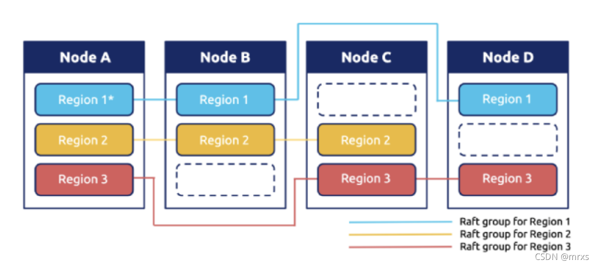
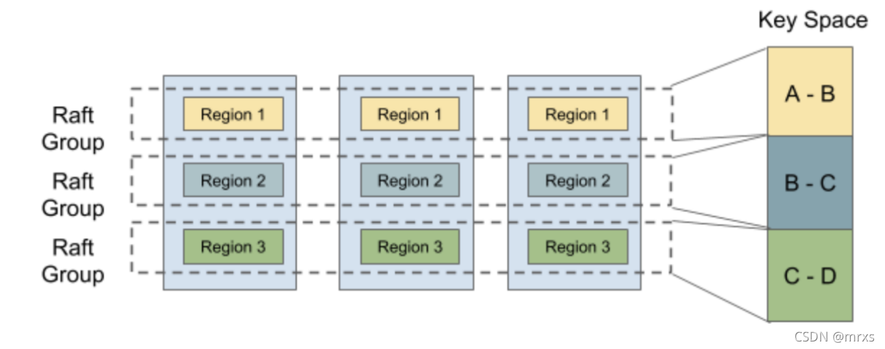
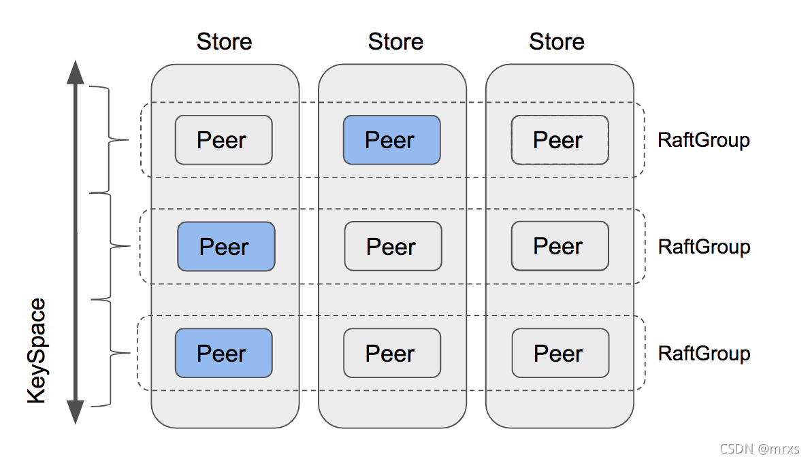

<!--more-->

## Project 3 MultiRaftKV

在 Project2 中，你建立了一个基于Raft的高可用的kv服务器，做得很好！但还不够，这样的kv服务器是由单一的 raftGroup 支持的，不能无限扩展，并且每一个写请求都要等到提交后再逐一写入 badger，这是保证一致性的一个关键要求，但也扼杀了任何并发性。

​​

在这个项目中，你将实现一个带有平衡调度器的基于 multi Raft 的kv服务器，它由多个 Raft group 组成，每个 Raft group 负责一个单独的 key 范围，在这里被命名为 region ，布局将看起来像上图。对单个 region 的请求的处理和以前一样，但多个 region 可以同时处理请求，这提高了性能，但也带来了一些新的挑战，如平衡每个 region 的请求，等等。

这个项目有3个部分，包括：

* 对 Raft 算法实现成员变更和领导变更
* 在 raftstore 上实现Conf change和 region split
* 引入 scheduler

### Part A

在这一部分中，你将在基本的 Raft 算法上实现成员变更和领导者变更，这些功能是后面两部分所需要的。成员变更，即 confChange，用于添加或删除 peer 到Raft Group，这可能会改变 RaftGroup 的节点数目，所以要小心。领导权变更，即领导权转移，用于将领导权转移给另一个 peer，这对平衡调度器非常有用。

#### 代码

你需要修改的代码都是关于 `raft/raft.go`​ 和 `raft/rawnode.go`​ 的，也可以参见`proto/proto/eraft.proto`​以了解你需要处理的新信息。confChange 和 leader transfer 都是由上层程序触发的，所以你可能想从 `raft/rawnode.go`​ 开始。

#### 实现领导者转移

为了实现领导者的转移，让我们引入两个新的消息类型，`MsgTransferLeader`​ 和`MsgTimeoutNow`​。为了转移领导权，你需要首先在当前领导上调用带有`MsgTransferLeader`​ 消息的 `raft.Raft.Step`​，为了确保转移的成功，当前领导应该首先检查被转移者（即转移目标）的资格，比如：被转移者的日志是否为最新的，等等。如果被转移者不合格，当前领导可以选择放弃转移或者帮助被转移者，既然放弃对程序本身没有帮助，就选择帮助被转移者吧。如果被转移者的日志不是最新的，当前的领导者应该向被转移者发送 `MsgAppend`​ 消息，并停止接受新的 propose，以防我们最终会出现循环。因此，如果被转移者符合条件（或者在现任领导的帮助下），领导应该立即向被转移者发送 `MsgTimeoutNow`​ 消息，在收到 `MsgTimeoutNow`​ 消息后，被转移者应该立即开始新的选举，无论其选举超时与否，被转移者都有很大机会让现任领导下台，成为新领导者。

#### 实现成员变更

这里要实现的 conf change 算法不是扩展Raft论文中提到的联合共识算法，联合共识算法可以一次性增加和/或移除任意 peer，相反，这个算法只能一个一个地增加或移除 peer，这更简单，更容易推理。此外，ConfChange从调用领导者的`raft.RawNode.ProposeConfChange`​开始，它将提出一个日志，其中`pb.Entry.EntryType`​设置为`EntryConfChange`​，`pb.Entry.Data`​设置为输入`pb.ConfChange`​ 。当 `EntryConfChange`​ 类型的日志被提交时，你必须通过`RawNode.ApplyConfChange`​ 与日志中的 `pb.ConfChange`​ 一起应用它，只有这样你才能根据 `pb.ConfChange`​ 通过 `raft.Raft.addNode`​ 和 `raft.Raft.removeNode`​ 向这个Raft 子节点添加或删除 peer。

> 提示：
>
> * ​`MsgTransferLeader`​消息是本地消息，不是来自网络的。
> * 将`MsgTransferLeader`​消息的`Message.from`​设置为被转移者（即转移目标）。
> * 要立即开始新的选举，你可以用`MsgHup`​消息调用`Raft.Step`​
> * 调用 `pb.ConfChange.Marshal`​ 来获取 `pb.ConfChange`​ 的字节表示，并将其放入 `pb.Entry.Data`​。

### Part B

由于 Raft 模块现在支持成员变更和领导变更，在这一部分中，你需要在 Part A 的基础上使 TinyKV 支持这些**​ admin 命令**。你可以在 `proto/proto/raft_cmdpb.proto`​ 中看到，有四种 admin 命令：

* CompactLog (已经在 Project2 的 PartC 实现)
* TransferLeader
* ChangePeer
* Split

TransferLeader 和 ChangePeer 是基于 Raft 支持的领导变更和成员变更的命令。这些将被用作平衡调度器的基本操作步骤。Split 将一个 region 分割成两个 region，这是 multi Raft 的基础。你将一步一步地实现它们。

#### 代码

所有的变化都是基于 Project2 的实现，所以你需要修改的代码都是关于 `kv/raftstore/peer_msg_handler.go`​ 和 `kv/raftstore/peer.go`​。

#### Propose TransferLeader

这一步相当简单。作为一个 Raft 命令，TransferLeader 将被 Propose 为一个Raft 日志项。但是 TransferLeader 实际上是一个动作，不需要复制到其他 peer，所以**你只需要调用 RawNode 的 ​**​`TransferLeader()`​**​ 方法**，而不是 TransferLeader 命令的`Propose()`​。

#### 在raftstore中实现confChange

confChange有两种不同的类型：AddNode 和 RemoveNode。正如它的名字所暗示的，它添加一个 Peer 或从 region 中删除一个 Peer。为了实现 confChange，你应该先学习 RegionEpoch 的概念。RegionEpoch 是 `metapb.Region`​ 的元信息的一部分。当一个 Region 增加或删除 Peer 或 Split 时，Region的`poch`​就会发生变化。**RegionEpoch 的 ​**​`conf_ver`​**​ 在 ConfChange 期间增加，而**​`version`​**在分裂期间增加。**它将被用来保证一个 Region 中的两个领导者在网络隔离下有最新的region信息。

你需要使 raftstore 支持处理 conf change 命令。这个过程是：

* 通过 `ProposeConfChange`​ 提出 conf change admin 命令
* 在日志被提交后，改变 `RegionLocalState`​，包括 RegionEpoch 和 Region 中的Peers。
* 调用 `raft.RawNode`​ 的 `ApplyConfChange()`​。

> 提示：
>
> * 对于执行AddNode，新添加的 Peer 将由领导者的心跳来创建，查看`storeWorker`​ 的 `maybeCreatePeer()`​。在那个时候，这个 Peer 是未初始化的，它的 region 的任何信息对我们来说都是未知的，所以我们用 0 来初始化它的日志任期和索引。这时领导者会知道这个跟随者没有数据（存在一个从0到5的日志间隙），**它将直接发送一个Snapshot给这个跟随者**。
> * 对于执行 RemoveNode，你应该明确地调用 `destroyPeer()`​ 来停止 Raft 模块。销毁逻辑是为你提供的。
> * **不要忘记更新 ​`GlobalContext`​ 的 ​**​`storeMeta`​**​ 中的 ​**​`regionState`​**。**
> * 测试代码会多次安排一个 conf change 的命令，直到该 conf change 被应用，所以**你需要考虑如何忽略同一 conf change 的重复命令**。

#### 在raftstore中实现region split

​​

为了支持 multi-raft，系统进行了数据分片，使每个 raft 组只存储一部分数据。Hash 和 Range 是常用的数据分片方式。TinyKV 使用 Range，主要原因是 Range 可以更好地聚合具有相同前缀的key，这对扫描等操作来说很方便。此外，Range在分片上比 Hash 更有优势。通常情况下，它只涉及元数据的修改，不需要移动数据。

```go
message Region {
 uint64 id = 1;
 // Region key range [start_key, end_key).
 bytes start_key = 2;
 bytes end_key = 3;
 RegionEpoch region_epoch = 4;
 repeated Peer peers = 5
}
```

让我们重新审视一下 Region 的定义，它包括两个字段 `start_key`​ 和 `end_key`​，以表明 Region 所负责的数据范围。所以 Split 是支持多进程的关键步骤。在开始时，只有一个Region，其范围是`["", "")`​。你可以把 key 空间看作一个圈，所以`["", "")`​代表整个空间。随着数据的写入，`SplitChecker`​ 将在每一个 `cfg.SplitRegionCheckTickInterval`​ 检查 region 的大小（`SplitChecker`​**如何获取region大小？**），并在可能的情况下生成一个`split_key`​，将该 region 切割成两部分，你可以在 `kv/raftstore/runner/split_check.go`​ 中查看其逻辑。​`split_key`​将被包装成一个 `MsgSplitRegion`​，由 `onPrepareSplitRegion()`​ 处理。

为了确保新创建的 Region 和 Peers 的 id 是唯一的，这些 id 是由调度器分配的。`onPrepareSplitRegion()`​ 实际上为 `pd Worker`​ 安排了一个任务，向调度器索取id。并在收到调度器的响应后做出一个 Split admin命令，见`kv/raftstore/runner/scheduler_task.go`​ 中的 `onAskSplit()`​。

所以你的任务是实现处理 Split admin 命令的过程，就像 conf change 那样。提供的框架支持 multi-raft，见 `kv/raftstore/router.go`​。**当一个 Region 分裂成两个 Region 时，其中一个 Region 将继承分裂前的元数据，只是修改其 Range 和 RegionEpoch，而另一个将创建相关的元信息。**

> 提示:
>
> * 这个新创建的 Region 的对应 Peer 应该由 `createPeer()`​ 创建，并注册到 `router.regions`​。而 region 的信息应该插入 `ctx.StoreMeta`​ 中的`regionRanges`​ 中。
> * 对于有网络隔离的 region split 情况，要应用的快照可能会与现有 region 的范围有重叠。检查逻辑在 `kv/raftstore/peer_msg_handler.go`​ 的`checkSnapshot()`​ 中。请在实现时牢记这一点，并照顾到这种情况。
> * 使用 `engine_util.ExceedEndKey()`​ 与 region 的 end key 进行比较。因为当end key 等于" "时，任何 key 都将等于或大于" "。**有更多的错误需要考虑。ErrRegionNotFound, ErrKeyNotInRegion, ErrEpochNotMatch。**

### Part C

正如上面所介绍的，我们的kv存储中的所有数据被分割成几个 region，每个region 都包含多个副本。一个问题出现了：我们应该把每个副本放在哪里？我们怎样才能找到副本的最佳位置？谁来发送以前的 AddPeer 和 RemovePeer 命令？Scheduler承担了这个责任。

为了做出明智的决定，Scheduler 应该拥有关于整个集群的一些信息。它应该知道每个 region 在哪里。它应该知道它们有多少个 key。它应该知道它们有多大…为了获得相关信息，Scheduler 要求每个 region 定期向 Scheduler 发送一个心跳请求。你可以在 `/proto/proto/schedulerpb.proto`​ 中找到心跳请求结构 `RegionHeartbeatRequest`​。在收到心跳后，调度器将更新本地 region 信息。

同时，调度器会定期检查 region 信息，以发现我们的 TinyKV 集群中是否存在不平衡现象。例如，如果任何 store 包含了太多的 region，region 应该从它那里转移到其他 store 。这些命令将作为相应 region 的心跳请求的响应被接收。

在这一部分，你将需要为 Scheduler 实现上述两个功能。按照我们的指南和框架，这不会太难。

#### 代码

需要修改的代码都是关于 `scheduler/server/cluster.go`​ 和 `scheduler/server/schedulers/balance_region.go`​ 的。如上所述，当调度器收到一个 region 心跳时，它将首先更新其本地 region 信息。然后，它将检查是否有这个 region 的未决命令。如果有，它将作为响应被发送回来。

你只需要实现 `processRegionHeartbeat`​ 函数，其中 Scheduler 更新本地信息；以及 balance_region 的 Scheduler 函数，其中 Scheduler 扫描 Store 并确定是否存在不平衡以及它应该移动哪个 region。

#### 收集区域心跳

正如你所看到的，`processRegionHeartbeat`​ 函数的唯一参数是一个 `regionInfo`​。它包含了关于这个心跳的发送者 region 的信息。Scheduler 需要做的仅仅是更新本地region 记录。但是，它应该为每次心跳更新这些记录吗？

肯定不是！有两个原因。有两个原因。一个是当这个 region 没有变化时，更新可能被跳过。更重要的一个原因是，Scheduler 不能相信每一次心跳。特别是说，如果集群在某个部分有分区，一些节点的信息可能是错误的。

例如，一些 Region 在被分割后会重新启动选举和分割，但另一批孤立的节点仍然通过心跳向 Scheduler 发送过时的信息。所以对于一个 Region 来说，两个节点中的任何一个都可能说自己是领导者，这意味着 Scheduler 不能同时信任它们。

哪一个更可信呢？**Scheduler 应该使用 ​`conf_ver`​ 和 `version`​ 来确定，即 `RegionEpoch`​​**​。Scheduler 应该首先比较两个节点的 Region `version`​ 的值。如果数值相同，Scheduler 会比较 `conf_ver`​ 的数值。拥有较大 `conf_ver`​ 的节点必须拥有较新的信息。

简单地说，你可以按以下方式组织检查程序：

* 检查本地存储中是否有一个具有相同 Id 的 region。如果有，并且至少有一个心跳的 conf_ver 和版本小于它，那么这个心跳 region 就是过时的。
* 如果没有，则扫描所有与之重叠的区域。心跳的 `conf_ver`​ 和 `version`​ 应该大于或等于所有的，否则这个 region 是陈旧的。

那么 Scheduler 如何确定是否可以跳过这次更新？我们可以列出一些简单的条件。

* 如果新的 `version`​ 或 `conf_ver`​ 大于原来的版本，就不能被跳过。
* 如果领导者改变了，它不能被跳过
* 如果新的或原来的有挂起的 peer，它不能被跳过。
* 如果 ApproximateSize 发生变化，则不能跳过。
* …

不要担心。你不需要找到一个严格的充分和必要条件。**冗余的更新不会影响正确性。**

如果 Scheduler 决定根据这个心跳来更新本地存储，有两件事它应该更新：region tree 和 store status。你可以使用 `RaftCluster.core.PutRegion`​ 来更新 region-tree ，并使用 `RaftCluster.core.UpdateStoreStatus`​ 来更新相关存储的状态（如领导者数量、区域数量、待处理的 peer 数量…）。

#### 实现 region balance 调度器

在调度器中可以有许多不同类型的调度器在运行，例如，balance_region 调度器和balance_leader 调度器。这篇学习材料将集中讨论 balance_region 调度器。

每个调度器都应该实现了 `Scheduler`​ 接口，你可以在 `/scheduler/server/schedule/scheduler.go`​ 中找到它。调度器将使用 `GetMinInterval`​ 的返回值作为默认的时间间隔来定期运行 `Schedule`​ 方法。如果它的返回值为空（有几次重试），`Scheduler`​ 将使用 `GetNextInterval`​ 来增加间隔时间。通过定义 `GetNextInterval`​，你可以定义时间间隔的增加方式。如果它返回一个操作符，`Scheduler`​ 将派遣这些操作符作为相关区域的下一次心跳的响应。

​`Scheduler`​ 接口的核心部分是 `Schedule`​ 方法。这个方法的返回值是操作符，它包含多个步骤，如 AddPeer 和 RemovePeer。例如，MovePeer 可能包含 AddPeer、transferLeader 和 RemovePeer，你在前面的部分已经实现了。以下图中的第一个RaftGroup为例。调度器试图将 peer 从第三个 store 移到第四个 store。首先，它应该为第四个 store 添加 peer。然后它检查第三家是否是领导者，发现不是，所以不需要转移领导者。然后，它删除第三个 store 的 peer。

你可以使用 `scheduler/server/schedule/operator`​ 包中的`CreateMovePeerOperator`​ 函数来创建一个 `MovePeer`​ 操作。

​​

​​

在这一部分，你需要实现的唯一函数是`scheduler/server/schedulers/balance_region.go`​ 中的 `Schedule`​ 方法。这个调度器避免了在一个 store 里有太多的 region。首先，Scheduler 将选择所有合适的 store。然后根据它们的 region 大小进行排序。然后，调度器会尝试从 reigon 大小最大的 store 中找到要移动的 region。

调度器将尝试找到最适合在 store 中移动的 region。首先，它将尝试选择一个挂起的 region，因为挂起可能意味着磁盘过载。如果没有一个挂起的 region，它将尝试找到一个 Follower region。如果它仍然不能挑选出一个 region，它将尝试挑选 Leader region。最后，它将挑选出要移动的 region，或者 Scheduler 将尝试下一个 region 大小较小的 store，直到所有的 store 都将被尝试。

在您选择了一个要移动的 region 后，调度器将选择一个 store 作为目标。实际上，调度器将选择 region 大小最小的 store 。然后，调度程序将通过检查原始 store 和目标 store 的 region 大小之间的差异来判断这种移动是否有价值。如果差异足够大，Scheduler 应该在目标 store 上分配一个新的 peer 并创建一个 Movepeer 操作。

正如你可能已经注意到的，上面的例程只是一个粗略的过程。还剩下很多问题：

* 哪些存储空间适合移动？

简而言之，一个合适的 store 应该是 Up 的，而且 down 的时间不能超过集群的`MaxStoreDownTime`​，你可以通过 `cluster.GetMaxStoreDownTime()`​ 得到。

* 如何选择区域？

Scheduler 框架提供了三种方法来获取区域。`GetPendingRegionsWithLock`​, `GetFollowersWithLock`​ 和 `GetLeadersWithLock`​。Scheduler 可以从中获取相关region。然后你可以选择一个随机的region。

* 如何判断这个操作是否有价值？

如果原始 region 和目标 region 的 region 大小差异太小，在我们将 region 从原始 store 移动到目标 store 后，Scheduler 可能希望下次再移动回来。所以我们要确保这个差值必须大于 region 近似大小的2倍，这样才能保证移动后，目标 store 的 region 大小仍然小于原 store。

‍
